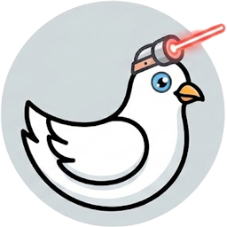

# laserdove



Experimental Python tooling to plan and drive dovetail joints on a Thunder Nova-class CO₂ laser with a stepper-based rotary jig. This is pre-production software: use at your own risk and double-check every motion before powering a laser.

## Safety warning
- Always dry-run or simulate before sending motion to hardware.
- Keep the beam off (`--movement-only` or dummy backend) until you trust the job.
- You are responsible for all outcomes. Third-party laser software and firmware can behave unexpectedly; monitor every job and have an e-stop within reach.

## What it does
- Plans tail/pin layouts and emits motion/laser commands for Ruida controllers.
- Supports dry-run, Tk simulation, and RD job saving for inspection.
- Rotary-aware Z offsets and origin capture to align with the controller’s current position.
- Dummy backends for safe development; GPIO-driven rotary for Raspberry Pi setups.

## Hardware requirements
- Ruida-based controller reachable over Ethernet (tested against RDC6442G protocol).
- Raspberry Pi (or similar) with GPIO access to a step/dir stepper driver for the rotary.
- Stepper-driven rotary fixture for the workpiece.
- For simulation-only use, hardware is optional.

## Install
```bash
source .venv/bin/activate
pip install -e .          # runtime
# For dev/lint/tests
pip install -e ".[dev]"
```

## Quick start
```bash
cp example-config.toml config.toml   # adjust to your jig/laser

python -m laserdove.main --config config.toml --mode both --dry-run  # plan only

python -m laserdove.main --config config.toml --simulate  # Tk sim

python -m laserdove.main --config config.toml --mode tails --save-rd-dir rd_out --movement-only  # build RD safely
```

## CLI reference

### Runtime flags
| Option | Default | Values | Description |
| --- | --- | --- | --- |
| `--config` | `config.toml` if present | path | TOML config file to load. |
| `--mode` | `both` | `tails` \| `pins` \| `both` | Which board to plan. |
| `--dry-run` | `false` | flag | Print commands; skip hardware. |
| `--simulate` | `false` | flag | Use Tk viewer + simulated backends. |
| `--reset` | `false` | flag | Skip planning; rotate to zero and park head at pin Z0 (laser off). |
| `--movement-only` | `false` | flag | Force laser power to 0 while moving (also set by `--reset`). |
| `--dry-run-rd` | `false` | flag | Build/log RD jobs without talking to Ruida. |
| `--save-rd-dir` | none | path | Save swizzled `.rd` jobs for inspection. |
| `--log-level` | `INFO` | std logging levels | Verbosity. |
| `--air-assist` / `--no-air-assist` | from config (default on) | flag | Toggle air assist in RD jobs. |
| `--z-positive-bed-up` / `--z-positive-bed-down` | from config (default bed-up) | flag | Z+ direction hint. |

### Geometry/Jig overrides
| Option | Default (config) | Values | Description |
| --- | --- | --- | --- |
| `--edge-length-mm` | `100.0` | float | Joint edge length. |
| `--thickness-mm` | `6.35` | float | Board thickness (also sets tail depth). |
| `--num-tails` | `3` | int | Tail count. |
| `--dovetail-angle-deg` | `8.0` | float | Tail angle. |
| `--tail-width-mm` | `20.0` | float | Tail outer width. |
| `--clearance-mm` | `0.05` | float | Socket minus tail clearance. |
| `--kerf-tail-mm` | `0.15` | float | Kerf for tail board cuts. |
| `--kerf-pin-mm` | `0.15` | float | Kerf for pin board cuts. |
| `--axis-offset-mm` | `30.0` | float | Axis-to-surface distance for rotary focus. |

### Hardware/backends
| Option | Default (config) | Values | Description |
| --- | --- | --- | --- |
| `--laser-backend` | `dummy` if `backend.use_dummy` else `ruida` | `dummy` \| `ruida` | Laser transport. |
| `--rotary-backend` | `dummy` if `backend.use_dummy` else `real` | `dummy` \| `real` | Rotary driver. |
| `--ruida-timeout-s` | `3.0` | float | UDP ACK timeout. |
| `--ruida-source-port` | `40200` | int | Local UDP source port. |
| `--rotary-steps-per-rev` | `4000.0` | float | Steps per revolution (includes microsteps). |
| `--rotary-microsteps` | none | int | Microsteps per full step (driver DIP). |
| `--rotary-step-pin` / `--rotary-dir-pin` | none | int | BCM pins for STEP-/DIR- (real rotary). |
| `--rotary-step-pin-pos` / `--rotary-dir-pin-pos` | `11` / `13` | int | BCM pins for STEP+/DIR+ (default high). |
| `--rotary-enable-pin` / `--rotary-alarm-pin` | none | int | Optional enable/alarm pins. |
| `--rotary-invert-dir` | `false` | flag | Invert DIR output. |
| `--rotary-pin-numbering` | `board` | `bcm` \| `board` | GPIO numbering scheme. |
| `--rotary-max-step-rate-hz` | `500.0` | float | Max step pulse rate. |

## Configuration file
- Copy `example-config.toml` to `config.toml` and edit.
- Sections:
  - `[joint]`: geometry inputs (length, tails, angle, kerf, clearance).
  - `[jig]`: rotary geometry (axis distance, zero angle, rotation speed).
  - `[machine]`: speeds, powers, Z zeros, air assist, Z direction.
  - `[backend]`: hardware targets and GPIO pins (dummy vs Ruida/real rotary, host/port, RD save dir).
- CLI flags override TOML values.

## Architecture (high level)
- CLI/config: `cli.py`, `config.py` parse flags/TOML into `RunConfig`, set logging.
- Geometry: `geometry.py` pure math for tail layouts and kerf offsets.
- Planning: `planner.py` + `model.py` build command sequences for tails/pins and rotary Z offsets.
- Hardware abstraction: `hardware/`:
  - `base.py` interfaces + dummy executor,
  - `sim.py` Tk simulation,
  - `ruida_*` + `rd_builder.py` UDP transport and RD payloads,
  - `rotary.py` GPIO/logging rotary drivers.
- Visualization/tools: `simulation_viewer.py`, `tools/rd_parser.py`, `tools/ruida_status_probe.py`.
- Validation: `validation.py` checks geometry, jig, and machine limits before execution.

To extend: add new motion types in `planner.py`/`model.py`, new hardware backends under `hardware/`, or new CLI/config fields in `config.py` plus `example-config.toml`.

## Development
- Lint/format: `make lint` (ruff check + format --check), autoformat with `make format`.
- Tests + coverage: `make test` (runs lint + `pytest`).
- Manual: `python -m pytest`, `ruff check src tests tools`.

## Diagnostics and inspection
- Save RD jobs: `--save-rd-dir rd_out/` then inspect with `tools/rd_parser.py path/to.rd`.
- Ruida status probe: `python -m tools.ruida_status_probe --host <ruida-ip>` to poll status bits with movement-only jobs.
- Simulation: `--simulate` to visualize paths with pacing based on commanded speeds.

## Credits and references
- Community and research work informed this tooling, including:
  - MeerK40t Ruida stack (`reference/meerk40t/`).
  - StevenIsaacs/ruida-protocol-analyzer.
  - EduTech Wiki Ruida notes.
  - jnweiger/ruida-laser.
- Additional vendor and community docs live in `reference/` for background only; they are not imported into runtime code.

## Disclaimer
This software is experimental and provided without any warranty or responsibility for damage or injury. Verify every setting, monitor your laser at all times, and proceed only if you accept full responsibility. Use dummy or simulated backends first, and keep an e-stop within reach.
