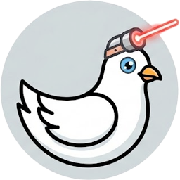

<div style="display:flex; align-items:center; justify-content:space-between;">
  <h1 style="margin:0; display:flex; align-items:center; gap:3rem;">
     laserdove
  </h1>
  <div>
    <a href="https://github.com/sayhiben/laserdove/actions/workflows/python-tests.yml"></a>
    <a href="https://github.com/sayhiben/laserdove/actions/workflows/python-lint.yml"></a>
  </div>
</div>

# Safety warning

> [!CAUTION]
> - Always dry-run or simulate commands before sending motion to hardware.
> - Keep the beam off (`--movement-only` or dummy backend) until you trust the job.
> - You are responsible for all outcomes. Third-party laser software and firmware can behave unexpectedly; monitor every job and have an e-stop within reach.

# Overview

Experimental Python tooling to plan and execute dovetail joints on a laser with a stepper-based rotary jig. It computes tail and pin geometry, turns plans into motion commands, and can simulate or emit Ruida RD jobs. This is pre-production software: verify every move before powering a laser.

## What it does
- Computes deterministic tail and pin layouts with kerf and clearance handling.
- Builds command sequences for tails (flat) and pins (rotary flanks with Z offsets).
- Sends Ruida UDP jobs or uses dummy backends for safe dry runs.
- Simulates jobs in pygame, including rotary and Z movement playback.
- Includes helper tools for rotary zeroing, midpoint finding, and RD inspection.

## Safety and status
- Pre-production: expect rough edges and check all moves before firing the laser.
- Always run a dry-run and simulator pass first; keep beam off until verified.
- Use `--movement-only` or `--reset` for first hardware shakedowns.

## Requirements
- Python 3.11+.
- Optional: `pygame` for the simulator.
- Optional: `RPi.GPIO` for real rotary GPIO (Raspberry Pi).
- Ruida controller required only for live cutting.

## Quick start (safe workflow)
```bash
cp example-config.toml config.toml

python -m laserdove.main --config config.toml --mode both --dry-run
python -m laserdove.main --config config.toml --simulate

# Safe Ruida output without firing
python -m laserdove.main --config config.toml --mode tails --save-rd-dir rd_out --movement-only
```

## Install
```bash
source .venv/bin/activate
pip install -e .
# Dev/lint/tests
pip install -e ".[dev]"
# Simulator (optional)
pip install pygame
```

## Usage
Entry points:
- `python -m laserdove.main` (recommended)
- `python -m laserdove.cli`

Common commands:
```bash
python -m laserdove.main --config config.toml --mode tails --dry-run
python -m laserdove.main --config config.toml --simulate
python -m laserdove.main --config config.toml --simulate --simulate-rd-dir rd_out
python -m laserdove.main --config config.toml --reset
```

Run `python -m laserdove.main --help` for the full CLI.

## Configuration
Use `example-config.toml` as the reference and copy it to `config.toml`.

Key notes:
- `joint.thickness_mm` sets both tail and socket depth.
- `joint.kerf_mm` applies to both boards unless `kerf_tail_mm` or `kerf_pin_mm` overrides are set.
- `jig.axis_to_fence_mm` plus `joint.thickness_mm` defines the top surface radius. If unset, the code falls back to 30.0mm with a warning.
- `machine.z_zero_tail_mm` and `machine.z_zero_pin_mm` define the baseline Z offsets for each board.
- `machine.pre_cut_warmup_s` controls pre-cut air assist and inline fan warmup.
- `backend.simulate_rd_dir` lets the simulator replay saved `.rd` jobs when `--simulate` is used.

Config sections:
- `[joint]`: geometry inputs (length, tails, angle, kerf, clearance, thickness).
- `[jig]`: rotary geometry (`axis_to_fence_mm`, rotation zero, rotation speed).
- `[machine]`: speeds, powers, Z zeros, air assist, inline fan, warmup, Z direction.
- `[backend]`: hardware targets and GPIO pins (dummy vs Ruida/real rotary, host/port, RD save dir).

CLI flags override TOML values.

## Architecture (high level)
- `config.py` parses TOML and CLI into `RunConfig`.
- `geometry.py` computes tail spacing and kerf offsets (pure math).
- `planner_tail.py` and `planner_pin.py` emit `Command` sequences.
- `hardware/` implements dummy backends, Ruida UDP transport, RD job building, and rotary drivers.
- `pygame_simulator.py` provides the visual simulator (split across `sim_viewer_*`).

Flow: config -> geometry -> planner -> commands -> simulator or hardware backends.

## Tools
- `python -m tools.rotary_zero --interactive` for rotary zeroing with step nudges and saved zero.
- `python -m tools.edge_midpoint` to compute the board edge midpoint and optional edge length update.
- `python -m tools.rd_parser path/to.rd` to inspect saved RD files.
- `python -m tools.ruida_status_probe --host <ruida-ip>` to poll controller status bits.
- `python -m tools.z_movement_suite` to exercise Z motion commands safely.

## Development
```bash
make format
make lint
make test
```

Notes:
- Tests live under `tests/`.
- Avoid importing from `reference/`; it is background material only.

## Pin cutting orientation
Pin flanks rotate to rotation_zero_deg plus or minus the dovetail angle so the pin widens toward the bottom of the mounted board. This helps reduce burning on the narrow faces.

## Diagnostics and inspection
- Save RD jobs with `--save-rd-dir` and inspect with `tools/rd_parser.py`.
- Replay RD jobs in the simulator with `--simulate --simulate-rd-dir rd_out`.
- Use `--movement-only` for travel-only validation on real hardware.

## Disclaimer
This software is experimental and provided without any warranty or responsibility for damage or injury. Verify every setting, monitor your laser at all times, and proceed only if you accept full responsibility.
