# RDC6442GU-DFM-RD-Control-System-V1.3-Manual.pdf

## Page 1

User’s Manual of RDC6442G(U)-DFM-RD Control System
SHENZHEN RUIDA TECHNOLOGY
RDC6442G(U)
-DFM-RD
Control System Manual
Read this manual before operation

The content include of electric connections and operating steps

Read the manual to operate the systems
RuiDa Technology Co., Ltd
Addr:
202-203,B-Block,Technology
Building,NO.,1057
Nanhai
Avenue,Nanshan
District,Shenzhen
city,Guangdong
Province,P.R.China
Tel:
0755--26066687
Fax:
0755--26982287
E-mail:
sales@rd-acs.com
Web:
www.rd-acs.com

## Page 2

User’s Manual of RDC6442G(U)-DFM-RD Control System
SHENZHEN RUIDA TECHNOLOGY
COPYRIGHT
All rights reserved.You may not reproduce, transmit, store in
a retrieval system or adapt thispublication, in any form or by any
means, without the prior written permissionof RuiDa, except as
allowed
under
applicable
copyright
laws.
We
have
identifiedwords that we consider as trademarks. Neither the
presence or absence oftrademark identifications affects the legal
status of any trademarks.

## Page 3

User’s Manual of RDC6442G(U)-DFM-RD Control System
SHENZHEN RUIDA TECHNOLOGY
CERTIFICATION
DECLARATION
CE
The product has been certified by the CE (Commutate European) safety certification.
It has passed the corresponding conformity assessment procedure and the
manufacturer's declaration of conformity, in accordance with the relevant EU directive.
ROHS
This product has been certified by EU legislation (Restriction of Hazardous Substances)
Safety certification; comply with relevant EU environmental regulations.
FCC
This product has been certified by the Federal Communications Commission for safety,
Comply with us electronic safety regulations.

## Page 4

User’s Manual of RDC6442G(U)-DFM-RD Control System
SHENZHEN RUIDA TECHNOLOGY
SAFETY INFORMATION
When using this system, please make sure the operation is correct and the usage is safe.
Some signs or text will be used to remind you to pay attention to the dangerous matters
and some important information.
Dangerous：
Indicates a serious danger. In the process of use, if the operation is
improper or the way of use is wrong, it may cause serious injury or
even death to the user. Please do not operate it easily until you have
made sure that the operation method is correct and the way of use is
correct.
Warning：
Danger.n the process of use, if the operation is improper or the use
is wrong, which may lead to the injury of the personnel, please do
not operate the personnel and related personnel easily, until ensure
the correct operation method and use method is correct before use.
Cautious：
Represents the potential risk of the product. In the process of use, if
the use method is wrong or improper operation, it may cause
damage to the product or some parts. Please do not use it until you
have made sure that the operation method is correct and the usage is
correct.
Important：
Represents important information to be paid attention to during the
use of the product.Please do not ignore this information, this
information will provide effective operational help.
This sign indicates laser radiation, which is usually posted on products
with laser output. Please be careful with laser and pay attention to
safety when using this kind of equipment.

## Page 5

User’s Manual of RDC6442G(U)-DFM-RD Control System
SHENZHEN RUIDA TECHNOLOGY
Sign in、Devanning、Examine cargo
The product itself with plastic or metal shell, can protect the external electrical
components from damage. The products are packed in foam bags and anti-static bags. If
there is any external damage to the package, check the equipment and notify the carrier
and carrier in writing of the damage.
Inportant:
After receiving the product, please check whether the outer package is
intact, check whether the product is complete after unpacking and
whether all parts are intact. If any damage is found, please contact ruida
immediately.
Remove all cargo from package and keep packing material and wiring parts. Please take
care of the safety of the goods when unpacking them.After taking out the goods, please
check whether the parts are complete and intact. If any missing parts or damaged parts
are found, please contact ruida technology immediately.Do not install or debug the
equipment if any obvious damage is found.

## Page 6

User’s Manual of RDC6442G(U)-DFM-RD Control System
SHENZHEN RUIDA TECHNOLOGY
Contents
Section 1
Overview.......................................................................................................................................1
1.1
Briefing............................................................................................................................................... 1
1.2
Description of Controller Model........................................................................................................1
1.3
Comparison of Controller Performance.............................................................................................1
Section 2
Installation Size............................................................................................................................ 2
2.1
Installation Size of MainBoard........................................................................................................... 4
2.2
Size of Panel........................................................................................................................................5
Section 3
Object Pictures and Interfaces.....................................................................................................6
3.1
Object Pictures of MainBoard............................................................................................................7
3.2
Object Pictures of Panel.....................................................................................................................8
3.3
Electric connection.............................................................................................................................9
3.4
Lamp instruction................................................................................................................................ 9
Section 4
Description of Interface Signal for MainBoard..........................................................................10
4.1
Interface of Main Power Source CN0...............................................................................................11
4.2
Panel Signal-Cable Interface HMI.....................................................................................................11
4.3
Udisk interface................................................................................................................................. 11
4.4
PC-USB interface.............................................................................................................................. 11
4.5
Ethernet Interface............................................................................................................................ 12
4.6
General Output Port CN1.................................................................................................................13
4.7
General Input Port CN2....................................................................................................................13
4.8
4-axle Spacing Input Interface CN3/CN4......................................................................................... 14
4.9
X/Y/Z/U axle Motor Driver Interface AXIS_X~AXIS_U..................................................................... 15
4.10
Laser Power Control Interface CN5/CN6....................................................................................... 15
Section 5
Examples of Laser Power Interface............................................................................................16
5.1
Brief.................................................................................................................................................. 17
5.2
Examples of Glass tube Laser Power............................................................................................... 18
5.3
Examples of RF-Laser....................................................................................................................... 19
Section 6
Example of Driver Interface for Step-servo Motor....................................................................20
6.1
Brief.................................................................................................................................................. 21
6.2
Examples of Motor Driver Connection............................................................................................ 22
Section 7
Examples of IO-port Wiring........................................................................................................23
7.1
Input................................................................................................................................................. 24
7.2
Output.............................................................................................................................................. 25
Section 8
Operating Instruction of Panel...................................................................................................26
8.1
Introduction to the Panel and Keys..................................................................................................27
8.1.1
The whole panel........................................................................................................................28
8.1.2
Introduction to the Keys........................................................................................................... 29
8.2
Introduction to the Main Interface..................................................................................................30
8.2.1
The whole panel........................................................................................................................28
8.2.2
Introduction to the Keys........................................................................................................... 29

## Page 7

User’s Manual of RDC6442G(U)-DFM-RD Control System
SHENZHEN RUIDA TECHNOLOGY
8.2.3
Max/Min power keys................................................................................................................ 28
8.2.4
Set the layer parameters...........................................................................................................29
8.3
Z/U Key............................................................................................................................................. 31
8.3.1
Z move.......................................................................................................................................28
8.3.2
U move...................................................................................................................................... 29
8.3.3
Axis reset+.................................................................................................................................28
8.3.4
Manual set+...............................................................................................................................29
8.3.5
Laser set+.................................................................................................................................. 28
8.3.6
Origin set+.................................................................................................................................29
8.3.7
Set Fact Para..............................................................................................................................28
8.3.8
Def Fact Para............................................................................................................................. 29
8.3.9
Auto Focus.................................................................................................................................28
8.3.10
Language................................................................................................................................. 29
8.3.11
IP Setup................................................................................................................................... 28
8.3.12
Diagnoses................................................................................................................................ 29
8.3.13
Screen Origin...........................................................................................................................29
8.4
File Key............................................................................................................................................. 31
8.4.1
Memory File.............................................................................................................................. 28
8.4.2
U Disk File..................................................................................................................................29
8.5
Introduction to some alarm info......................................................................................................32
Section 9
Manufacturer/User Parameters Explanation............................................................................26
9.1
Manufacturer parameters................................................................................................................27
9.2
User parameters...............................................................................................................................53

## Page 8

User’s Manual of RDC6442G(U)-DFM-RD Control System
SHENZHEN RUIDA TECHNOLOGY
1
Section 1
Overview
CONTENTS:
Briefing
Description of Controller Model
Comparison of Controller Performance

## Page 9

User’s Manual of RDC6442G(U)-DFM-RD Control System
SHENZHEN RUIDA TECHNOLOGY
2
1.1Briefing
RDC644XG system is a new generation system for control of laser engraving and cutting,
which is developed by RD Co., Ltd. In addition to high hardware stability, high voltage or
static electricity rejection, and friendly 3.5’’ TFT man-machine display. This system is
provided with stronger software function including perfect 4-axle motion control function,
large-capacity file storage, two-channel adjustable digits laser power control interface,
USB driver of stronger compatibility, multi-channel general/special IO control, and, this
system can communicate with PC by USB2.0 or Ethernet, and the communication mode
is automatically checked by the system.
1.2 Description of Controller Model
1.3 Comparison of Controller Performance
RDLC
420
RDC6332G
RDC6342G
RDC644XG
Power
Feature
One-way
5V,
one-way
24V,
independent
Only
one-way
24V (compatible with
36V
for
power
supply,
but
not
recommended)
Only
one-way
24V (compatible with
36V for power supply,
but
not
recommended)
Only one-way 24V
(compatible with 36V for
power supply, but
not
recommended)
Laser
Port
Feature
One-way
digit
and
one-way
analog
Two-way
digits
and two-way analog
port,
settable
independently
and
non-interacted
Two-way
digits
and two-way analog
port,
settable
independently
and
non-interacted
Two-way digits port,
settable
independently
and non-interacted
USB
Feature
Copying
Speed
Common
Quick
Quick
Very Quick
Compatib
ility
Support
USB disks with
Support all USB
disks
with
different
Support all USB
disks
with
different
Support
all
USB

## Page 10

User’s Manual of RDC6442G(U)-DFM-RD Control System
SHENZHEN RUIDA TECHNOLOGY
3
small capacity
capacities
capacities
disks
with
different
capacities
Memor
y Feature
Capacity
64M
256M
256M
128M
Fault
Tolerance
Common
Capable
of
checking
defective
track and formatting
and
good
in
fault
tolerance
Capable
of
checking
defective
track and formatting
and
good
in
fault
tolerance
Capable
of
checking defective track
and formatting and good
in fault tolerance
Genera
l IO Feature
Input Port
Two ways
4 ways (two for
general,
two
for
specialties)
4 ways (two for
general,
two
for
specialties)
4
ways
(two
for
general,
two
for
specialties)
Output
Port
1-way
(low
current,
so
additional
drive
is
needed)
4-ways
(500mA
high current for each,
OC
output,
no
reverse
current
protection)
4-ways
(500mA
high current for each,
OC
output,
no
reverse
current
protection)
4-ways
(500mA
high current for each,
OC
output,
reverse
current
protection
included)
Softwa
re Feature
Power-off
restart
for
Engraving
YES
YES
YES
YES
Multi-origi
n Logics
NO
YES
YES
YES
Paramete
r
Backup
Logics
NO
YES
YES
YES
Work time
Preview
NO
YES (the
work
time
accurate
to
1ms)
YES
(the
work
time
accurate
to
1ms)
YES (the work time
accurate to 1ms)
Online
Update
Mainboard
Program
NO
YES
YES
YES
Displa
y
Featur
e
Online
Modification
Laser
Power/Speed
YES
YES
YES
YES
Offline
Modification
Layer
parameters
NO
YES
YES
YES
Online
Update
Startup
Display
NO
YES
YES
NO
File
dynamic/static
preview
NO
YES
YES
YES
Run
progress
bar
display
NO
NO
NO
YES
Modificati
on
Factory/User’s
NO
YES
YES
NO

## Page 11

User’s Manual of RDC6442G(U)-DFM-RD Control System
SHENZHEN RUIDA TECHNOLOGY
4
para
on
display
Display
type
128*64,
dot display
320*240
TFT
display
320*240
TFT
display
320*480
TFT
display
Motion
-axle
Feature
Soft
Spacing
YES
YES
YES
YES
Hard
Spacing
NO
YES
YES
YES
Z-axle
Linkage
NO
YES
YES
YES
Feeding
Feature
Single
direction
Single/double
direction for option
Single/double
direction for option
Single/double
direction for option
Power-on
Resetting
Fixed
Configurable for
each axes
Configurable for
each axes
Configurable
for
each axes
Key
Speed
Fixed
Configurable
Configurable
Configurable
Axles
4
3
(Z
axes
is
configurable to flat or
feedin axes）
3
(Z
axes
is
configurable to flat or
feedin axes）
4
Encryp
tion
Feature
Encryption
based on the
PC time
Realtime
clock
and
battery
integrated
for
hardware encryption
Realtime
clock
and
battery
integrated
for
hardware encryption
No
realtime clock,
but encryption included
Comm
unicate
Mode
USB2.0
10/100MHZ
Ethernet or USB2.0
10/100MHZ
Ethernet or USB2.0
10/100MHZ
Ethernet
or
USB2.0,
communication mode is
automatically checked

## Page 12

User’s Manual of RDC6442G(U)-DFM-RD Control System
SHENZHEN RUIDA TECHNOLOGY
5
Section 2
Installation
Size
CONTENTS:
Installation Size of MainBoard
Size of Panel

## Page 13

User’s Manual of RDC6442G(U)-DFM-RD Control System
SHENZHEN RUIDA TECHNOLOGY
6
2.1 Installation Size of MainBoard
The unit of all sizes is millimeter (mm) and the size accurate to 0.1mm (the four holes are
symmetrical)
Figure

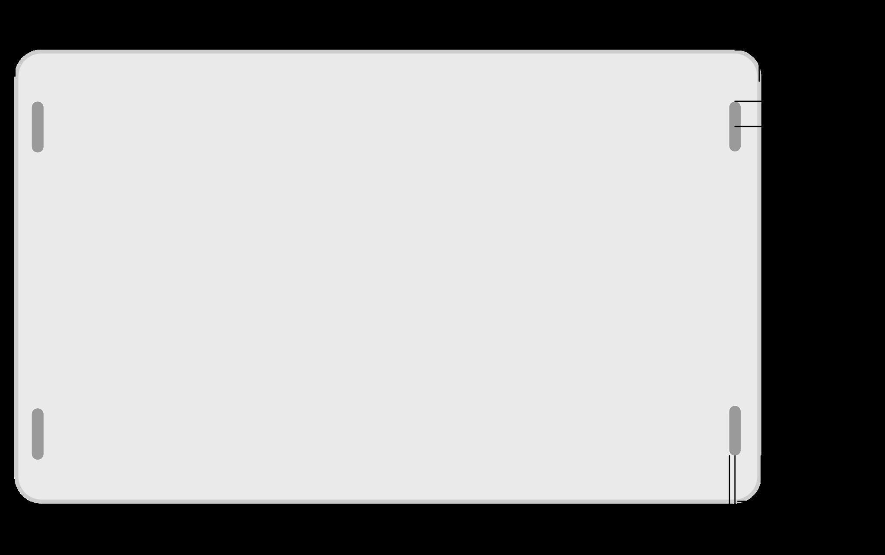

## Page 14

User’s Manual of RDC6442G(U)-DFM-RD Control System
SHENZHEN RUIDA TECHNOLOGY
7
2.2 Size of Panel
The unit of all sizes is millimeter (mm) and the size accurate to 0.1mm.
Figure

## Page 15

User’s Manual of RDC6442G(U)-DFM-RD Control System
SHENZHEN RUIDA TECHNOLOGY
8
Section3
Object
Pictures and Interfaces
CONTENTS:
Object Pictures of MainBoard
Object Pictures of Panel
Electric connection
Lamp instruction

## Page 16

User’s Manual of RDC6442G(U)-DFM-RD Control System
SHENZHEN RUIDA TECHNOLOGY
9
3.1 Object Pictures of MainBoard
For more detailed pin description, see the Chapter 4: Description of Interface Signal for
MainBoard.
Figure:
3.1-1
Object
Picture
of

## Page 17

User’s Manual of RDC6442G(U)-DFM-RD Control System
SHENZHEN RUIDA TECHNOLOGY
10
3.2 Object Pictures of Panel
Figure: 3.2-1 Object Picture of Panel

## Page 18

User’s Manual of RDC6442G(U)-DFM-RD Control System
SHENZHEN RUIDA TECHNOLOGY
11
3.3 Electric connection
3.4 Lamp instruction
RDC6442G have fifteen red lamps:
LED NUMBER
NAME
SENSE
LED1
LmtX-
X negative limit indicator
LED2
LmtX+
X positive limit
LED3
LmtY-
Y negative limit
LED4
LmtY+
Y positive limit
LED5
LmtZ-
Z negative limit
LED6
LmtZ+
Z positive limit
LED7
LmtU-
U negative limit
Figure
3.3-1
electric

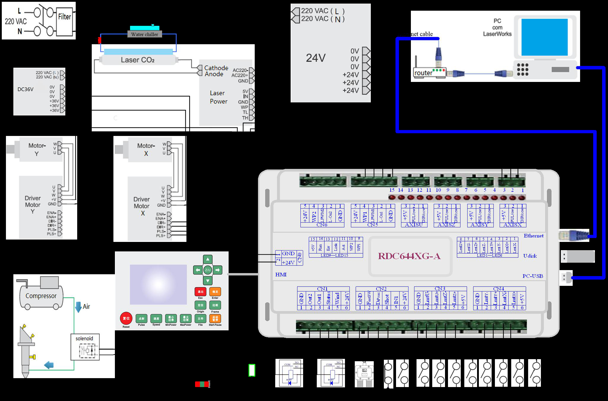

## Page 19

User’s Manual of RDC6442G(U)-DFM-RD Control System
SHENZHEN RUIDA TECHNOLOGY
12
LED8
LmtU+
U positive limit
LED9
Wp1
Indication
for
water
protect 1
LED10
Wp2
Indication
for
water
protect 2
LED11
Act
Ethernet communication
LED12
Link
Ethernet connection
LED13
Err
error
in
controller
hardware
LED14
Run
the normal running status
LED15
+5V
+5V power supply

## Page 20

User’s Manual of RDC6442G(U)-DFM-RD Control System
SHENZHEN RUIDA TECHNOLOGY
13
Section 4
Description
of Interface Signal for
MainBoard
CONTENTS:
Interface of Main Power Source CN0
Panel Signal-Cable Interface HMI
Udisk Interface
PC-USB Interface
Ethernet Interface
General Output Port CN1
General Input Port CN2
4-axle Spacing Input Interface CN3/CN4
X/Y/Z/U axle Motor Driver Interface AXIS_X~AXIS_U
Laser Power Control Interface CN5/CN6

## Page 21

User’s Manual of RDC6442G(U)-DFM-RD Control System
SHENZHEN RUIDA TECHNOLOGY
14
4.1 Interface of Main Power Source CN0
This control system employs single 24 power supply. For a certain
margin, it is suggested to select 24V/2A power. Besides, this system is
compatible with 36V power, that is to say, the 36V power of Motion
driver can directly be connected to this main power port of this system,
but generally it is not suggested to do so.
4.2 Panel Signal-Cable Interface HMI
The panel signal-cable is a pin-to-pin cable, which is included in the factory shipper bill.
4.3 Udisk Interface
Udisk is a USB-AM interface. The controller may visit the u-disk by this interface.
4.4 PC-USB Interface
PC-USB is a USB-BM interface. The controller may communicate with PC by this port.
4.5 Ethernet Interface
Using this interface, the mainboard can communicate with PC by 10/100MHZ Ethernet.
Pin to Pin Ethernet parallel line is recommended.
Pin
Symbols
Definitions
1
GND
24V power ground (input)
2
+24V
24V power positive (input)
Caution
Caution

## Page 22

User’s Manual of RDC6442G(U)-DFM-RD Control System
SHENZHEN RUIDA TECHNOLOGY
15
4.6 General Output Port CN1
Definition of general output port
Pin
Symbols
Definitions
1
GND
Power ground (output)
2
Out2
General output, with the function reserved.
3
Out1
General output, with the function reserved.
4
Status
General output for the signal port of running status. If this port is
externally connected with the relay, the relay coil is broken over
when it works; no influence is produced when it suspends working.
When its work ends or is stopped manually, the relay coil will be
cut off.
5
Wind
General output for blower control. When the blower control is
enabled, this port will output the control signal of the blower,
otherwise it will output other special control signals. When the
blower is connected and its control enabled, the blower switch can
be set separately on each layer. If the relay is connected
externally, the relay coil will be broken over when the blower is on;
the relay coil will be cut off when the blower is off.
6
+24V
24V Power positive output (If the interface of main power source is
powered with 24V power supply, this pin should be 24V; if it is
powered with 36 V power supply, this pin should be 36V.)
All outputs are isolated through the optocoupler, and 500mA current for
each, OC gate output, each can directly drive the 6V/24V relay.
4.7 General Input Port CN2
Pin
Symbols
Definitions
1
GND
Power ground (output)
2
FootSW
Input port of foot switch. The connection method is: when the
pedal is stepped down, the low-level signal will be inputted to
this port; when the pedal is released, the port will be
disconnected or the high-level signal can be inputted to this
port; when the stepped-down pedal is held for not less than
100 ms, if the machine lies idle, it can be started for work; if
the machine is in the working state, the work will be
suspended; of the machine is in the suspension, the work will
be restarted, that is to say, the function of the pedal switch is
the same as that of the “Start/Pause” key. If the interval time to
the first stepping-down of the pedal should be less than
100ms when the pedal is stepped down once again, the
Prompt

## Page 23

User’s Manual of RDC6442G(U)-DFM-RD Control System
SHENZHEN RUIDA TECHNOLOGY
16
second stepping-down of the pedal will be considered invalid
by the mainboard.
3
DrProc
Input from protective port. If the machine needs to be
protected in the special state (such as door open protection),
the protective signal can be inputted from this pin. This pin can
be enabled and prohibited. This signal is not inquired by the
mainboard if this pin is prohibited; if this pin is enabled, when
the input is high-leveled or this input port is suspended, the
machine will be protected, the work suspended and the laser
closed.
4
Shot
Input for manual laser on/off. Low level is to open laser
and high level or no-connection is to close laser.
5
IN1
General Input, with the function reserved.
6
+24V
24V Power positive output (If the interface of main power
source is powered with 24V power supply, this pin should be
24V; if it is powered with 36 V power supply, this pin should be
36V.)
4.8 4-axle Spacing Input Interface CN3/CN4
X/Y axle spacing input CN4
Pin
Symbols
Definitions
1
GND
Power ground (output)
2
LmtY-
The spacing from axle Y- and Y to 0 coordinate
3
LmtY+
The spacing from axle Y+ and Y to max. coordinate
4
LmtX-
The spacing from axle X- and X to 0 coordinate
5
LmtX+
The spacing from axle X+ and X to max. coordinate
6
Puxy
5V Power positive (output)
The spacing polarity is optional, that is to say, when the motion axle reaches the spacing
position, it will trigger a low-level signal so as to make the corresponding LED (under the
cover) light; when the motion axle leaves the spacing position, it will trigger a high-level
signal or disconnect the spacing signal so as to make the spacing indicator go out, but
when it leaves the spacing, the corresponding indicator will light and the spacing polarity
become positive. The mistaken setting of spacing polarity will result that the spacing can’t
be detected when the system is reset so as to lead to the collision of axles.
The pin definitions of Z/U axle spacing input CN3 are the same as CN4.
All XYZU axle spacing inputs are compatible to 5V/12V/24V logic level inputs。

## Page 24

User’s Manual of RDC6442G(U)-DFM-RD Control System
SHENZHEN RUIDA TECHNOLOGY
17
4.9 X/Y/Z/U axle Motor Driver Interface AXIS_X~AXIS_U
The interfaces of the above four motion axles are the same. The AXIS-X interface is
exampled.
Pin
Symbols
Definitions
1
DIR
Directional signal (OC output)
2
PUL
Pulse signal (OC output)
3
+5V
5V Power positive (output)
The polarity of directional signal for driver pulse signal can be set. Where a certain axle is
reset, it will move to the opposite direction of machine origin, which means the polarity of
directional signal for this axle is not correct. In such a case, the connection between this
axle and the motor driver can be broken first (otherwise the mainboard can not be
detected to the spacing so as to lead to the collision of this axle), and then such a polarity
can be corrected after this axle is reset completely. Upon the correction, the reset key can
be pressed against to reset the mainboard.
And, the Pulse signal can be falling edge valid or rising edge valid. The default setting is
falling edge valid.
The Pulse signal and the directional signal are all OC outputs. The
Controller must be common anode with the motor driver
4.10 Laser Power Control Interface CN5/CN6
This control system has two independent and adjustable digital laser power control
interfaces. Signals of the two interfaces are similar and the first digital interface (CN5) is
hereby exampled:
Pin
Symbols
Definitions
1
GND
Power ground (output)
2
L-ON1
Laser-enabled control interface
1. When the laser is the RF laser, this pin will not be used;
2. When the laser is a glass tube, if the used laser is outputted in
the low-level form, this pin will be connected with the laser power
enable end and used to control the ON/Off of laser.
3
LPWM1
Power control interface of laser/laser tube
1. When the laser is the RF laser, this pin will be connected with
the laser RF-PWM end;
2. When the laser is a glass tube, this pin will be connected with
the laser power PWM end and used to control the power of the
laser.
Prompt

## Page 25

User’s Manual of RDC6442G(U)-DFM-RD Control System
SHENZHEN RUIDA TECHNOLOGY
18
4
WP1
The input port of water protector for the first laser power source.
When the water protector 1 is enabled, the mainboard will detect
the input port of water protector 1. If this port is of low level, it will
be deemed normal; if this port is of high level, the mainboard will
forcibly close the laser to suspend the work in progress and the
system will warn. If the water protector 1 is not enabled, the
mainboard will not detect the input port of water protector 1 and so
the water protector 1 can be unconnected.
Water protection input must be 24V logic level.
5
L-AN1
The analog signals for Laser Power. If Glass Tube is used, this pin
is recommended to control the power of the Laser.
Please correctly select the laser type in the factory parameters.
Prompt

## Page 26

User’s Manual of RDC6442G(U)-DFM-RD Control System
SHENZHEN RUIDA TECHNOLOGY
19
Section 5
Examples of
Laser Power Interface
CONTENTS:
Brief
Examples of Glass tube Laser Power
Examples of RF-Laser

## Page 27

User’s Manual of RDC6442G(U)-DFM-RD Control System
SHENZHEN RUIDA TECHNOLOGY
20
5.1 Brief
This control system has two independent and adjustable digital laser power control
interfaces, which can be used to control glass tube laser power and RF-laser.
Please correctly select the laser type in the factory parameters, or, the laser control is
incorrect.

## Page 28

User’s Manual of RDC6442G(U)-DFM-RD Control System
SHENZHEN RUIDA TECHNOLOGY
21
5.2 Examples of Glass tube Laser Power

## Page 29

User’s Manual of RDC6442G(U)-DFM-RD Control System
SHENZHEN RUIDA TECHNOLOGY
22
5.3 Examples of RF-Laser

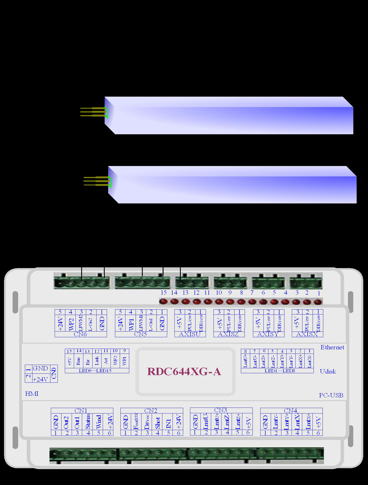

## Page 30

User’s Manual of RDC6442G(U)-DFM-RD Control System
SHENZHEN RUIDA TECHNOLOGY
23
Section 6
Examples of
Driver Interface for
Step-servo Motor
CONTENTS:
Brief
Examples of Motor Driver Connection

## Page 31

User’s Manual of RDC6442G(U)-DFM-RD Control System
SHENZHEN RUIDA TECHNOLOGY
24
6.1 Brief
The input signal end of step-servo motor driver employs the light-coupled isolation
technology. For the step-by-step impulse signal, some isolate the side OC diode from
cutoff to conduction (e.g. the valid falling edge of pulse signal inputted from the diode
minus end) and some do so from conduction to cutoff (e.g. the valid rising edge of pulse
signal inputted from the diode minus end).
When it is indicated whether the pulse signal of motor driver is the valid rising edge
or the valid falling edge, it will be subject to the pulse signal inputted from the
minus end of side OC diode.
Some input signals of motor driver are independent and some are internally of common
anode, so some have 4 external leading-out wires and some 3 wires (only the pulse and
directional signals are counted) as shown in Figure 6.1-1 and 6.1-2.
RDC644XG Controller has four groups of 3-wires motion driver interface, each interface
has one direction signal, one pulse signal, and one 5V positive output, the direction signal
and the pulse signal are all OC output.
RDC644XG controller must be common anode with the motor driver. The polarity of
the direction signal can be changed in the factory parameters, and the valid edge of
the pulse signal can also be changed.
Figure: 6.1-1 Four Inputs, Independent
Input Signal of Driver
Figure: 6.1-2 Three Inputs, Common-anode
Input Signal of Driver

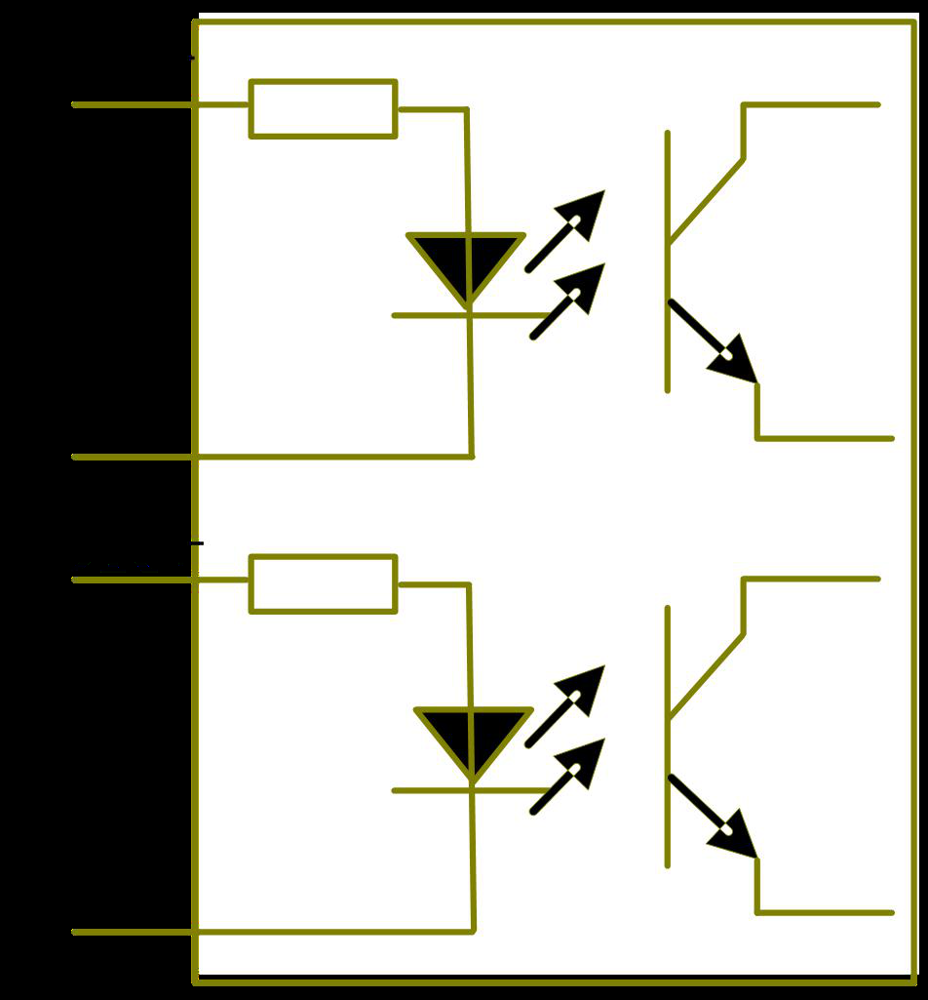

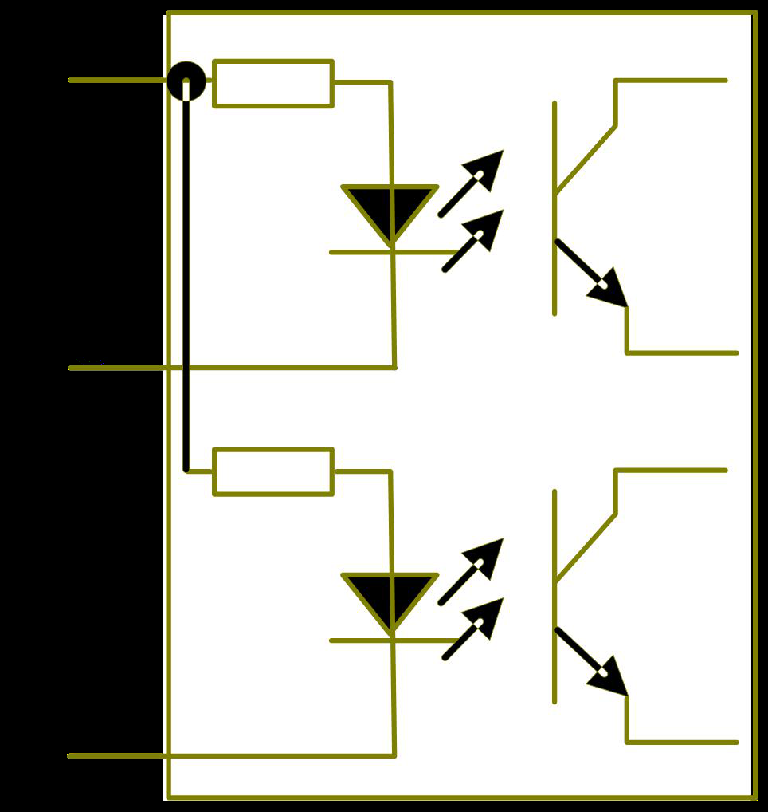

## Page 32

User’s Manual of RDC6442G(U)-DFM-RD Control System
SHENZHEN RUIDA TECHNOLOGY
25
6.2 Examples of Motor Driver Connection

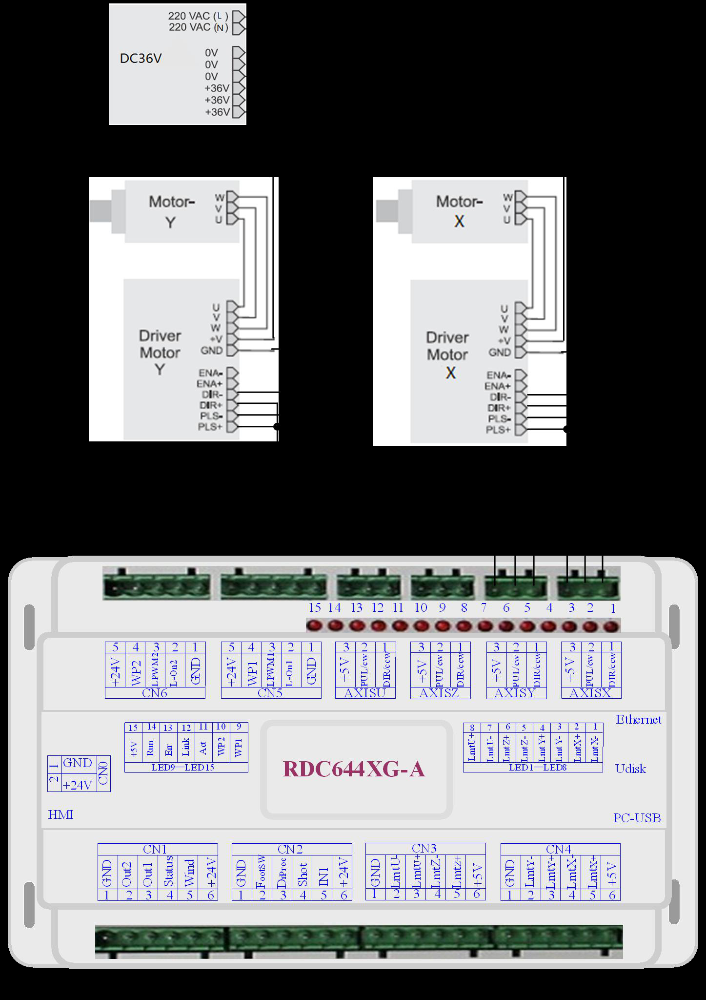

## Page 33

User’s Manual of RDC6442G(U)-DFM-RD Control System
SHENZHEN RUIDA TECHNOLOGY
26
Section 7
Examples of
IO-port Wiring
CONTENTS:
Input
Output

## Page 34

User’s Manual of RDC6442G(U)-DFM-RD Control System
SHENZHEN RUIDA TECHNOLOGY
27
7.1 Input
The two water protection inputs are 24V logic level; all other inputs are compatible with
5V/12V/24V logic level.
Input connection shown as below
Figure 7.1-1 example of input

## Page 35

User’s Manual of RDC6442G(U)-DFM-RD Control System
SHENZHEN RUIDA TECHNOLOGY
28
7.2 Output
All outputs are isolated through the optocoupler, and 500mA current for each, OC gate output, each can
directly drive the 6V/24V relay, led lamp, buzzer etc.
Output connection shown as below
Figure 7.2-1 example of output

## Page 36

User’s Manual of RDC6442G(U)-DFM-RD Control System
SHENZHEN RUIDA TECHNOLOGY
29
Section 8
Operating
Instruction of Panel
CONTENTS:
Introduction to the Panel and Keys
Introduction to the Main Interface
Z/U Key
File Key
Introduction to some alarm info

## Page 37

User’s Manual of RDC6442G(U)-DFM-RD Control System
SHENZHEN RUIDA TECHNOLOGY
30
8.1 Introduction to the Panel and Keys
8.1.1 The whole panel
3.1.1 8.1.2 Introduction to the Keys
:Reset the whole system;
:Set the relative origin;
:Let the Laser to splash;
:To track by the current file’s frame;
:The management of the memory and U disc files;
:Set the speed of the current running layer, or set the direction keys’ move
speed;
:Set the max laser power of the current running layer, or set the power of
“Laser” Key;
Reset
Laser
Max.
Power
Speed
File
Origin
Fram

## Page 38

User’s Manual of RDC6442G(U)-DFM-RD Control System
SHENZHEN RUIDA TECHNOLOGY
31
:Set the min laser power of the current running layer,
:To start or pause the work;
:To move the X axes or the left/right cursor;
:To move the Y axes or the up/down cursor;
:The Z/U key can be pressed when the system is idle or the work is finished. On
pressing this key, it will show some entries in the interface, each entry includes some
functions, Z axes move, U axes move, each axes to go home etc.;
:To stop work, or to exit to some menu;
: Validate the change;

8.2
Introduction to the Main Interface
8.2.1 The main interface
When the system is powered on, the screen will show as below:
Min.
Power
Start/
Pause
Esc
Enter

## Page 39

User’s Manual of RDC6442G(U)-DFM-RD Control System
SHENZHEN RUIDA TECHNOLOGY
32

Graph Display Area: To display the whole file’s track, and display the running
track.

Running parameters: To display the running file’s file number, speed, max
power etc.;

Coordinate: To display the current coordinate of X,Y and Z axes

Graph layer parameters: To display the layers’ information of the current file,
such as max or min power, speed etc.. When system is idle, dblclick the layer, then
users can change the layer’s parameters and the changing would be saved.

Running Status: To display the current status of the machine, such as Idle, Run,
Pause, Finish, etc.;

Running Progress Bar: To display the progress bar of the current running file;

Working Number: To accumulate the work number of the current file.

File Dimension: To display the dimension of the current file;

Net status: To display the connecting status of the Ethernet.
When work is Idle or finished, all keys can be pushed, users can select a file to run, set some
parameters, preview to a select file etc. But, when work is running or paused, some keys don’t
respond when they are pushed.
8.2.2 Speed key
Push the “Speed” key when the screen is on the main interface, it will show as below:
Figure 8.2-1

## Page 40

User’s Manual of RDC6442G(U)-DFM-RD Control System
SHENZHEN RUIDA TECHNOLOGY
33
Push the “X+/-“ Keys to move the cursor in the numeral area, and push the “Y+/-” keys to change
the value, then push the “Enter” key to save the change, push the “Esc” key to invalidate the
change.
8.2.3 Max/Min power keys
Push the “Max Power” or the “Min Power” keys when the screen is on the main interface, it will
show as below:
When “Z/U” key is pushed, the green block can move up and down to denote the changing item,
then “Y+/-” keys and “X+/-” keys can be used to change the value.
Figure 8.2-2
Figure 8.2-3
Figure 8.2-4

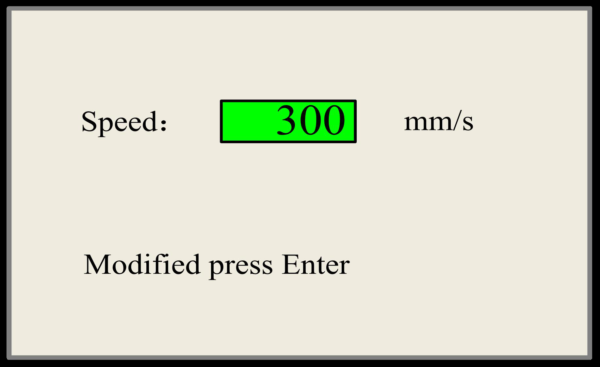

## Page 41

User’s Manual of RDC6442G(U)-DFM-RD Control System
SHENZHEN RUIDA TECHNOLOGY
34
8.2.4 Set the layer parameters
After selecting a file to preview on the main interface, user can push “Enter” key to let the cursor
move to the first layer, then “Y+/-” Keys can be pushed to select the intent layer, on that time, user
can push “Enter” key to check the selected layer’s parameters, show as below:
User can push “Z/U” Keys to move the green block on the intent parameter, then he could change
the parameter if needed. “OK” to validate the change, and “Esc” to invalidate the change.
8.3 Z/U Key
The Z/U key can be pressed when the system is idle or the work is finished. On pressing this key,
it will show some entries in the following interface:
Figure 8.2-5
Figure 8.2-6

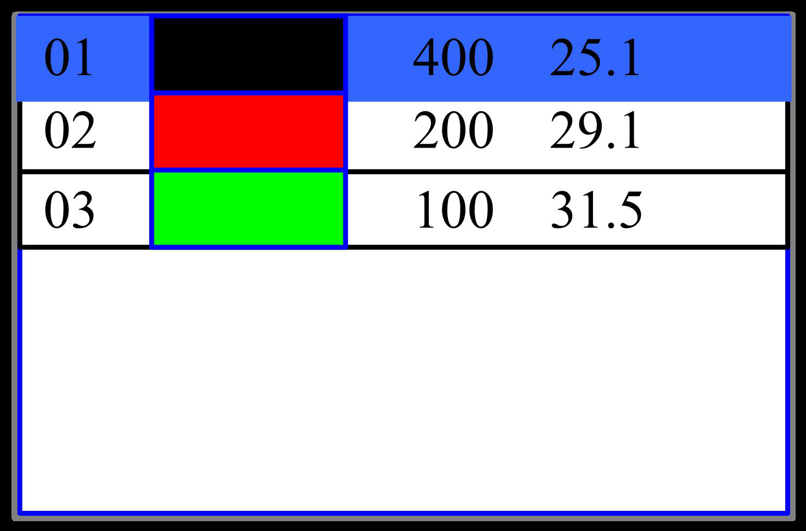

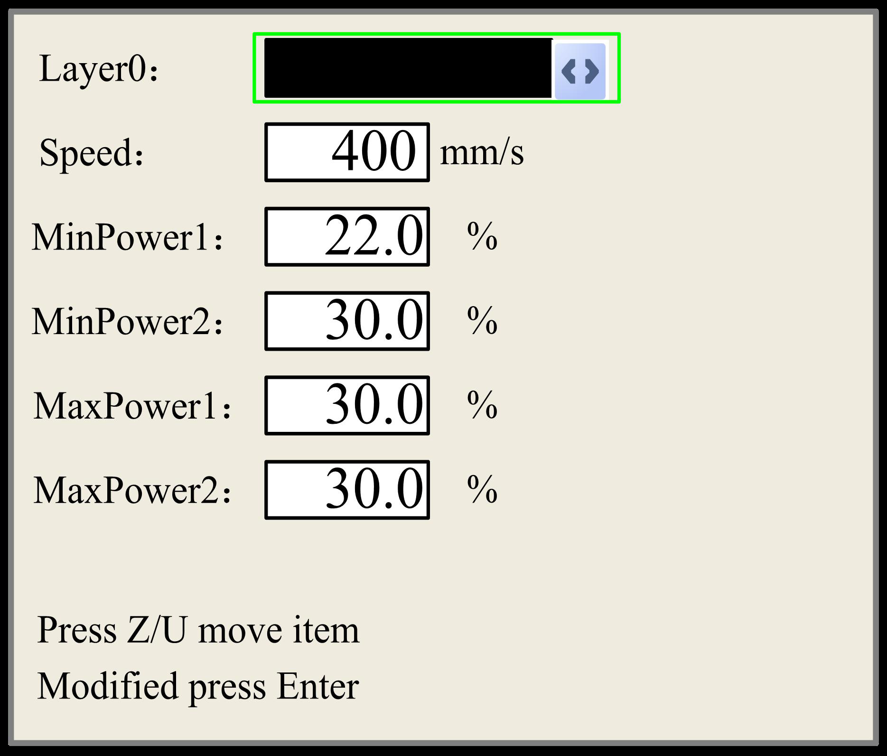

## Page 42

User’s Manual of RDC6442G(U)-DFM-RD Control System
SHENZHEN RUIDA TECHNOLOGY
35
Push “Y+/-” keys to move the green block to the anticipant item, and then push the “Enter” key to
display the sub menu.
8.3.1 Z move
When the green block is on “Z Move” item, “X+/-” keys can be used to move the z axes.
8.3.2 U move
When the green block is on “U Move” item, “X+/-” keys can be used to move the u axes.
8.3.3 Axis reset+
When the green block is on this item, push the “Enter” key to show as below:
Figure 8.3-1

## Page 43

User’s Manual of RDC6442G(U)-DFM-RD Control System
SHENZHEN RUIDA TECHNOLOGY
36
Push the “Y+/-“ Keys to move the cursor to one of the entry, then push “Enter” key to restart the
selected axis, the screen will show some information when resetting.
8.3.4 Manual set+
When the green block is on this item, push the “Enter” key to show as below:
Push “Z/U” key to move the green block, and when the green block is on the “Mode” item, push
“X+-“ keys to select the anticipant value, “Continue” or “Manual”. When “Continue”
item is
selected,
then the “Manual” item is not valid, on that time, push the direction keys to move the
corresponding axes, and when the pushed key is loosed, then the corresponding axes will finish
moving. When the Mode item is “manual”, then pushing the direction key one time, the
corresponding axes will move a fixed length, unless the scope is overstepped.
Figure 8.3-2
Figure 8.3-3

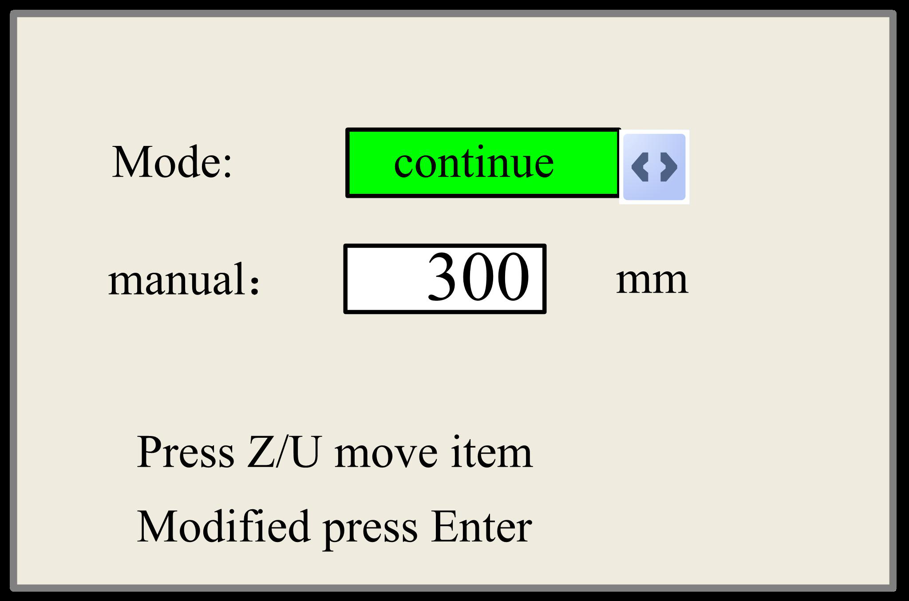

## Page 44

User’s Manual of RDC6442G(U)-DFM-RD Control System
SHENZHEN RUIDA TECHNOLOGY
37
8.3.5 Laser set+
When the green block is on this item, push the “Enter” key to show as below:
Push “Z/U” key to move the green block, and when the green block is on the “Mode” item, push
“X+-“ keys to select the anticipant value, “Continue” or “Manual”. When “Continue”
item is
selected,
then the “Laser Set” item is not valid, on that time, push the Laser key to splash the
enabled lasers, and when Laser key is loosed, then the lasers will finish splashing. When the
Mode item is “manual”, then pushing the Laser key one time, the enabled lasers will splash a fixed
time.
8.3.6 Origin set+
When the green block is on this item, push the “Enter” key to show as below:
Figure 8.3-5
Figure 8.3-4

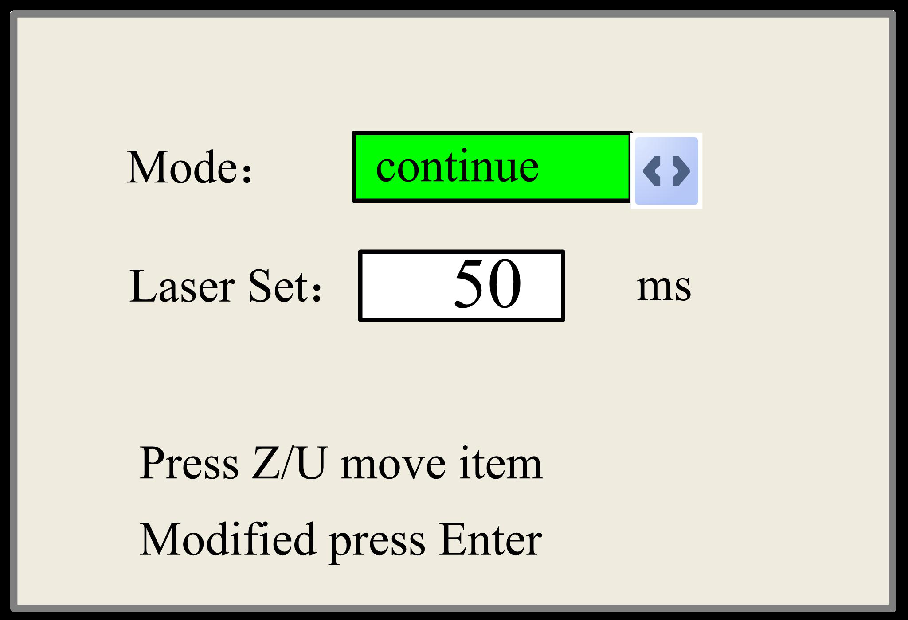

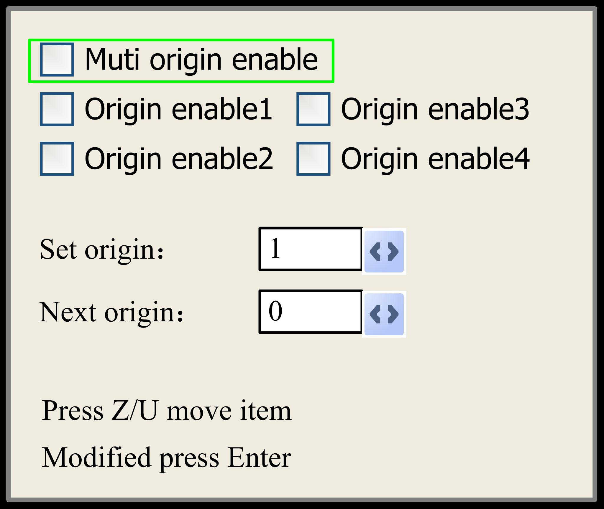

## Page 45

User’s Manual of RDC6442G(U)-DFM-RD Control System
SHENZHEN RUIDA TECHNOLOGY
38
Push “Z/U” key to move the green block to the anticipant item, and when the green block is on
“enable” items, push “Enter” key to enable or disable the item, when enabled, the small diamonds
is green, and when disabled, the small diamonds is grey. When the green block is on the “Set
origin” item or the “Next origin” item, push the “X+-“ keys to select the value.
Pay attention to if when the green block is on the “Set origin” item, push the “X+-“ keys to select a
value, then, “Enter” key must be pushed to valid the change, or, the change is invalid.
Each item introduced as below:

Multiple Origins Enable: “Yes” or “No” can be selected. If you select “No”, the
system will use the single-origin logic. You can press the “Origin” key and set the origin,
and only this origin can become valid. If you select “Yes”, the system will use the
multiple- origin logic and the “Origin” key on the keyboard become invalid. In such a case,
the parameter of each origin must be set in the menu as follows.

Origin Enable1/2/3/4: after the multiple-origin logic is enabled, the four origins
can independently be prohibited and enabled.

Set Origin 1/2/3/4: after the multiple- origin logic is enabled, you can stop the
cursor at “Set as Origin 1/2/3/4”. Press the “Enter” key on the keyboard and the system
will take the coordinate figures of current X/Y axles as the corresponding ones to the
origin 1/2/3/4.

Next Origin: there are such five digits as 0~4 for option, which are the origins to
be used for the next figure. Origin 0 means the origin set by the “Origin” key on the panel
in the single- origin logic. 1~4 means the serial number of the origins in the multiple-
origin logic. Next origin can be modified to any one of origin 1~4, so as to control the start
location of next work (the premise is that the origin is enabled), but it can’t be modified to
origin 0.
Once the multiple- origin logic is selected and if the serial number
of the next origin is 1 and four origins are enabled, when the memory
file function is started or the processing file is uploaded into the PC
and this file selects “Take the Original Origin as current Origin”, the
work started for each time will use different origins. The rotation order
of origin is 1->2->3->4->1->2…….
8.3.7 Set Fact Para
After the “Set Fact Para” is selected and the Enter key pressed, the interface will show the specific
password to be entered when set as default parameter.
Prompt

## Page 46

User’s Manual of RDC6442G(U)-DFM-RD Control System
SHENZHEN RUIDA TECHNOLOGY
39
Push “X+/-” keys and “Y+/-” keys to select the characters, and push the “Enter” key to valid the
characters, when finishing enter the password ,that is to say, the six characters, if the password is
error, it prompts there is some error, or, all parameters are stored.
After the manufacturer regulates all parameters of the machine well
(including all manufacturer parameters and user parameters), this
function can be used to store the well-regulated parameters to help
users to recover the original parameters (including all manufacturer
parameters and user parameters) through selecting “Recover Para”
when they regulate parameters improperly.
8.3.8 Def Fact Para
After the “Def Fact Para” is selected and the Enter key pressed, the “Successful Recovery” dialog
box will pop up to prompt that all manufacturer parameters and user parameters are recovered
successfully. You can return to the previous menu by press the Enter key.
8.3.9 Auto Focus
When the cursor stops at “Auto Focus”, press the Enter key to search for the focus(When there is
z axes, and the z axes reset function is enabled, the auto focusing is valid); press the Esc key to
return the prior menu.
8.3.10 Language
The item “Language” helps you to select a appropriate langue which is displayed on the pane:
Figure 8.3-6
Prompt

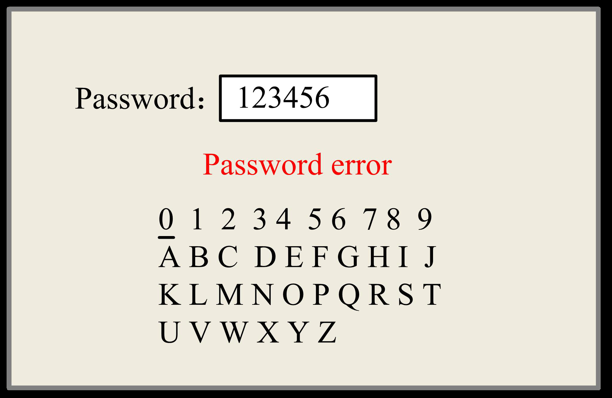

## Page 47

User’s Manual of RDC6442G(U)-DFM-RD Control System
SHENZHEN RUIDA TECHNOLOGY
40
8.3.11 IP Setup
When the green block is on this item, push the “Enter” key to show as below:
Push “Z/U” key to move the changing item, then push “X+/-” keys and “Y+/-” keys to change the
value, when all the IP value and the Gateway value are changed, push “Enter” key to validate the
change, or “Esc” key to invalidate the change.
8.3.12 Diagnoses
If the “Diagnoses” item is pressed, the system will show as below:
Figure 8.3-7
Figure 8.3-8

## Page 48

User’s Manual of RDC6442G(U)-DFM-RD Control System
SHENZHEN RUIDA TECHNOLOGY
41
This interface shows some system input information, such as limiter status, the status of the water
protecting, and the status of the foot switch etc.. When the input is validated, the color frame will
be green, otherwise it’s gray.
8.3.13 Screen Origin
If the “Screen Origin” item is pressed, the system will show as below:
There are four entries to be selected: Top Left, Top Right, Bottom Left and Bottom Right. When
one is selected, the previewed graph on the screen would be enantiomorphous based on X or Y
direction.
Figure 8.3-9
Figure 8.3-10

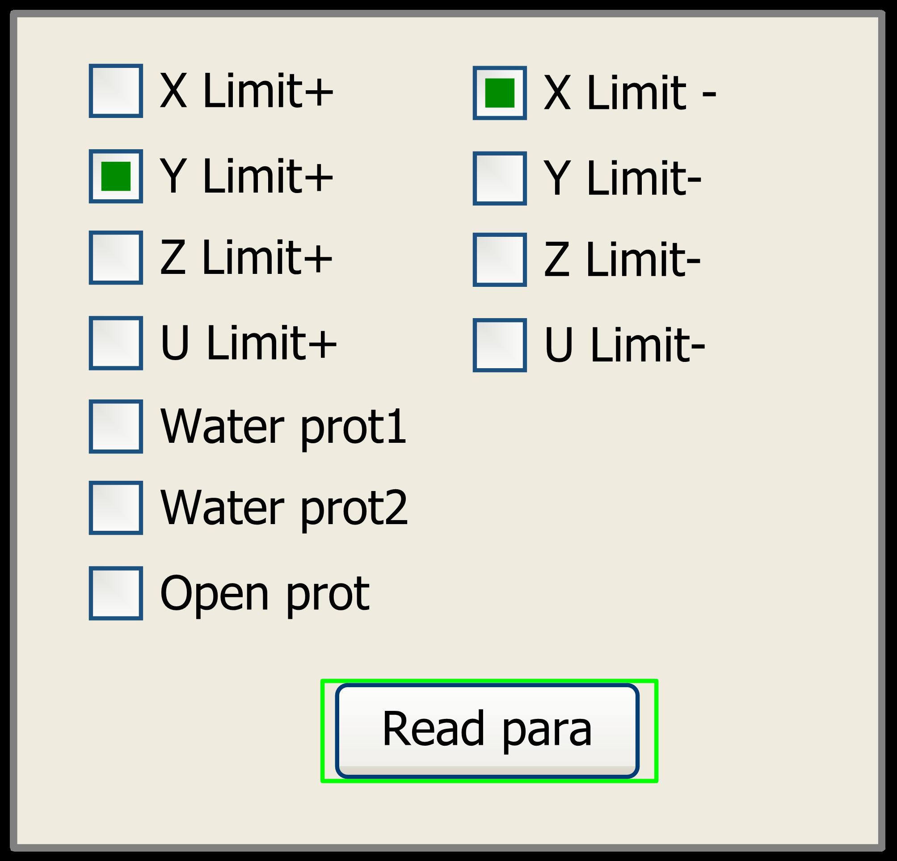

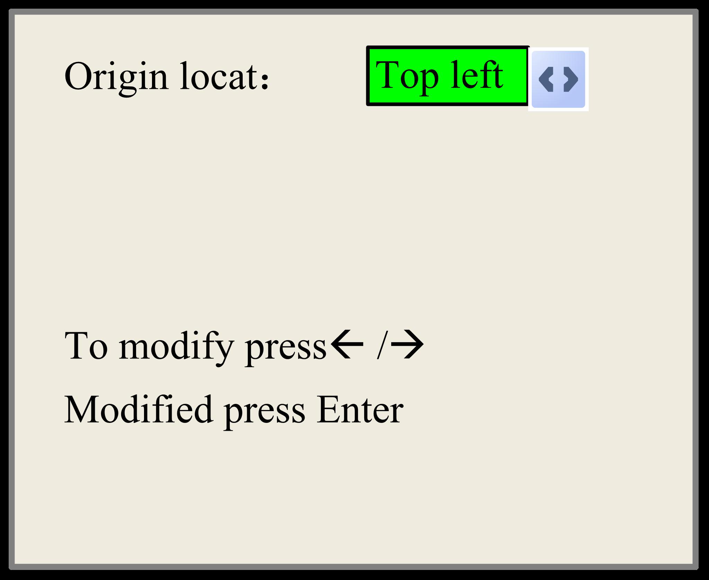

## Page 49

User’s Manual of RDC6442G(U)-DFM-RD Control System
SHENZHEN RUIDA TECHNOLOGY
42
This item is only used to preview the file on the screen, and it is no
meaning to the machine’s movement.
8.4 File Key
8.4.1 Memory File
On the main interface, if “File” key is pressed, it will show as below:
When showing this menu, the system would read the memory file firstly, the file name and the
work times would be listed in the area, and the selected file is previewed in the bottom right area.
“Y+/-” keys could be used to move the cursor on the file name list.
When the cursor is on a target
file name, presses the “Enter” key, the selected file will be previewed on the main interface, and
then if “Esc” key is pushed, the preview will disappear.
“X+/-” keys could be used to move the cursor left and right. All the item show as below:

Read mem file: read the memory file list;

Udisk: read the U disk file list;

Other: the other operation of the memory files;

Run: To run the selected file;

Track: To track the selected file, and the track mode is optional;

Work time: To forecast the running time of the selected file, and the time is
accurate to 1ms;

Clear count: To clear the running times of the selected file;

Delete: To delete the selected file in the memory;
Caution
Figure 8.4-1

## Page 50

User’s Manual of RDC6442G(U)-DFM-RD Control System
SHENZHEN RUIDA TECHNOLOGY
43

Copy to Udisk: To copy the selected file to Udisk;
If the “Other” entry is pressed, the system will show as below:

Current work time: To forecast the running time of the current file(the current
file No. is showed on the main interface), and the time is accurate to 1ms.

Clear all count: To clear the running times of every file in the memory

Delete all file: To delete all memory files

Format speedily: To format memory speedily, and then all the files in memory
will be deleted.

Format drastically: To format memory drastically, and then all the files in
memory will be deleted.

Total: the total running times of all the files.
8.4.2 U Disk File
If the “Udisk” entry in figure 8.4-1 is pressed, the system will show as figure 8.4-3, and the
operation method is all the same as figure 8.4-1.
Figure 8.4-2

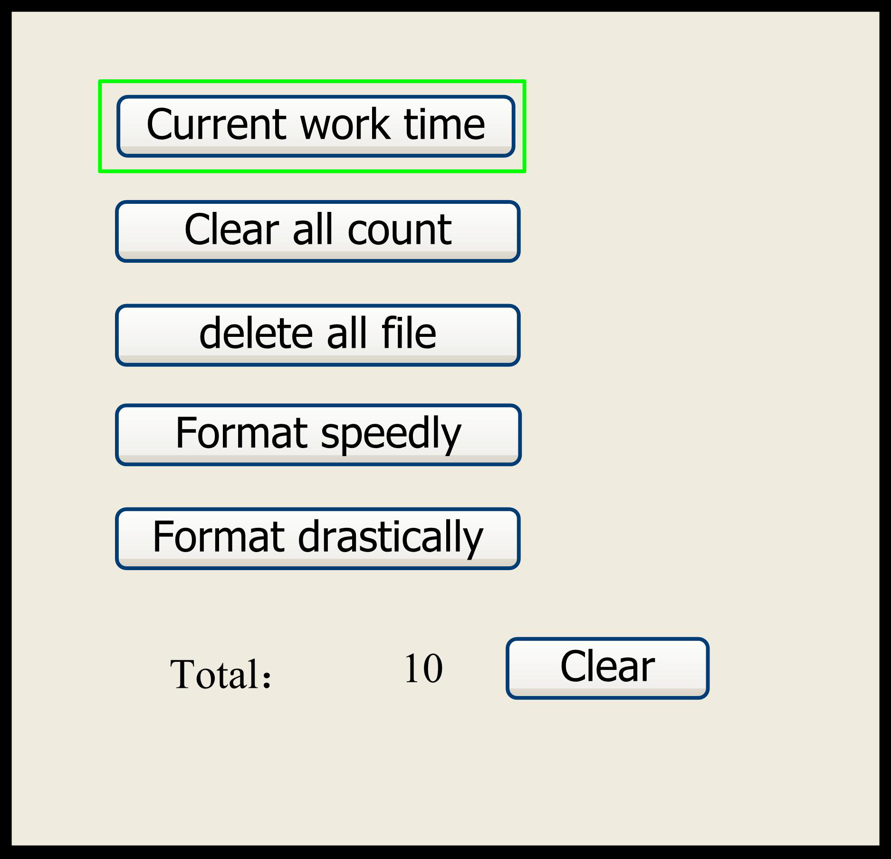

## Page 51

User’s Manual of RDC6442G(U)-DFM-RD Control System
SHENZHEN RUIDA TECHNOLOGY
44

Read Udisk: read the file list in the Udisk;

Copy to memory: copy the target Udisk file to the memory;

Delete: delete the selected Udisk file;
This system supports such file formats of Udisk as FAT32 and
FAT16, but it can identify them when the files are put under the root
directory of Udisk. The file name of more than 8 characters will
automatically be cut out by the system. The file name that has only
English letters and digits will not show when they are copied to the
mainboard. The files copied from the mainboard to Udisk will be
placed under the root directory of Udisk.
8.5 Introduction to some alarm info
When users are operating the system, or when the machine is running, some alarm information
such as water protecting error maybe shows as below:
Figure 8.4-3
Prompt

## Page 52

User’s Manual of RDC6442G(U)-DFM-RD Control System
SHENZHEN RUIDA TECHNOLOGY
45
Push “Enter” key or “Esc” key, the system will execute some relative steps.
Figure 8.5-1

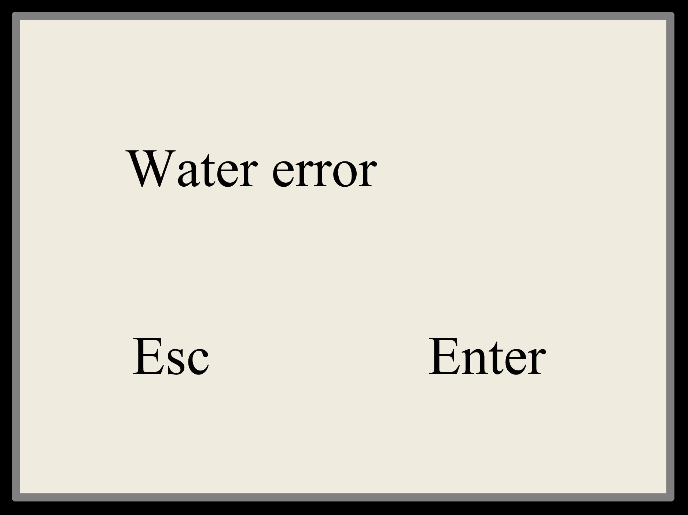

## Page 53

User’s Manual of RDC6442G(U)-DFM-RD Control System
SHENZHEN RUIDA TECHNOLOGY
46
Section 9
Manufacturer/User
Parameters Explanation
CONTENTS:
Manufacturer parameters
User parameters

## Page 54

User’s Manual of RDC6442G(U)-DFM-RD Control System
SHENZHEN RUIDA TECHNOLOGY
47
9.1 Manufacturer parameters
（1）Motor parameters
X/Y/Z/U axle parameters

Direction Polarity: Modification of direction polarity can move the motor to the
opposite direction. The modification purpose can move this axle to the origin on resetting.
If this axle moves far from the origin on resetting, it means the direction polarity of this
axle is wrong in setting and should be modified.

Spacing Polarity: it is used to set the high and low level mode of spacing signal.
When the motion axle arrives at the spacing position and input a low-level signal to the
mainboard, the spacing polarity at this time should be set to be minus.

scope: it means the farthest distance that the motion axle can move, which is
determined in accordance with the actual condition of the machine.

Distance from Origin to Hard Spacing: if this axle enables hard-spacing
protection, generally this value should be set to be 2~5mm; if it is set to be 0, when this
motion axle moves to the smallest coordinate, i.e. 0, this spacing may be validate, which
may wrongly triggers the hard-spacing protection and scram the machine. If the
hard-spacing protection is not enabled, this value can be set to be 0~5mm.

Control Mode: Double pulse or direction+single pulse are optional, in general,
direction+single pulse is selected.

Motor Stepping: it means the impulse equivalent, the absolute distance gone
by the corresponding motion axle when a pulse is delivered to the motor. Prior to the
correct setting of this value, a large rectangle can be cut with the machine (the larger the
figure is, the smaller the difference is). The motor stepping can automatically be
calculated according to the figure length and measuring length.

Hard-spacing Protection: it is used for whether the hard-spacing protection of
this axle is enabled.

PWM Rising edge valid：To set the motor driver’s pulse signal rising edge valid
or falling edge valid. If this item is disabled, the pulse is falling edge valid, or, it’s rising
edge valid.

Reset Enable: if the machine is provided with this axle, its “Reset Enable”
should be opened; if no, its “Reset Enable” should be prohibited.

Takeoff Speed: it means the speed of the motion axle in direct start from the
idle condition. If this value is excessively large, it will make the motor lose steps, jar and
even squeak; if small, it will reduce the running speed of the whole figure. If the inertia of
the motion axle is larger (the axle is heavier), you can set a smaller takeoff speed; if
smaller (the axle is lighter), you can increase the takeoff speed. For example, the typical
value is 5~30mm/s.

Maximum Speed: it means the maximum limit of motion speed that this axle
can bear. This parameter has something to do with the driving force of motor, the inertia
of motion axle and its drive ratio. For example, the typical value is 200~500mm/s.

Maximum Acceleration: it means the maximum acceleration of the motion axle
in accelerated or decelerated motion. If the acceleration is set too large, it will make the

## Page 55

User’s Manual of RDC6442G(U)-DFM-RD Control System
SHENZHEN RUIDA TECHNOLOGY
48
motor lose steps, jar and even squeak; if too small, it will cause the reduction of
acceleration so as to reduce the running speed of the whole figure. For the axles with
larger inertia, such as Y axle corresponding to the beam, its typical setting range is
800~3000mm/s2; for the axles with smaller inertia, such as X axle corresponding to the
car, its typical setting range is 8000~20000mm/s2.

Scram Acceleration: if this axle enables the hard-spacing protection, when this
axle moves to the spacing position, it will scram operation at the scram acceleration.
This value can be 2~3 times of the maximum acceleration for this axle.
Key parameters

Key Move Takeoff Speed: it means the starting speed to move this axle by
way of the keys on the keyboard, which can’t be higher than the takeoff speed.

Key Move Acceleration: it means the acceleration to move this axle by way of
the keys on the keyboard, which can’t be higher than the maximum acceleration of this
axle.

Key Polarity: it is used to control the movement direction of the axle that is
moved through manual operation of the keys. After the direction polarity is correctly set,
if you press the directional keys on the operating panel, this axle will move to the
opposite direction. In such a case the polarity of keys should be modified.
（2）Laser parameters

Laser Configuration: single laser and double lasers are available for option
and set in accordance with the laser-tube quantity provided by the manufacturer.

Laser Type: glass tube, RF laser (not need pre-ignition pulse) and RF laser
(needing pre-ignition pulse) available for option.

Laser Attenuation Quotiety

Laser Enable: When double lasers are used, then each laser can be
respectively enabled or disabled.

Minimum Power

Maximum Power

Laser PWM Frequency

Pre-generation Frequency

Pre-generation pulse scale: When the laser is RF-laser and it’s need to
pre-generate PWM, then set the Pre-generation Frequency and the Pre-generation
pulse scale.

Water Protector Enabled: When the water protector is enabled, the mainboard will
detect the input port of water protector. If this port is of low level, it will be deemed normal; if this
port is of high level, the mainboard will forcibly close the laser to suspend the work in progress
and the system will warn. If the water protector is not enabled, the mainboard will not detect the
input port of water protector and so the water protector can be unconnected.
Laser PWM Frequency is used to set the pulse frequency of control signal used by this
laser, in general, glass tube is about 20KHZ, RF laser is about 5KHZ; the maximum/minimum

## Page 56

User’s Manual of RDC6442G(U)-DFM-RD Control System
SHENZHEN RUIDA TECHNOLOGY
49
power (%) is used to set the limit power of this laser, that is to say, during the operation, the
maximum power set by the user can’t be higher than that set here and the minimum power
set by the user can’t be less than that set here, either. When a laser’s power is attenuated,
then the laser attenuation quotiety may be set
If it is only provided with the single laser, it can show the one-path
parameter.
（3）Other manufacturer parameters
Machine configuration

Machine Type: In most cases, the general engraving machine should be
selected and other types used for specific purposes.

Transmission Mode: generally the “Belt Stepping Type” should be made
choice of. The control algorithm will be changed a little when other types are selected.

Feeding Mode: it has single-way mode and two-way mode for option. If it is of
single-way feeding, it is unnecessary to check the coordinates. Feeding can be
conducted in the single-way mode; if it is of two-way feeding, the system will check the
maximum and minimum coordinates. The odd sequence means feeding should be done
to one direction and the even sequence means feeding done to the other direction. The
initial direction for the first time can be changed through setting the directional polarity or
modifying the plus and minus values of the feeding length.

Power-Off-Restart Delay: it can be set to be 0~3000ms. After the power-off of
the electricity grid, the power supply of the system will not drop to 0 at once. There is a
delay during this time. The delay value set here should basically consistent with the
actual off-delay value. If the deviation of set value is larger, on the de-energizing for
continuous engraving, either the figure processed for the second time is not closed with
that before the cutoff, or it is coincided with that too much.
After the configuration parameters in the manufacturer parameters,
such as directional polarity, control mode, laser type and laser PWM
frequency, are modified, the system should be reset. Such a
modification can function upon the resetting of the system.
Enable parameters

Door Opening Protection: If this item is enabled, then the door opening
protection must be connected to the controller, or, the machine will not run.

Whether to enable the blower: If using wind out port to control the blower by
the graph layer parameter, this item must be enabled, or, the wind output is a signal for
other using.
Prompt
Prompt

## Page 57

User’s Manual of RDC6442G(U)-DFM-RD Control System
SHENZHEN RUIDA TECHNOLOGY
50
9.2 User parameters
（1）Cutting parameters(Only affect cutting arts)

Idle Move Speed: this parameter decides the highest speed of all non-lighting
lines for the machine in the movement process.

Idle Move Acceleration: it means the highest acceleration of all non-lighting
lines. Idle stroke speed and idle stroke acceleration can be set higher to reduce the
working time of the whole figure, but if they are set too high, it may cause the jarring of
track, so comprehensive consideration should be given to the setting.

Idle Move Delay：If this parameter is zero, then after idle moving there is no
delay, or, there is delay and the speed will decrease to turn off speed.

Turning Speed: it means the speed of turning at the acute-angle corner, which
is also the highest speed in the whole cutting process.

Turning Acceleration: it means the acceleration of turning at the acute-angle
corner when cutting. If the two speeds are set too high, jarring will happen to the turning;
if set too low, it will influence the cutting speed. This acceleration is the least value of the
whole graph.

Cutting Acceleration: it means the highest acceleration value in the whole
cutting process.

Acc Factor: This parameter indicates how speedy the cutting acceleration is
changing.

G0 Acc
Factor: This
parameter
indicates
how
speedy the
idle
move
acceleration is changing.

Speed Factor: This parameter indicates the cutting speed of the arc of various
curvatures.
●Key Setting: This is a button but not a parameter, this button is used to recommend
some experiential cutting parameters.
（2）Scanning parameters(Only affect scanning arts)

X-axle Starting Speed

Y-axle Starting Speed

X-axle Acceleration

Y-axle Acceleration
The above four parameters are used to set the starting speed and acceleration of
two axles on the scanning. The higher the two speeds are, the quicker the scanning is.

Scanning Line-feed Speed: this parameter is specially used to control the
highest speed at which that the previous line vertically moves to the next line in the
scanning mode. If the space between lines is larger during the scanning or if the
distance of each block is larger during the scanning and deblocking of figure, it is
necessary to position each line or block accurately. In such a case the speed of
scanning line-feed can be set as a lower value.

Scanning Mode: it is divided into general mode and special mode for option. If
special mode is used, the laser power should be increased. The smaller the speckle

## Page 58

User’s Manual of RDC6442G(U)-DFM-RD Control System
SHENZHEN RUIDA TECHNOLOGY
51
percentage is, the more the laser power reduces. The laser power to set should be
larger in order to reach the same scanning depth. The purpose to select the special
mode is to make the laser light at high power and short time. On the depth scanning the
effect that the bottom is flatter is obtained, but it should be noticeable that if the speckle
adjustment is not appropriate, it can achieve this goal. If the high power remains short,
the lighting mode will influence the life of the laser. The system will default the selection
of general mode.

Speckle Size: When the general mode is selected as the scanning mode, this
parameter will become ineffective; when the special mode is selected, this parameter
will become effective. The controller will control this parameter among 50%~99%.
The cutting and scanning parameters can’t exceed the limited ones
in the axle parameters. If so, the setting will become ineffective and
the system will automatically cover the parameters with the axle
parameters.
（3）Feeding parameters

Before-feeding Time Lag: settable at 0~300s. The lagged time can facilitate
user’s feeding and picking on the feeding device.

After-feeding Time Lag: settable at 0~9.9s. It can facilitate the feeding
device’s delaying in jarring after moving to the correct position and waiting for the 2nd
work after the feeding axle stands still completely.

Progressive feeding: If this item is enabled, then the dummy array graph on Y
direction will run in the same position, running one line graph, the U axes moving one
time to feed, the moving length of U axes is the interval of the two lines graph on Y
direction.

Progressive feeding repay: Because of the imprecision of U axes’ moving,
there can set a value to repay the interval of the two lines graph on Y direction.
（4）Reset parameters

Reset Speed: it means the speed of X/Y-axle linkage reset to the origin.

X axle start-up reset(Auto home)

Y axle start-up reset(Auto home)

Z axle start-up reset(Auto home)

U axle start-up reset(Auto home)
You can select “Yes” or “No” in the field of the above four parameters, which is used to
confirm whether each axle can be reset on the startup.
（4）Go scale parameters

Go scale Mode: “Blanked Bordering” means idling to start border preview;
“Outputted Border Cutting” can manually cut off the well-processed figure; “4-corner
Dotting” means to emit the light at four corner points of the frame to make a point and
turn off light. The size and position of this figure can be checked intuitively through the
four points. The bordering speed is the speed value set on the keyboard when the
system is idle. For light output, its minimum/maximum power is the corresponding value
Prompt

## Page 59

User’s Manual of RDC6442G(U)-DFM-RD Control System
SHENZHEN RUIDA TECHNOLOGY
52
set on the keyboard when the system is idle (The lasering power on the 4-corner dotting
means the well-set maximum power).

Go scale Blank: It means whether to extend a certain length outside the actual
frame of the figure on the preview/cutting of frame.
If the frame crosses the border, the interface will prompt it. If the
Enter key is pressed at this time, the system will cut the border at
the maximum/minimum coordinates first, and then border the
figure. This bordering can be given up.
（5）Other user parameters

Array Mode: Two-way array or one-way array can be selected. Two-way array
means the to-and-fro cutting of array in sequence; one-way array means the cutting of
array from one direction to another. On selecting one-way array, the elements of each
array are the same in action mode and completely uniform in action fluency, which takes
a little more time than two-way array. Two-way array is the default option.

Back Position: The origin (the relative origin) and the machine’s absolute origin
can be selected. This parameter decides the parking position of laser head after each
work.

Focus Setting: it means the distance from the focal point of laser head lens to
Z-axle origin. When there is no automatic focusing function, this parameter becomes
invalid.

Backlash X: The X axes’ backlash, accurate to 1um.

Backlash Y: The Y axes’ backlash, accurate to 1um.
Prompt

## Page 60

User’s Manual of RDC6442G(U)-DFM-RD Control System
SHENZHEN RUIDA TECHNOLOGY
53
Thank you for your selection of our production!
All the copyright of this manual is owned by Ruida technology. Any person or company can
not copy upload and send the manual without Ruida’s permission.
Content will be revised or modified. We will not send message to every users.
If there are any question or suggestion about our products and manuals, please tells us.
Tel：(086)0755-26066687
Fax：(086)0755-26982287
Adress ：202-203,B-Block,Technology Building,NO.,1057 Nanhai Avenue,Nanshan district,
Shenzhen, Guangdong , China.
Website：www.rd-acs.com
