# nova_plus_series_unified_user's_manual.pdf

## Page 1

USERS MANUAL
NOVA PLUS SERIES
www.thunderlaser.com
DONGGUAN THUNDER LASER EQUIPMENT CO.,LTD
tech@thunderlaser.com
Room1101, Building 3, No.68, Xingzhou Road, Shatian Town,
Tel:(86) 18103043363
Dongguan City, Guangdong Province, China
1
THUNDER LASER
SYSTEMS
NOVA PLUS Series
Unified User’s Manual
For Nova Plus 24,35,51
Thunder Laser
www.thunderlaser.com
tech@thunderlaser.com
December 2024
DONGGUAN THUNDER LASER EQUIPMENT CO.,LTD
Dongguan City, Guangdong Province, China

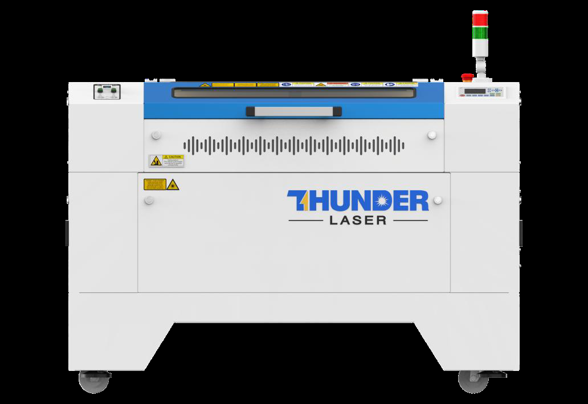

## Page 2

USERS MANUAL
NOVA PLUS SERIES
www.thunderlaser.com
DONGGUAN THUNDER LASER EQUIPMENT CO.,LTD
tech@thunderlaser.com
Room1101, Building 3, No.68, Xingzhou Road, Shatian Town,
Tel:(86) 18103043363
Dongguan City, Guangdong Province, China
2
Introduction
This manual has been designated as the thunder laser systems, laser cutting machine installation and user
guide; The manual is divided into five chapters, including general information instructions, safety instructions,
the key components of every laser cutting systems and the installation steps, operation instructions and
maintenance instructions from THUNDERLASER Company.
First, it should be emphasized that the installation of each system must meet the requirements, and make it
consistent with the installation requirements of THUNDERLASER. If not, the machine will not working properly，
poor performance, life shortened, maintenance costs increased and even machine damage .
The note is for getting a specific requirement of system installation, and we hope every customer try to
understand these notes before installation and usage, thus you can correctly install and use. If you meet any
installation problems, you can contact our technical staff and customer service staff.

## Page 3

USERS MANUAL
NOVA PLUS SERIES
www.thunderlaser.com
DONGGUAN THUNDER LASER EQUIPMENT CO.,LTD
tech@thunderlaser.com
Room1101, Building 3, No.68, Xingzhou Road, Shatian Town,
Tel:(86) 18103043363
Dongguan City, Guangdong Province, China
3
Contents
CHAPTER 1.
GENERAL...........................................................................................................................................................5
1.1
GENERAL INFORMATION.............................................................................................................................................................5
1.2
DESIGNATED............................................................................................................................................................................ 6
1.3
DISPOSAL REMARKS...................................................................................................................................................................6
1.4
TECHNICAL DATA / DEVICE SPECIFICATION.....................................................................................................................................7
1.5
MANUFACTURER'S LABEL...........................................................................................................................................................9
CHAPTER 2.
SAFETY............................................................................................................................................................ 10
2.1
GENERAL SAFETY INFORMATION................................................................................................................................................10
2.2
LASER SAFETY INFORMATION.................................................................................................................................................... 11
2.3
SAFETY PRECAUTIONS WHEN OPERATING THE DEVICE...................................................................................................................11
2.4
WARNING AND INFORMATION LABELS........................................................................................................................................12
CHAPTER 3.
PROCESS OF INSTALLING.................................................................................................................................15
3.1
UNPACKING........................................................................................................................................................................... 15
3.2
LOCATION..............................................................................................................................................................................15
3.3
BEFORE INSTALLATION............................................................................................................................................................. 16
3.4
EXHAUST SYSTEM – REQUIREMENTS.......................................................................................................................................... 19
3.5
AIR SYSTEM – REQUIREMENTS..................................................................................................................................................19
3.6
COMPUTER – REQUIREMENTS...................................................................................................................................................20
3.7
CONNECTIONS........................................................................................................................................................................21
3.7.1
Connecting the Mains....................................................................................................................................................21
3.7.2
Connecting the Computer..............................................................................................................................................22
3.7.3
Connecting the Air System.............................................................................................................................................23
3.7.4
Connecting the Exhaust System.....................................................................................................................................24
CHAPTER 4.
OPERATION..................................................................................................................................................... 26
4.1
MACHINE VIEW......................................................................................................................................................................26
4.2
ON/OFF SWITCH...................................................................................................................................................................31
4.3
HOW TO SETUP THE OEM SOFTWARE........................................................................................................................................32
4.3.1
Software installation..................................................................................................................................................... 32
4.3.2
Make connection between PC and machine..................................................................................................................34
4.4
HOW TO USE THE DISPLAY........................................................................................................................................................37
4.4.1
Function of the Buttons................................................................................................................................................. 37
4.4.2
The main interface.........................................................................................................................................................39
4.4.3
Speed button..................................................................................................................................................................40
4.4.4
Max Power buttons........................................................................................................................................................40
4.4.5
Set the Layer Parameters...............................................................................................................................................40
4.4.6
Menu button..................................................................................................................................................................41
4.4.7
File button......................................................................................................................................................................41
4.5
OPTIONAL LENSES...................................................................................................................................................................44
4.5.1
HOW TO USE DIFFERENT LENS...............................................................................................................................................44
4.5.2
How to replace different lens.........................................................................................................................................44
4.5.3
HOW TO USE DIFFERENT NOZZLE............................................................................................................................................45
4.6
HOW TO FOCUS......................................................................................................................................................................46

## Page 4

USERS MANUAL
NOVA PLUS SERIES
www.thunderlaser.com
DONGGUAN THUNDER LASER EQUIPMENT CO.,LTD
tech@thunderlaser.com
Room1101, Building 3, No.68, Xingzhou Road, Shatian Town,
Tel:(86) 18103043363
Dongguan City, Guangdong Province, China
4
4.7
HOW TO USE THE TL-TIMER.....................................................................................................................................................47
4.8
HOW TO USE AIR-ASSIST CONTROL ........................................................................................................................................... 49
4.9
HOW THE HEAT ALARM SYSTEM WORKS......................................................................................................................................50
4.10
THE FIRST TIME RUNNING THE LASER........................................................................................................................................ 52
4.11
WORKSTATION AREA INDICATION...............................................................................................................................................55
4.12
HOW TO USE THE CHUCK ROTARY AXIS ATTACHMENT....................................................................................................................56
4.13
FOR LASER ENGRAVING........................................................................................................................................................... 58
CHAPTER 5.
MAINTENANCE................................................................................................................................................59
5.1
CLEANING THE LASER MACHINE................................................................................................................................................59
5.2
CLEANING THE OPTICAL PARTS..................................................................................................................................................60
5.2.1
Cleaning the Focus Lens.................................................................................................................................................60
5.2.2
Cleaning the Mirrors......................................................................................................................................................62
5.2.3
Cleaning Laser Combiner...............................................................................................................................................64
5.3
CLEAN THE COLLING SYSTEM............................................................................................................................................ 65
5.4
CHECK THE BEAM PATHMAINTAIN THE X/Y/Z RAILS.....................................................................................................................67
5.5
CHECK THE BEAM PATH........................................................................................................................................................... 68
5.6
MAINTENANCE PLAN...............................................................................................................................................................68

## Page 5

USERS MANUAL
NOVA PLUS SERIES
www.thunderlaser.com
DONGGUAN THUNDER LASER EQUIPMENT CO.,LTD
tech@thunderlaser.com
Room1101, Building 3, No.68, Xingzhou Road, Shatian Town,
Tel:(86) 18103043363
Dongguan City, Guangdong Province, China
5
Chapter 1. General
1.1
General Information
Please read this documentation carefully before installation and operation.
Injury, death, loss of property, fire, electric shock, malfunction, reduced performance & machine life, and
critical failures can result from not reading, understanding, and following the Operation Manual!
Operation of the system is permitted only with equipment and spare parts supplied or listed in the spare parts and
consumables lists. The use of 3rd Party components may void the warranty.
Auxiliary equipment must be adjusted to the base machine (contact us for further info).
The following symbols are used throughout the Operation Manual:
Caution: Warnings to keep in mind when operating the laser.
High Voltage: Care must be taken to prevent injury and/or death.
Laser Radiation: Pay attention to the dangers of the laser beam.
Fire Hazard: High potential for fire. NEVER RUN UNATTENDED!
Tips: Helpful notes or info that simplify the use or understanding.

## Page 6

USERS MANUAL
NOVA PLUS SERIES
www.thunderlaser.com
DONGGUAN THUNDER LASER EQUIPMENT CO.,LTD
tech@thunderlaser.com
Room1101, Building 3, No.68, Xingzhou Road, Shatian Town,
Tel:(86) 18103043363
Dongguan City, Guangdong Province, China
6
1.2
Designated
The THUNDER LASER NOVA PLUS SERIES is used for engraving and cutting of signs, stamps and
suchlike.
A wide variety of materials such as rubber, acrylic, coated metal, tin, special steel,
anodized aluminum, cork, cardboard, glass, leather, marble, several plastics and wood
can be processed on the laser.
1. The engraving process must only be performed with a perfectly adjusted machine.
2. For cutting applications with 80 W the use of the cutting table is absolutely necessary.
3. Use of the system in other areas is against the designated use. The manufacturer does not
admit liability for damage to personal and/or equipment resulting from such use.
4. The system must only be operated, maintained and repaired, by personnel that are familiar
with the designated field of use and the dangers of the machine!
5. Non-observance of the instructions for operation, maintenance and repair described in this
Operation Manual excludes any liability of the manufacturer if a defect occurs.
6. Caution when processing conductive materials (carbon fibers), Conductive dust or particles in
the ambient air might damage electrical components and lead to short circuits. Bear in mind
that those defects are not warranted.
1.3
Disposal remarks
Do not dispose the machine with domestic waste!
Electronic devices have to be disposed according to the regional directives on electronic and electric waste
disposal. In case of further questions, please ask your supplier. He might take care of proper disposal.

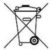

## Page 7

USERS MANUAL
NOVA PLUS SERIES
www.thunderlaser.com
DONGGUAN THUNDER LASER EQUIPMENT CO.,LTD
tech@thunderlaser.com
Room1101, Building 3, No.68, Xingzhou Road, Shatian Town,
Tel:(86) 18103043363
Dongguan City, Guangdong Province, China
7
1.4
Technical Data / Device Specification
Mechanics
System
NOVA PLUS 24
NOVA PLUS 35
NOVA PLUS 51
Working Area
23.6“x 15.7“
(600 x 400 mm)
35.4“x 23.6“
(900 x 600 mm)
51.2“x 35.4“
(1300 x 900 mm)
Table Size
25.3“x 19.6“
(645 x 500mm)
39“x 27.2“
(991 x 691mm)
54.7“x 39.1“
(1391 x 995mm)
Z Axis Height
6.1” / 155 mm
8.9” / 225 mm
Max Work Height
6.1” / 155 mm
8.9” / 225 mm
Max. Speed
1200 mm/sec
Motor
Easy Servo Motor
Drive
Hybrid Servo Drive
Work piece table
Solid metal blades & Honey comb table
Max. table load
20kg / 44lbs
40kg / 88lbs
30kg / 66lbs
Net Weight
/
/
/
Standard Head
2.5”
Lens Diameter
20mm
Mirror Diameter
25mm
Beam Comb. Dia.
25mm
Dimensions
NOVA PLUS 24
NOVA PLUS 35
NOVA PLUS 51
W x D x H
44.1“ x 34.1“ x 26.9“
(1120x865x682mm)
59.9“ x 45.5“ x 45.5“
(1520x1155x1115mm)
75.6“ x 57.2“ x 44.5“
(1920x1452x1115mm)
Max Part Size (W x L x H)
NOVA PLUS 24
NOVA PLUS 35
NOVA PLUS 51
Door Closed
24.2“x 18.5“x 8.3“
(615 x 470 x 155mm)
36.6“x 25.6“x 8.9 “
(931 x 651 x 225mm)
52.4“x 37.5“x 8.9 “
(1331 x 955 x 225mm)
Pass Thru
24“ x ∞“ x 0.79““
(610 x ∞mm x 20 mm)
37.7“ x ∞“ x 0.79“
(960 x ∞mm x 20 mm)
53.5“ x ∞“ x 0.79“
(1360 x ∞mm x 20 mm)

## Page 8

USERS MANUAL
NOVA PLUS SERIES
www.thunderlaser.com
DONGGUAN THUNDER LASER EQUIPMENT CO.,LTD
tech@thunderlaser.com
Room1101, Building 3, No.68, Xingzhou Road, Shatian Town,
Tel:(86) 18103043363
Dongguan City, Guangdong Province, China
8
Features
Standard:
Open flap protection, Fire alarm protection, Dual air-assist control,
Red Dot Pointer, Auto Focus, Smart board, Motorized Table, Honey Comb Table, Aluminum blade cutting table,
Pass-Through Door, 2,5” Focus Lens, Warning light, Emergency Stop, LCD Display, Easily Adjustable Home
Position, 3D Engraving, Maintenance mode, Air pump, Exhaust Fan.
Optional:
Rotary Attachment, High air compressor set (Includes water filter), 1.5'', 2''&4'' Focus lenses.
Control System
Laser power
Adjustable from 1 - 100% (typically 5-100%)
Interface Hardware
USB: connect to PC and U-disk
Ethernet: connect to PC
Interface Software
LightBurn - RDWorksV8
Operating Modes
Optimized raster, vector, and combined mode
Buffer Memory
1G standard
Laser Equipment
Laser Type:
Sealed Radio frequency Laser Tube
Standard Laser Power:
60W
Wavelength:
10.6µm
Red dot pointer:
Laser Power< 1mW
Wavelength of Red dot pointer:
630nm – 680nm
Cooling System
Machine Cooling System:
Air-Cooled
Tube Cooling System:
Air-Cooled
Electricity, Power, Breaker
60 WATT
Electricity
Requirement
110 or 220 Volt AC,50 or 60Hz,Single phase
Machine requires either 110V or 220V voltage(customized from factory); Support both
50Hz and 60Hz, single phase
Power
consumption
1000W,220V
Recommended
circuit breaker
/ A,110V
10A,220V
Ambient Conditions
Ambient temperature
+15°C to +35°C / 59°F to 95°F
Humidity
40% to max. 70%, not condensing
Laser Safety
Laser class
Laser Class 2

## Page 9

USERS MANUAL
NOVA PLUS SERIES
www.thunderlaser.com
DONGGUAN THUNDER LASER EQUIPMENT CO.,LTD
tech@thunderlaser.com
Room1101, Building 3, No.68, Xingzhou Road, Shatian Town,
Tel:(86) 18103043363
Dongguan City, Guangdong Province, China
9
1.5 Manufacturer's Label
The manufacturer's label is located on the back of the device (see Figure below).
It is recommended to record all of the data so that you always have this handy. You will need to supply your Serial
Number to our Support Team on occasion.

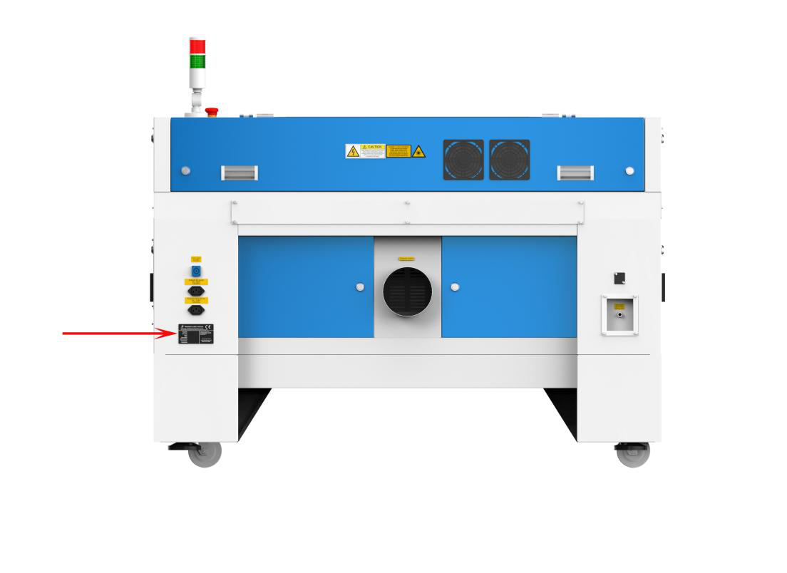

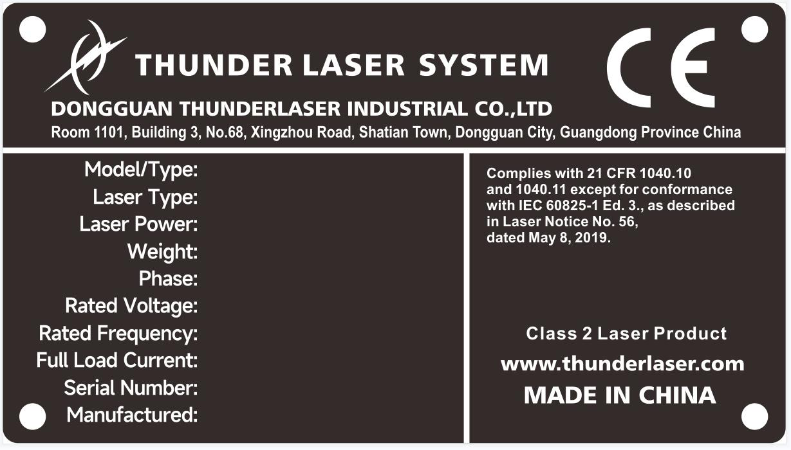

## Page 10

USERS MANUAL
NOVA PLUS SERIES
www.thunderlaser.com
DONGGUAN THUNDER LASER EQUIPMENT CO.,LTD
tech@thunderlaser.com
Room1101, Building 3, No.68, Xingzhou Road, Shatian Town,
Tel:(86) 18103043363
Dongguan City, Guangdong Province, China
10
Chapter 2. Safety
2.1
General Safety Information
All personnel involved in installation, set-up, operation maintenance and repair of the machine, must have read
and understood the Operation Manual and in particular the "Safety" section. The user is recommended to
generate company-internal instructions considering the professional qualifications of the personnel employed in
each case, and the receipt of the instruction/Operation Manual or the participation at introduction/training should
be acknowledged in writing in each case.
Safety-conscious of Working
The machine must only be operated by trained and authorized personnel.
The scopes of competence for the different activities in the scope of operating the machine must be clearly
defined and observed, so that under the aspect of safety no unclear questions of competence occur. This applies
in particular to activities on the electric equipment, which must only be performed by special experts.
For all activities concerning installation, set-up, start-up, operation, modifications of conditions and methods of
operation, maintenance, inspection and repair, the switch-off procedures that may be provided in the Operation
Manual must be observed.
Safety Information for the User and/or Operating Personnel
1. No working methods are permitted that affect the safety of the machine.
2. The operator must also ensure that no unauthorized persons work with the machine (e.g. by
activating equipment without authorization).
3. It is the duty of the operator, to check the machine before start of work for externally visible
damage and defects, and to immediately report changes that appear (including behavior during
operation) that affect the safety.
4. The user must provide that the machine is only operated in perfect condition.
5. The user must guarantee the cleanness and accessibility at and around the machine by
corresponding instructions and controls.
6. No safety components may be removed or disabled (again we emphasize the imminent
dangers, for example severe burns, loss of eyesight, etc…). If the removal of safety
components is required during repair and service, the replacement of the safety components
must be performed immediately after completion of the service and repair activities.
7. Preparation, retooling, change of work piece, maintenance and repair activities must only
performed with equipment switched off and by trained personnel.
8. Any attempt to perform unauthorized modifications and changes to the machine can
VOID THE WARRANTY. This does not apply to preventative & general maintenance,
adjustment and alignment, etc… that follow Thunder Laser’s best practices.

## Page 11

USERS MANUAL
NOVA PLUS SERIES
www.thunderlaser.com
DONGGUAN THUNDER LASER EQUIPMENT CO.,LTD
tech@thunderlaser.com
Room1101, Building 3, No.68, Xingzhou Road, Shatian Town,
Tel:(86) 18103043363
Dongguan City, Guangdong Province, China
11
2.2
Laser Safety Information
1. To assess the potential dangers laser systems pose, they are classified into 2 safety classes,
Thunder Laser NOVA PLUS series is a device of class 2. This is guaranteed by the protective
housing and the safety installations.
Please note that improper and warranty operation of the device can override the status of
Safety class 2 and can cause the emission of harmful radiation.
2. This laser engraving system contains a carbon dioxide (CO2) laser of class 4 that emits
intensive and invisible laser radiation. Without safety precautions the direct radiation or even
diffuse reflected radiation is dangerous!
3. Without safety precautions, the following risks exist with exposure to laser radiation:
Eyes: Burns to the cornea
Skin: Burns
Clothing: Danger of fire
4. Never try to modify or disassemble the laser and do not try to start up a system that had
been modified or disassembled!
5. Dangerous radiation exposure can result from the use of operation or adjustment equipment
other than that described here, and if different operational methods are performed.
2.3
Safety Precautions when Operating the Device
Your Thunder Laser NOVA PLUS SERIES has an integrated safety system which immediately stops the job when
the protection cover (Lid) is opened. An incomplete job will occur if the cover is opened during operation. Press
the "PAUSE" button first if you want to interrupt an engraving process.
Please remember the following safety precautions when working with this device:
1. CO2 Fire extinguishers should be placed near laser. Always keep a
properly maintained and inspected fire extinguisher on hand.
2. Do not store any flammable materials in the inside of the device. Particularly leftovers of
produced materials have to be removed to prevent fire hazard.
3. Please maintain free airflow around this system at all times. Do not cover the machine while in
operation.
4. Stay with the laser. Do not leave the laser unattended when it is working, small scraps can
ignite and without supervision can destroy the machine if not checked.
5. Use Air Assist. Always use the system’s Air Assist feature when vector cutting.

## Page 12

USERS MANUAL
NOVA PLUS SERIES
www.thunderlaser.com
DONGGUAN THUNDER LASER EQUIPMENT CO.,LTD
tech@thunderlaser.com
Room1101, Building 3, No.68, Xingzhou Road, Shatian Town,
Tel:(86) 18103043363
Dongguan City, Guangdong Province, China
12
1. These lasers emit invisible radiation; safety glasses should be worn when maintaining these
machines for your protection.
2. Adjustment of the beam path must be performed only by specially trained personnel. An
improper setting can lead to uncontrolled emission of the laser radiation.
1. Do not disable limit switches or safety features as this can invalidate warranties and cause
damage to you and the machine.
2. Before processing materials the user must verify whether harmful materials can be generated
and whether the filter equipment of the exhaust system is suitable for the harmful materials. We
emphasize that it is the responsibility of the user, to consider the national and regional
threshold values for dust, fogs and gases when selecting the filters and the exhaust system.
(The values for the maximum workplace concentration must not be exceeded.)
3. PVC (polyvinyl chloride) must under no circumstances be processed with the laser.
2.4
Warning and Information Labels
The warning and information labels in various locations if the machine should always be read
carefully and understood. If labels are lost or damaged, they must be replaced immediately.

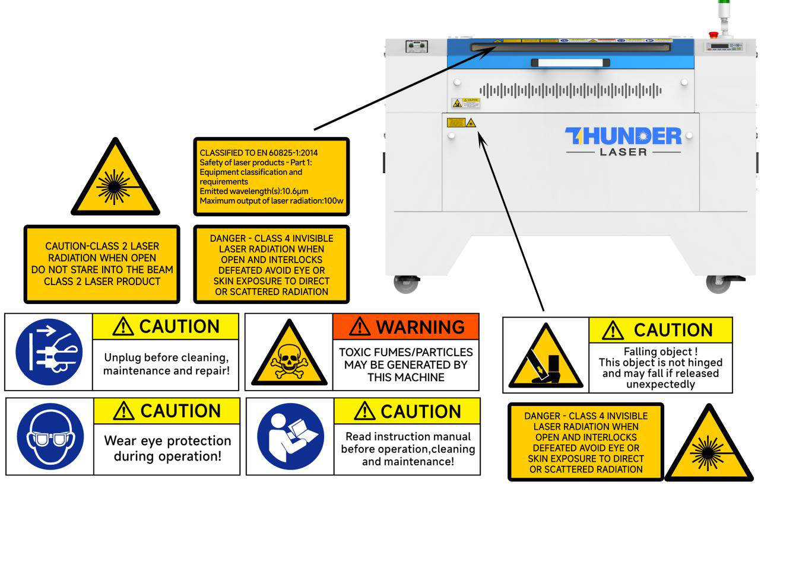

## Page 13

USERS MANUAL
NOVA PLUS SERIES
www.thunderlaser.com
DONGGUAN THUNDER LASER EQUIPMENT CO.,LTD
tech@thunderlaser.com
Room1101, Building 3, No.68, Xingzhou Road, Shatian Town,
Tel:(86) 18103043363
Dongguan City, Guangdong Province, China
13

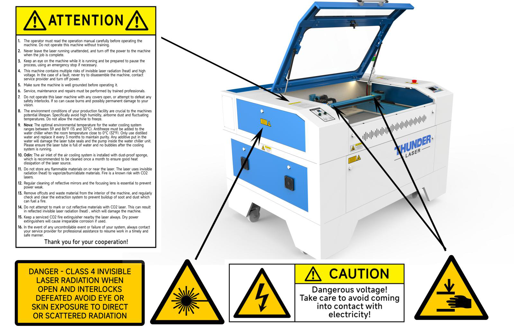

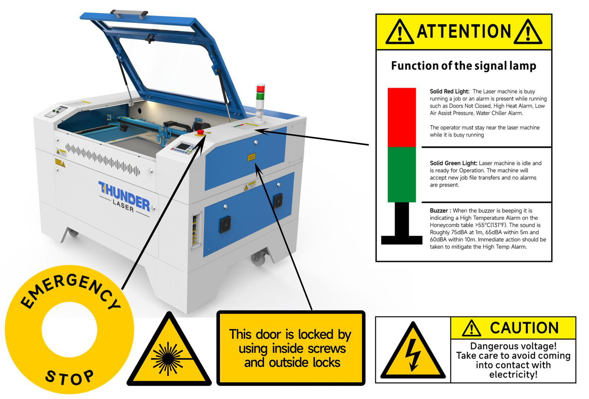

## Page 14

USERS MANUAL
NOVA PLUS SERIES
www.thunderlaser.com
DONGGUAN THUNDER LASER EQUIPMENT CO.,LTD
tech@thunderlaser.com
Room1101, Building 3, No.68, Xingzhou Road, Shatian Town,
Tel:(86) 18103043363
Dongguan City, Guangdong Province, China
14

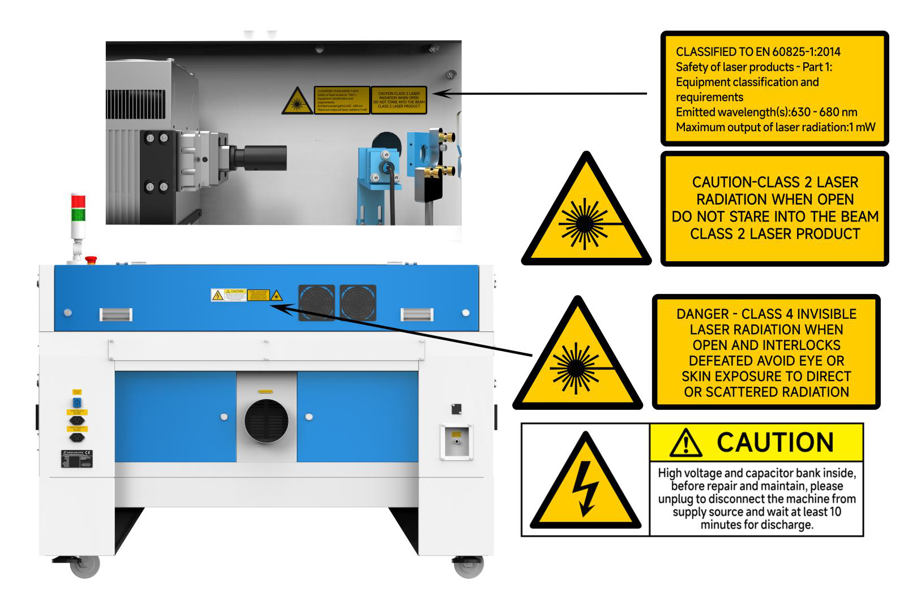

## Page 15

USERS MANUAL
NOVA PLUS SERIES
www.thunderlaser.com
DONGGUAN THUNDER LASER EQUIPMENT CO.,LTD
tech@thunderlaser.com
Room1101, Building 3, No.68, Xingzhou Road, Shatian Town,
Tel:(86) 18103043363
Dongguan City, Guangdong Province, China
15
Chapter 3. Process of Installing
3.1
Unpacking
You receive your THUNDER LASER NOVA PLUS SERIES packed in a wooden box which contains the laser
machine and additional accessories. The following steps give you an overview of the unpacking and assembly of
the laser. Please follow these steps carefully.
Keep the packing box. You will require it in case of a return.
Dispose all waste according to the applicable waste disposal law.
1. Put the wooden box on a flat and spacious room for unpacking.
2. Remove the machine box; carefully remove the protective foam, wraps, films, etc…
3. Take out the key，open the door of the laser, remove the accessories box which contains all accessory parts
required for the installation of the laser machine and check the contents carefully.
4. You will see an attachment table on the machine; please check whether the accessories are all on the table.
5. Please keep the keys and the warranty certificate as well as the model and serial number of the machine. If you
need tech support we may ask you for this information.
6. Remove the sponges and nylon cable ties from inside the machine, and then start to install the machine,
carefully following the instructions in this manual.
3.2
Location
Before you install the laser system, you should select an appropriate location. Follow the guidelines shown below:
1. Avoid locations where the system is exposed to high temperatures, dust and high humidity.
(The humidity must not exceed 70% and the temperature must not be close to the dew point.)
2. Avoid locations, where the system is exposed to mechanical shocks.
1. Circuit Breaker protection: Do not connect other devices on the same circuit as the laser
system. It requires a dedicated circuit.
2. DO NOT open any of the machine’s access panels while the unit is plugged in. Opening a

## Page 16

USERS MANUAL
NOVA PLUS SERIES
www.thunderlaser.com
DONGGUAN THUNDER LASER EQUIPMENT CO.,LTD
tech@thunderlaser.com
Room1101, Building 3, No.68, Xingzhou Road, Shatian Town,
Tel:(86) 18103043363
Dongguan City, Guangdong Province, China
16
panel may expose the operator to severe electric shock, invisible CO2 laser radiation,
mechanical pinch points, burns, blindness, and other hazards. ALWAYS POWER OFF AND
UNPLUG!
3. DO NOT make or break any electrical connections to the system while the unit is turned on.
1. Avoid locations with poor air circulation; select a location close to ventilation (if
available).Select a location, whose room temperature is between 15 °C and 25 °C (59° – 77°
F).
2. This is fundamental to maintain consistent and reliable operation of a CO2 laser, Metal RF or
Glass tube and the machine itself. Avoid higher ambient temperatures and strong exposure of
the engraver to the sun. Use blinds, if required.
3. Mechanical shock and vibration of the laser will have detrimental effects on the performance
and life expectancy of the machine. It will manifest (over a period of time) with a noticeable
decrease in performance and increased maintenance required, possibly even damage. Setting
your Thunder Laser up in s suitable temperature controlled, dust free, moisture free, level,
stable surface (a level concrete floor) with the recommended extraction is critical to the ongoing
performance of the machine. It is also a warranty condition.
3.3
Before Installation
1.
Remove the nylon cable ties around the honey comb plate.
Remove the transparent bag from the front of honey comb plate, Like below:

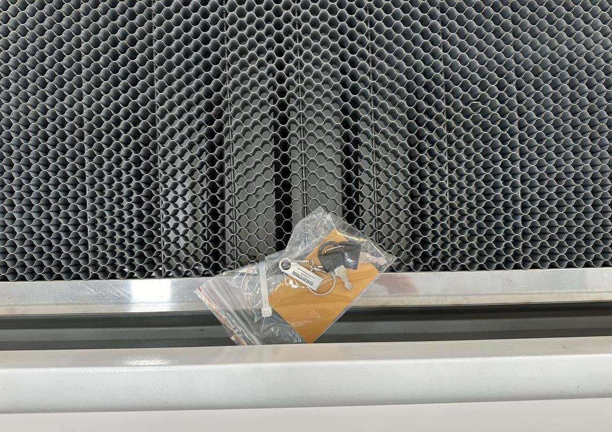

## Page 17

USERS MANUAL
NOVA PLUS SERIES
www.thunderlaser.com
DONGGUAN THUNDER LASER EQUIPMENT CO.,LTD
tech@thunderlaser.com
Room1101, Building 3, No.68, Xingzhou Road, Shatian Town,
Tel:(86) 18103043363
Dongguan City, Guangdong Province, China
17
The transparent bag has a set of machine door keys, USB flash drive, and an engraving test
sample. The USB flash drive stores software, manuals, libraries, etc… that you will need.
Reverse Offset/Scan Offset compensation settings for this specific machine are included. These settings need
to be entered into your RDWorks and/or LightBurn settings to ensure the highest engraving
quality. Refer to the Ruida and/or LightBurn Manuals for these necessary procedures.
2.
Rotate the E-Stop switch in the direction of the arrows to reset. Familiarize yourself with the emergency
stop button’s operation and location.
4. When you have the machine in its final position, please be sure to re-fix the feet in all four corners.
Please see below:

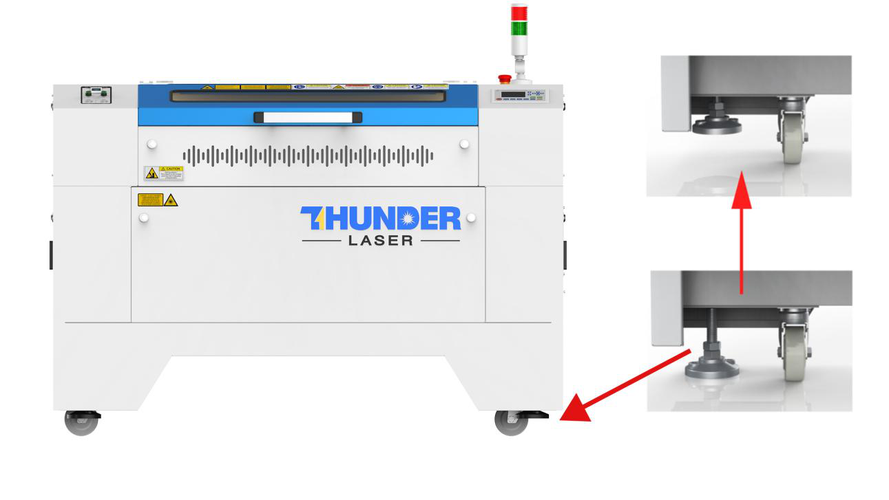

## Page 18

USERS MANUAL
NOVA PLUS SERIES
www.thunderlaser.com
DONGGUAN THUNDER LASER EQUIPMENT CO.,LTD
tech@thunderlaser.com
Room1101, Building 3, No.68, Xingzhou Road, Shatian Town,
Tel:(86) 18103043363
Dongguan City, Guangdong Province, China
18
The main power cable is in the tool box that came with the machine.

## Page 19

USERS MANUAL
NOVA PLUS SERIES
www.thunderlaser.com
DONGGUAN THUNDER LASER EQUIPMENT CO.,LTD
tech@thunderlaser.com
Room1101, Building 3, No.68, Xingzhou Road, Shatian Town,
Tel:(86) 18103043363
Dongguan City, Guangdong Province, China
19
3.4
Exhaust System – Requirements
Proper fume extraction is imperative to evacuate the combustible and noxious fumes that are created during the
lasing process. This machine must be equipped with an adequate exhaust system. This includes a blower of
rated flow, volume, and duty cycle as well as properly installed ducting and peripherals. You can further reduce
smells from fine particulate matter with an inline filtering system.
Connection - see section 3.7.4 connecting the Exhaust System.
Do not start the machine without an adequate exhaust system.
3.5
Air System – Requirements
The included air pump supplies the dual stage air assist control and is a critical component. This helps keep the
focusing lens clean and cool during the engraving process. Air assist is also critical when cutting to reduce
flame-ups and clear the debris field.
Always use the system’s Air Assist feature when vector cutting.

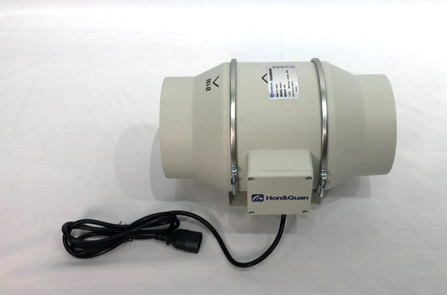

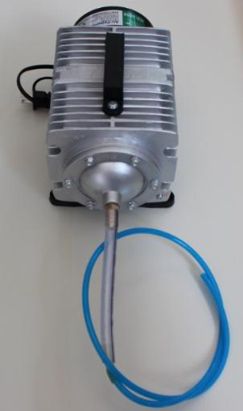

## Page 20

USERS MANUAL
NOVA PLUS SERIES
www.thunderlaser.com
DONGGUAN THUNDER LASER EQUIPMENT CO.,LTD
tech@thunderlaser.com
Room1101, Building 3, No.68, Xingzhou Road, Shatian Town,
Tel:(86) 18103043363
Dongguan City, Guangdong Province, China
20
3.6 Computer – Requirements
The following recommendation represents the minimum requirements. When using a more powerful computer the
graphics are generated and displayed faster and the computing times and the data transfer to the laser are
reduced. To use the newest software version, you might have to abide other requirements.
• Windows 11 (32 bit or 64 bit )
• Windows 10 (32 bit or 64 bit )
• Windows 8 (32 bit or 64 bit )
• Windows 7 (32 bit or 64 bit )
Windows Vista (with Service Pack 1 or later)
Windows XP (with Service Pack 2 or later)
• 1024 MB of RAM, 400 MB of hard disk space
• Pentium® 3 or 4 processor or AMD Athlon™XP
• 1024 x 768 or better monitor resolution
• 1 free USB interface
• 1 free Ethernet interface
• Mouse

## Page 21

USERS MANUAL
NOVA PLUS SERIES
www.thunderlaser.com
DONGGUAN THUNDER LASER EQUIPMENT CO.,LTD
tech@thunderlaser.com
Room1101, Building 3, No.68, Xingzhou Road, Shatian Town,
Tel:(86) 18103043363
Dongguan City, Guangdong Province, China
21
3.7
Connections
Perform the connections exactly in the order described; otherwise electrostatic charging can
damage your computer and/or the electronics of the laser system.
3.7.1
Connecting the Mains
Connect one end of the mains cable with the connection socket at the rear side of the laser device (see Figure
below) and the other end with a protected power outlet.
Mains voltage and operating voltage must correspond (AC 115V 50/60 Hz or AC 230V 50/60 Hz) – see
information label beside the connection socket.
Under no circumstances should you switch on the device if the voltages do not correspond.
The mains cable is placed the front of the honey comb table.

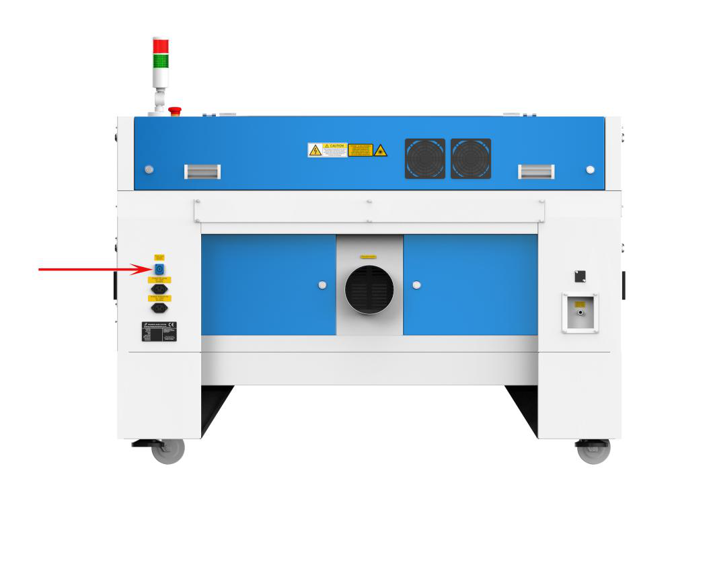

## Page 22

USERS MANUAL
NOVA PLUS SERIES
www.thunderlaser.com
DONGGUAN THUNDER LASER EQUIPMENT CO.,LTD
tech@thunderlaser.com
Room1101, Building 3, No.68, Xingzhou Road, Shatian Town,
Tel:(86) 18103043363
Dongguan City, Guangdong Province, China
22
3.7.2
Connecting the Computer
Connecting the Computer and the machine by using the USB cable. Like below:
Connecting the Computer and the machine by using the Ethernet cable. Like below:
The USB and Ethernet cable are placed inside the toolbox.

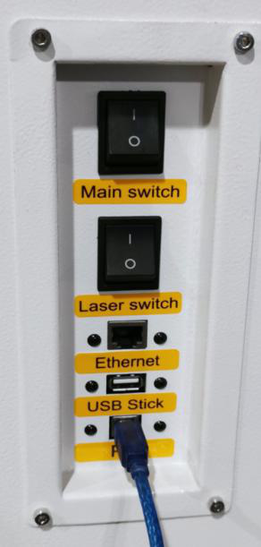

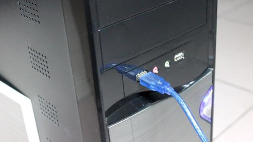

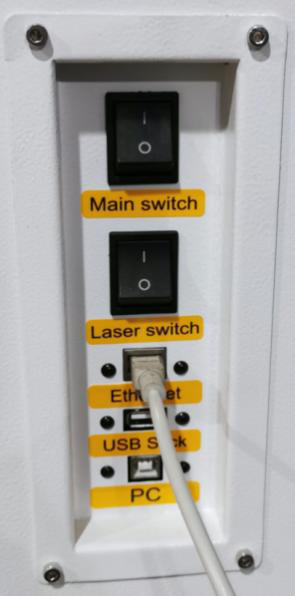

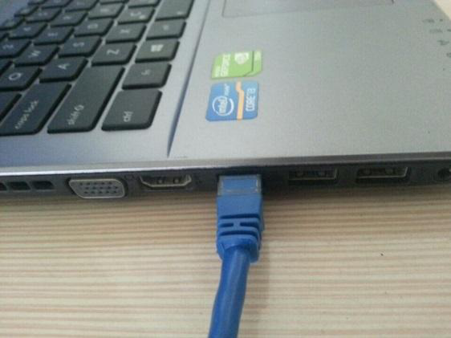

## Page 23

USERS MANUAL
NOVA PLUS SERIES
www.thunderlaser.com
DONGGUAN THUNDER LASER EQUIPMENT CO.,LTD
tech@thunderlaser.com
Room1101, Building 3, No.68, Xingzhou Road, Shatian Town,
Tel:(86) 18103043363
Dongguan City, Guangdong Province, China
23
3.7.3
Connecting the Air System
First of all, install an air blowing mouth (copper) to the air system, then connect the hoses (white side) to the
mouth, the other side to the machine. After that, please connect the power cable (of the air system) to the
machine. Like below:
A customized anti-shock foam that came with the air pump can be placed under the air pump.
The input voltage must correspond (AC 230V 50/60 Hz or AC 115V 50/60 Hz) – see information label beside the
connection socket.

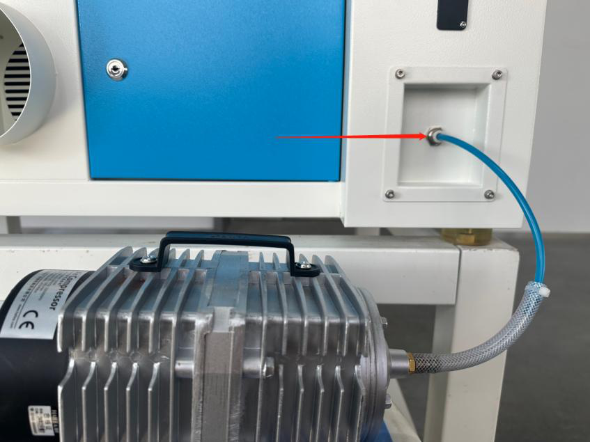

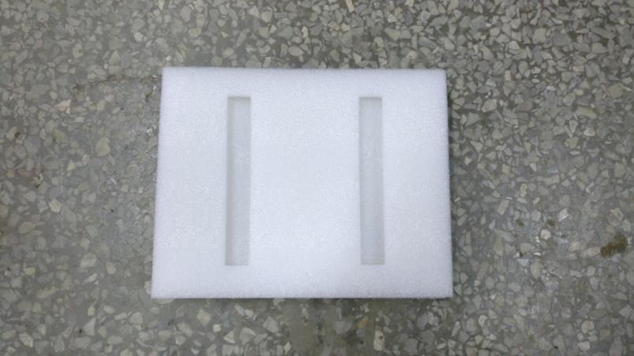

## Page 24

USERS MANUAL
NOVA PLUS SERIES
www.thunderlaser.com
DONGGUAN THUNDER LASER EQUIPMENT CO.,LTD
tech@thunderlaser.com
Room1101, Building 3, No.68, Xingzhou Road, Shatian Town,
Tel:(86) 18103043363
Dongguan City, Guangdong Province, China
24
3.7.4
Connecting the Exhaust System
How to set up the exhaust system
Insert one side of the gray exhaust pipe into the fan inlet and the other side into the fuselage behind the exhaust
tank. Insert one side of the gray exhaust pipe into the fan outlet and put the other side of the pipe outside where
you work (If the machine is far from the outside of the room that the gas manufactured by the machine cannot be
discharged; then you might need and dust/fume filter, it can keep the air quality of your working environment well).
Please refer to the following pictures about how to install the exhaust pipe:

## Page 25

USERS MANUAL
NOVA PLUS SERIES
www.thunderlaser.com
DONGGUAN THUNDER LASER EQUIPMENT CO.,LTD
tech@thunderlaser.com
Room1101, Building 3, No.68, Xingzhou Road, Shatian Town,
Tel:(86) 18103043363
Dongguan City, Guangdong Province, China
25
Also you can refer to the video on how to set up your Nova Plus laser machine in our website
How to setup your Nova laser cutter 2020 - YouTube
The input voltage must correspond (AC 230V 50/60 Hz or AC 115V 50/60 Hz) – see information label beside the
connection socket.
Do not connect the air compressor to the above interface，if connect them to the above interfaces that
cause in failure of the machine, the warranty does not covered.

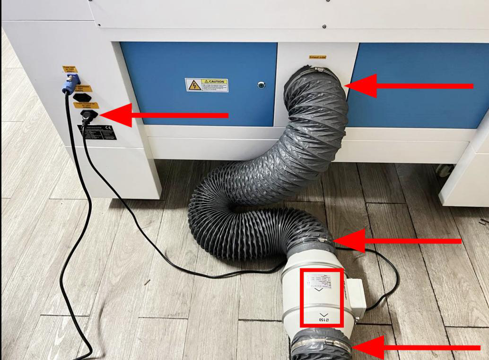

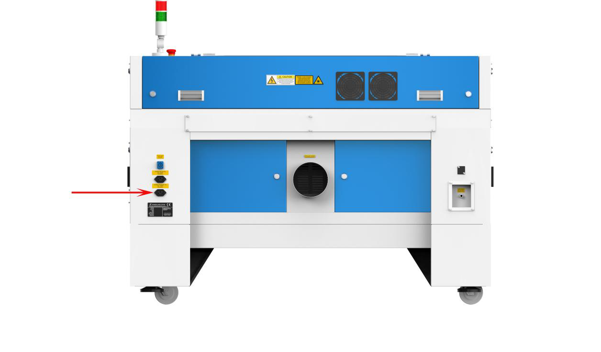

## Page 26

USERS MANUAL
NOVA PLUS SERIES
www.thunderlaser.com
DONGGUAN THUNDER LASER EQUIPMENT CO.,LTD
tech@thunderlaser.com
Room1101, Building 3, No.68, Xingzhou Road, Shatian Town,
Tel:(86) 18103043363
Dongguan City, Guangdong Province, China
26
Chapter 4. Operation
4.1
Machine View

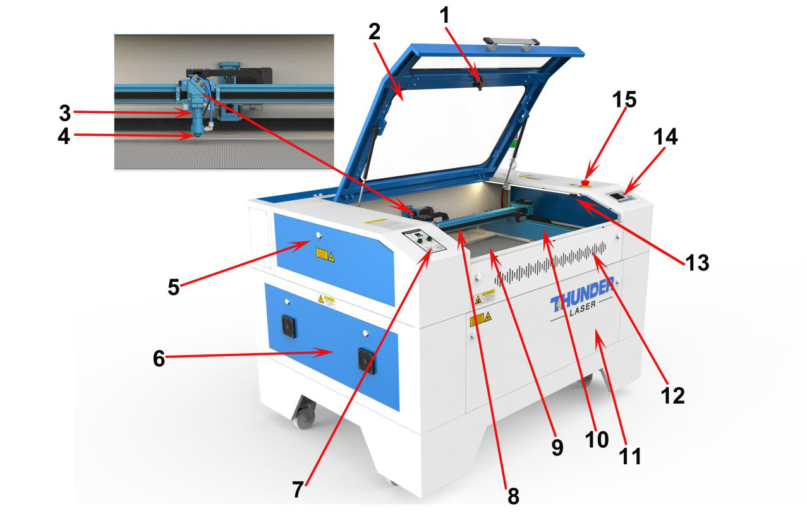

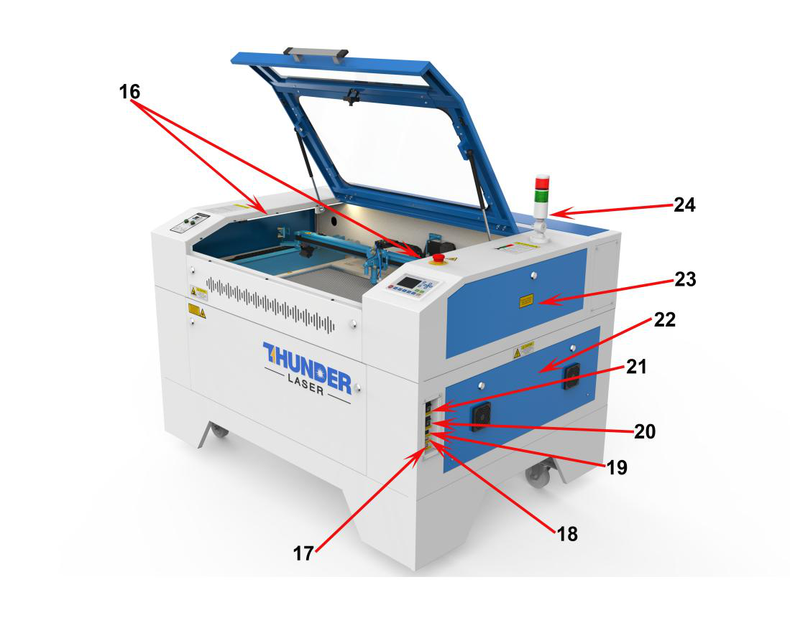

## Page 27

USERS MANUAL
NOVA PLUS SERIES
www.thunderlaser.com
DONGGUAN THUNDER LASER EQUIPMENT CO.,LTD
tech@thunderlaser.com
Room1101, Building 3, No.68, Xingzhou Road, Shatian Town,
Tel:(86) 18103043363
Dongguan City, Guangdong Province, China
27
1. Camera
16. LED lamp
2. Top flap
17. PC connection port (USB)
3. Laser head
18. U-disk connection port (USB)
4. Auto focus sensor
19. Ethernet port
5. Left-up side door
20. Laser power switch
6.Left side door
21.Main power switch
7.Dual air-assist control panel
22. Right side door
8.X-axis
23. Right-up side door
9.Honey comb table
24.Indicate light
10. Y-axis
25. Power supply socket
11. Front door
26.Manufacture’s Label
12. Front up door
27. Rear door
13. Flap protection sensor
28. Blow air porte
14. LCD panel
29. Exhaust hose
15. Emergency stop switch
30. Laser tube cover
1.
Camera
Camera function.
2.
Top flap
If the Top flap is opened, no data is processed. When the protection cover is opened during working, the motion
system is stopped and the laser source is turned off. During processing of commands the protection cover must
only be opened after pressing the “Pause “button.
3.
Laser head
Laser beam and red dot pointer are all come out from the laser head.

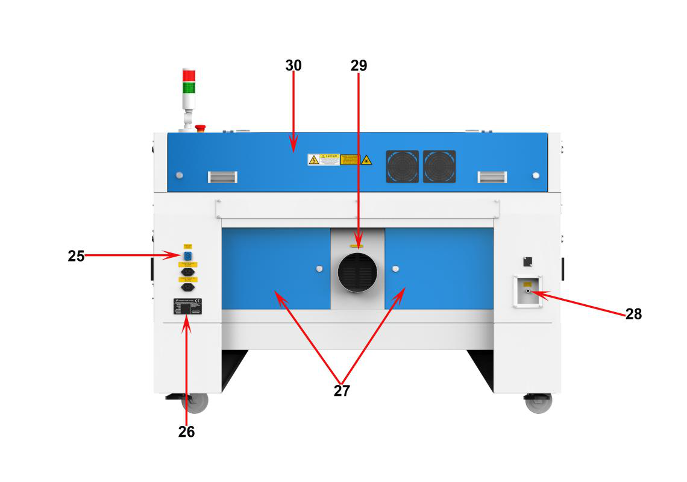

## Page 28

USERS MANUAL
NOVA PLUS SERIES
www.thunderlaser.com
DONGGUAN THUNDER LASER EQUIPMENT CO.,LTD
tech@thunderlaser.com
Room1101, Building 3, No.68, Xingzhou Road, Shatian Town,
Tel:(86) 18103043363
Dongguan City, Guangdong Province, China
28
4.
Auto-focus sensor
Used for the automatic focusing of the work table.
5.
Left-up side door
Open this door for cleaning the second reflective mirror or align that laser beam. This door is installed with the flap
protection sensor.
6.
Left side door
On Nova Plus 24, there are installed the laser power supplier, Ammeter, Flap sensor checking board etc.
Please open this door for checking these parts, but must pay attention to the electric current.
7.
Dual air-assist control panel
You can adjust air volume for cutting or engraving if require.
8.
X-axis
The motion system is that performs the mechanical movements in X direction. The X-axis is visible in the working
area.
9.
Honey comb table
The honey comb plate sits on top of the blade bed and has indexing pins for alignment.
10. Y-axis
The motion system is that performs the mechanical movements in Y direction. The Y-axis is visible in the working
area.
11. Front door
To clean the waste after working or remove the honey comb table. This door is installed with the flap protection
sensor.
12. Front up door
Open this door to use pass-through door. This door is locked by using inside screws and outside locks.
13. Flap protection sensor
This is where Open flat protection exist. Laser will stop working once the cover is opened during working.
14. LCD panel
You can control the X-axis, Y-axis and Z-axis manually by the display panel, it also shows the working time, power,
speed and the whole working time and affords many function options .
15. Emergency stop switch
Once there’s an accident happen (laser catch fire, laser out leakage) during working, please turn off this switch
immediately. It will be cut off the laser power and motion power immediately.
16. LED lamp
It’s used for lighting the working table once turn the Main switch on.

## Page 29

USERS MANUAL
NOVA PLUS SERIES
www.thunderlaser.com
DONGGUAN THUNDER LASER EQUIPMENT CO.,LTD
tech@thunderlaser.com
Room1101, Building 3, No.68, Xingzhou Road, Shatian Town,
Tel:(86) 18103043363
Dongguan City, Guangdong Province, China
29
17. PC connection port(USB)
This USB is for connecting computer.
18. U-disk connection port(USB)
You can save the file as a U-disk File by press “SaveToUFile” on the software, then save it to the u-disk and insert
the u-disk to the port of laser machine, then use the control panel to select and control it to work
19. Ethernet port
This Ethernet port is for connecting computer.
20. Laser power switch
The laser power will be on while you turn it on.
21. Main switch
The laser machine will be start while you turn it on.
22. Right side door
On Nova Plus 24, there are laser controller, driver(Hybrid Servo Drive and Stepper Drive ),TL-timer, and the main
connecting cables etc.
On Nova Plus 35/51, there are laser controller, driver(Hybrid Servo Drive and Stepper Drive ), power supplier
(both 24v DC and 48vDC),TL-timer, flap sensor checking board and the main connecting cables etc.
Please open this door for checking these parts, but must pay attention to the electric current. If you need to repair,
please contact with professional maintenance staff.
23. Right-up side door
Maintenance for the Emergency stop button if required. This door is locked by using inside screws and outside
locks.
24. Indicate light
If laser machine is running a job or user starts it without closing door, the signal lamp is in red light. The red light
indicates the dangerous situation and user must stay with the laser.
If laser machine is not at work, the signal lamp is in green light. The green light indicates the safety situation and
the laser machine is ready for operation.
If temperature is higher than 55°C/131°F on working table, the signal lamp will make buzzing sound.
(roughly 80dBA within 1m,75dBA within 5m and 65dBA within 10m,the sound gets weaker as it travels).
25. Laser supply socket
To connect the main power and the extend power according the label information.
26. Manufacture’s Label
It’s Show you the laser information like serial number or manufacturing date etc.
27. Rear door
There are power supplier (both 24v DC and 48vDC)
Please open this door for checking these parts, but must pay attention to that electric current.

## Page 30

USERS MANUAL
NOVA PLUS SERIES
www.thunderlaser.com
DONGGUAN THUNDER LASER EQUIPMENT CO.,LTD
tech@thunderlaser.com
Room1101, Building 3, No.68, Xingzhou Road, Shatian Town,
Tel:(86) 18103043363
Dongguan City, Guangdong Province, China
30
28. Blow air port
This port is for connecting hoses of the air compressor.
29. Exhaust hose
This is for installing the exhaust device.
30. Laser tube cover
There are installed the laser tube, red dot pointer device, beam combiner and the first reflective mirror mount.
This door is installed with the flap protection sensor

## Page 31

USERS MANUAL
NOVA PLUS SERIES
www.thunderlaser.com
DONGGUAN THUNDER LASER EQUIPMENT CO.,LTD
tech@thunderlaser.com
Room1101, Building 3, No.68, Xingzhou Road, Shatian Town,
Tel:(86) 18103043363
Dongguan City, Guangdong Province, China
31
4.2
ON/OFF Switch
The mains and the laser supply power ON/OFF switch
The following conditions must be fulfilled for correct start up:
Unrestricted freedom of motion of the mechanics
No materials under the engraving table
Protection covers closed
When turn on the power of machine, and note that turn on the main switch first and then the laser supply power
switch
When turn off the power of machine, and note that turn off the laser supply power switch first and then the main
switch
If all covers are closed, immediately after being switched on, the device starts the referencing process. When the
referencing process is completed correctly, an acoustic signal sounds and the device is ready for operation. The
operation panel will display the home screen when the laser is completed resets.
Before switching on the device, the user must make sure that no objects of any kind are located
inside the operating space, which could limit or obstruct the mechanics of the device.
Please note that do not to press “ESC” button during the referencing process.

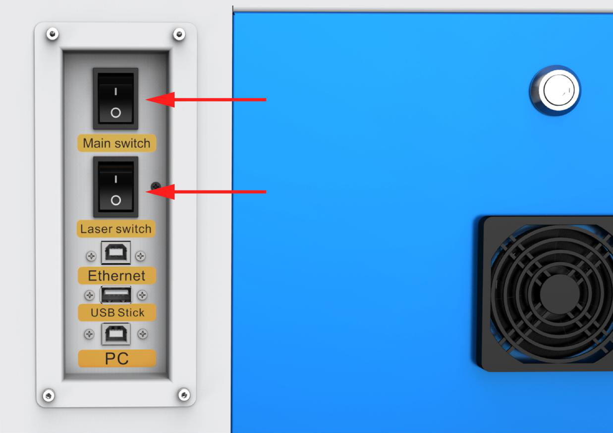

## Page 32

USERS MANUAL
NOVA PLUS SERIES
www.thunderlaser.com
DONGGUAN THUNDER LASER EQUIPMENT CO.,LTD
tech@thunderlaser.com
Room1101, Building 3, No.68, Xingzhou Road, Shatian Town,
Tel:(86) 18103043363
Dongguan City, Guangdong Province, China
32
4.3
How to setup the OEM software
4.3.1
Software installation
Your machine comes with a USB flash drive, which you will find many helpful application videos and instructions
as well as the software for your machine.
To install the software, insert the USB flash drive into your PC and open the "Software" folder on the USB flash
drive.
In this folder you will find the installation file "RDWorksV8Setup8.01.43.exe". Run this file by double-clicking on
your PC.
Follow the installation menu until the window "Welcome to use" opens, like below.
If you use USB cable connection, please install the USB driver.
The type of the program offers different possibilities:
1. LaserWork: If you select this option, the laser software RDworksV8 will be installed on your computer.
2.CorelDraw_Laser: If you work a lot with Corel Draw, you can transfer your images and drawings directly to
RDworksV8.
How to install the coreldraw plugin for RDworksV8, click below link for instruction
How to import PDF files into RDWorks (thunderlaser.com)
3. AutoCAD_Laser: Select this option to install a plugin that can transfer the drawings directly from AutoCAD to
RDWorksV8.
4. EngraveLab_Laser: Select this option and install a plugin that can transfer the drawings directly from
EngraveLab to RDWorksV8.
Origin (zero point): This is specified by the machine and must always be selected "top-left" for Thunderlaser

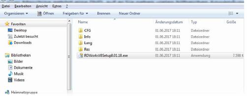

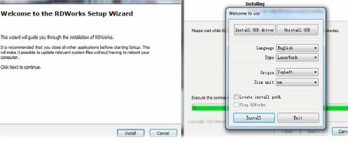

## Page 33

USERS MANUAL
NOVA PLUS SERIES
www.thunderlaser.com
DONGGUAN THUNDER LASER EQUIPMENT CO.,LTD
tech@thunderlaser.com
Room1101, Building 3, No.68, Xingzhou Road, Shatian Town,
Tel:(86) 18103043363
Dongguan City, Guangdong Province, China
33
machines.
Size unit: Here you can choose between millimeters and inches.
Select installation path: Here you can select a different installation directory for your laser software. We
recommend that you use the default settings, otherwise some operating systems may restrict the functionality of
the software due to misinterpreted access rights.
After selecting your options, click "Install" and then brings up a window "Install Finish!”. You can confirm this and
then end the installation process.
A "RDWorksV8" icon will be automatically added to your Desktop, you are now ready to use the RDworksV8.
Trouble shooting for RDworks installation.
If you were unable to install the RDworks,it’s possible that your Anti-Virus software is blocking
installation.
Please disable all Virus and Spyware Protection Features. After the RDworksV8 has been
installed go back into your Anti-Virus software and re-enable the setting that was disabled.

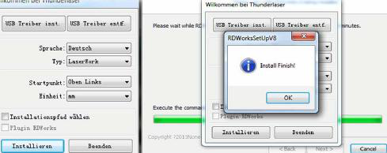

## Page 34

USERS MANUAL
NOVA PLUS SERIES
www.thunderlaser.com
DONGGUAN THUNDER LASER EQUIPMENT CO.,LTD
tech@thunderlaser.com
Room1101, Building 3, No.68, Xingzhou Road, Shatian Town,
Tel:(86) 18103043363
Dongguan City, Guangdong Province, China
34
4.3.2
Make connection between PC and machine

USB cable connection
Make sure that you have the USB driver installed during the installation process.
Make sure that you have your PC connected to the machine via USB cable,
Open RDworks, from right bottom corner of the software, set up the Device by Setting>>Device --- (USB: Auto).
Your PC is now connected to the machine.
When connecting the machine and the PC for the first time, it may take a few minutes for the
operating system to recognize the machine and install the driver.

Ethernet cable connection
Make sure that you have your PC connected directly to the machine via Ethernet cable,
The machine is already assigned an IP address when delivered: 192.168.1.100
Now set up your PC so that it is in the same network and can communicate with the machine.

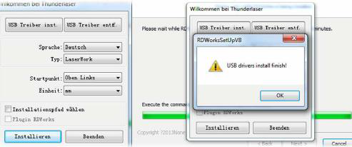

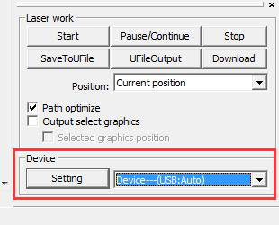

## Page 35

USERS MANUAL
NOVA PLUS SERIES
www.thunderlaser.com
DONGGUAN THUNDER LASER EQUIPMENT CO.,LTD
tech@thunderlaser.com
Room1101, Building 3, No.68, Xingzhou Road, Shatian Town,
Tel:(86) 18103043363
Dongguan City, Guangdong Province, China
35
Please follow the instructions below for the setup process (For Windows7):
1). Click Windows Start > Control Panel.
2). Click Network and Internet > Network and Sharing Center. In the left pane, click Change adapter setting.
3).Right click Local Area Connection and then select Properties.
4). Under Networking tab, choose Internet Protocol Version 4 (TCP/IPv4) and then click Properties
5). In "Internet Protocol Version 4 (TCP/IPv4) Properties" window, Select "Use the following IP address:"
Type IP Address: 192.168.1.1
And Type subnet mask: 255.255.255.0
Then click OK.
With this you have successfully created the prerequisites so that the machine and the PC can communicate via LAN.
Now open your RDWorks from right bottom corner of the software, set up the Device by Setting>>Device --- Add a
“Device---(IP:192.168.1.100)”.

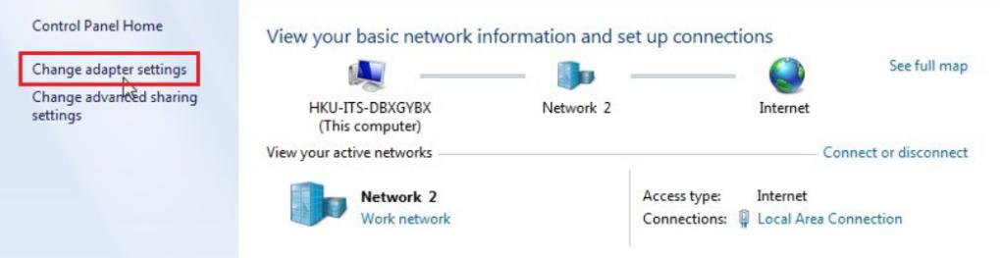

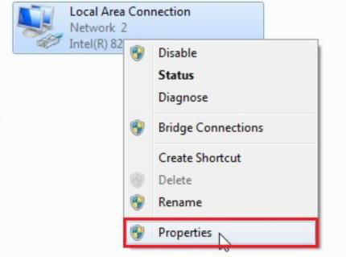

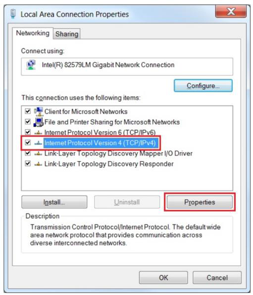

## Page 36

USERS MANUAL
NOVA PLUS SERIES
www.thunderlaser.com
DONGGUAN THUNDER LASER EQUIPMENT CO.,LTD
tech@thunderlaser.com
Room1101, Building 3, No.68, Xingzhou Road, Shatian Town,
Tel:(86) 18103043363
Dongguan City, Guangdong Province, China
36
Now RDWorks communicates with your laser machine via LAN.

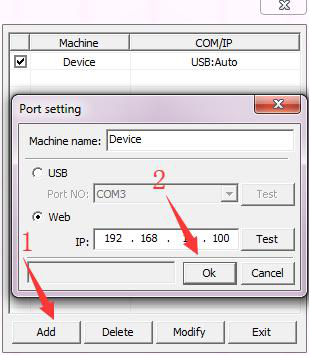

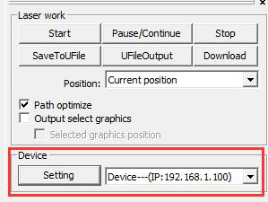

## Page 37

USERS MANUAL
NOVA PLUS SERIES
www.thunderlaser.com
DONGGUAN THUNDER LASER EQUIPMENT CO.,LTD
tech@thunderlaser.com
Room1101, Building 3, No.68, Xingzhou Road, Shatian Town,
Tel:(86) 18103043363
Dongguan City, Guangdong Province, China
37
4.4
How to use the display
4.4.1
Function of the Buttons

Arrow buttons: control the movement of the Z-axis.

Arrow buttons: control the movement of the laser head.(also can be used
to change the parameters in the control panel)

Menu button: The Menu key can be pressed when the system is idle or the work is finished. On
pressing this key, it will show some entries in the interface, each entry includes some functions, U axes move,
each axes to go home etc.

Reset button: Reset the machine.

Pulse button: Pulse a laser beam.

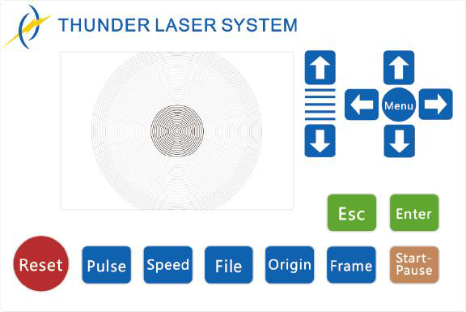

## Page 38

USERS MANUAL
NOVA PLUS SERIES
www.thunderlaser.com
DONGGUAN THUNDER LASER EQUIPMENT CO.,LTD
tech@thunderlaser.com
Room1101, Building 3, No.68, Xingzhou Road, Shatian Town,
Tel:(86) 18103043363
Dongguan City, Guangdong Province, China
38

Speed button: Set the speed of the current running layer, or set the arrow buttons’ move speed.

File button: The management of the memory and U disc files.

Start-Pause button: run/pause the current job.

Origin button: set the starting point for the laser head.

Frame button: To track by the current file’s frame.

Esc button: To stop work, or return to the last menu.

Enter button: confirm your selection.

## Page 39

USERS MANUAL
NOVA PLUS SERIES
www.thunderlaser.com
DONGGUAN THUNDER LASER EQUIPMENT CO.,LTD
tech@thunderlaser.com
Room1101, Building 3, No.68, Xingzhou Road, Shatian Town,
Tel:(86) 18103043363
Dongguan City, Guangdong Province, China
39
4.4.2
The main interface
When the system is powered on, the screen will show as below:

Graph Display Area: To display the whole file’s track, and display the running track.

Running parameters: To display the running file’s file number, speed, max power etc.;

Coordinate: To display the current coordinate of X,Y and Z axes

Graph layer parameters: To display the layers’ information of the current file, such as max or min power,
speed etc. When system is idle, double click the layer, then users can change the layer’s parameters
and the changing would be saved.

Running Status: To display the current status of the machine, such as Idle, Run, Pause, Finish, etc.;

Running Progress Bar: To display the progress bar of the current running file;

Working Number: To accumulate the work number of the current file.

File Dimension: To display the dimension of the current file;

Net status: To display the connecting status of the Ethernet.
When work is Idle or finished, all buttons can be clicked, users can select a file to run, set some parameters,
preview to a select file etc. But, when work is running or paused, some buttons don’t respond when they are
clicked.

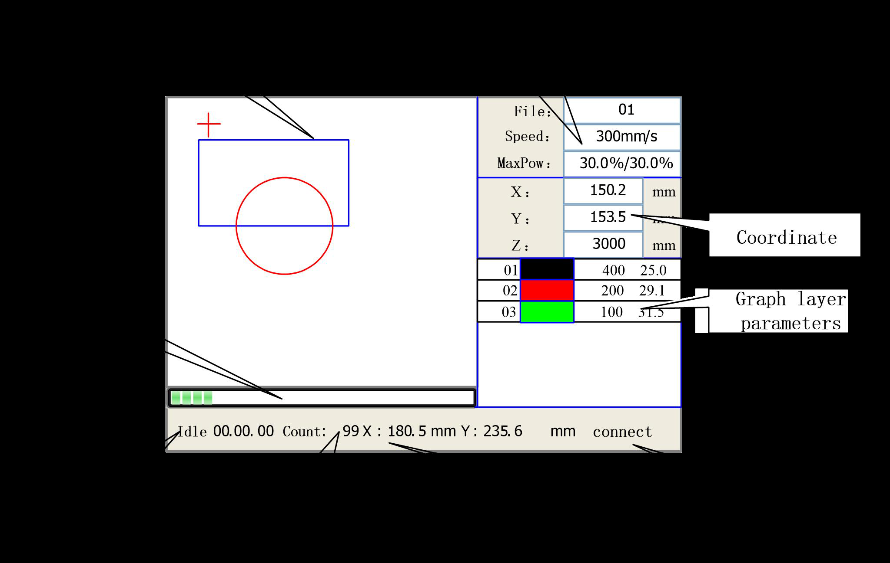

## Page 40

USERS MANUAL
NOVA PLUS SERIES
www.thunderlaser.com
DONGGUAN THUNDER LASER EQUIPMENT CO.,LTD
tech@thunderlaser.com
Room1101, Building 3, No.68, Xingzhou Road, Shatian Town,
Tel:(86) 18103043363
Dongguan City, Guangdong Province, China
40
4.4.3
Speed button
The speed can be set from 1~1000mm/s.
4.4.4
Max Power buttons
The max power can set the power for pulse button to shoot the laser beam,and max power2 is
only for the double laser tube machine.
4.4.5
Set the Layer Parameters
After selecting a file to preview on the main interface, user can click “Enter” button to modify the parameter for the
file from the machine.

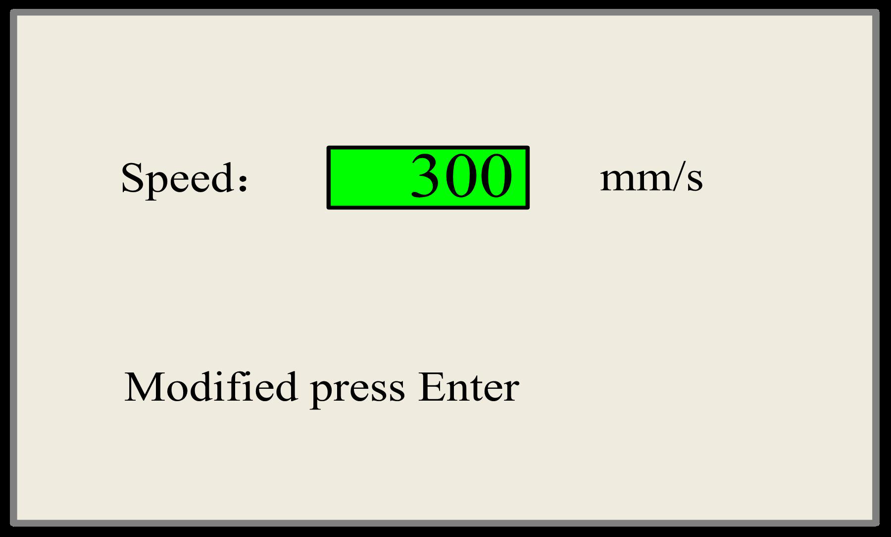

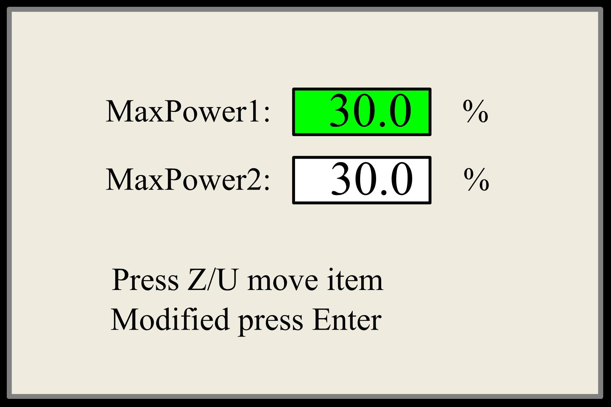

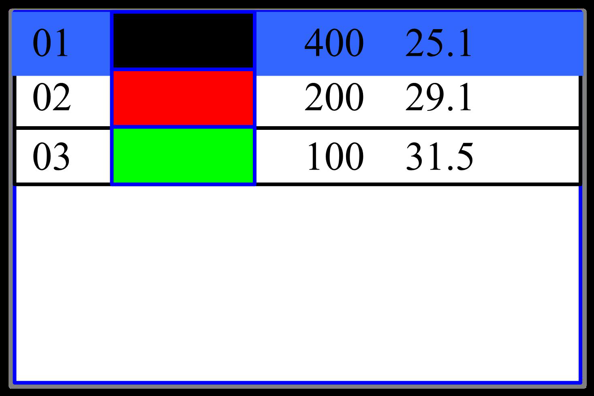

## Page 41

USERS MANUAL
NOVA PLUS SERIES
www.thunderlaser.com
DONGGUAN THUNDER LASER EQUIPMENT CO.,LTD
tech@thunderlaser.com
Room1101, Building 3, No.68, Xingzhou Road, Shatian Town,
Tel:(86) 18103043363
Dongguan City, Guangdong Province, China
41
4.4.6
Menu button
The Menu button can be pressed when the system is idle or the work is finished. On pressing this button, it will
show some entries in the following interface:

U Move: When the green block is on “U Move” item, to control the rotary attachment to turn by pressing
left and right arrow button.

Axis Reset+: When the green block is on this item, you can manually reset the axis if needed.

Set default para: To recover all manufacturer parameters and user parameters for your machine

Auto Focus: To use the auto focus function.

Language: The item “Language” helps you to select a appropriate langue which is displayed on the
panel:

IP Setup: The machine is already assigned an IP address as 192.168.1.100,and the IP address on
software should be the same while communicate

Diagnoses: the “Diagnoses” interface shows some system input information, such as limiter status and
the status of the door protection etc.
4.4.7
File button
1). Memory File
On the main interface, if “File” button is pressed, it will show as below:

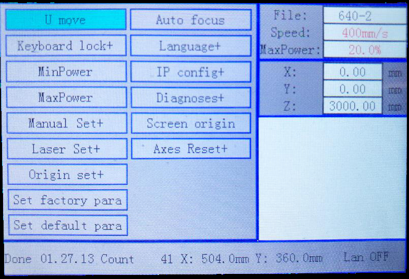

## Page 42

USERS MANUAL
NOVA PLUS SERIES
www.thunderlaser.com
DONGGUAN THUNDER LASER EQUIPMENT CO.,LTD
tech@thunderlaser.com
Room1101, Building 3, No.68, Xingzhou Road, Shatian Town,
Tel:(86) 18103043363
Dongguan City, Guangdong Province, China
42
When showing this menu, the system would read the memory file firstly, the file name and the work times would
be listed in the area, and the selected file is previewed in the bottom right area. “Y+/-” keys could be used to move
the cursor on the file name list.
When the cursor is on a target file name, presses the “Enter” key, the selected
file will be previewed on the main interface, and then if “Esc” key is pushed, the preview will disappear.
“X+/-” keys could be used to move the cursor left and right. All the item show as below:

Read mem file: read the memory file list;

Udisk: read the U disk file list;

Other: the other operation of the memory files;

Run: To run the selected file;

Track: To track the selected file, and the track mode is optional;

Work time preview: To forecast the running time of the selected file, and the time is accurate to 1ms;

Clear count: To clear the running times of the selected file;

Delete: To delete the selected file in the memory;

Copy to Udisk: To copy the selected file to Udisk;
If the “Other” entry is pressed, the system will show as below:

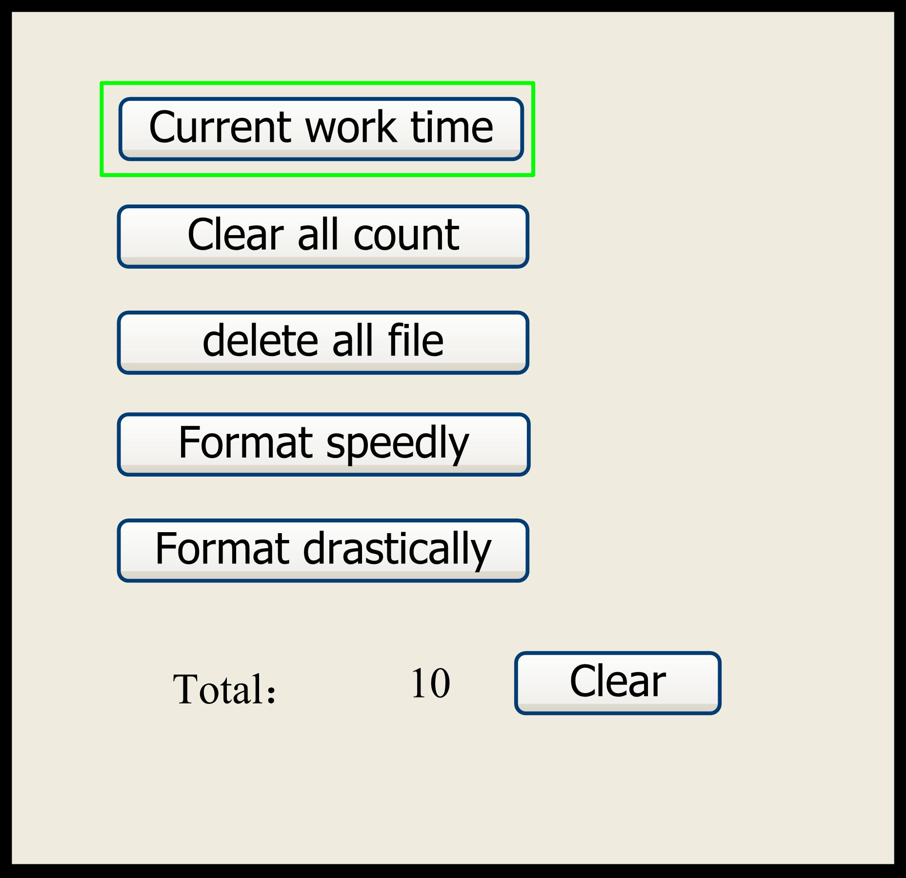

## Page 43

USERS MANUAL
NOVA PLUS SERIES
www.thunderlaser.com
DONGGUAN THUNDER LASER EQUIPMENT CO.,LTD
tech@thunderlaser.com
Room1101, Building 3, No.68, Xingzhou Road, Shatian Town,
Tel:(86) 18103043363
Dongguan City, Guangdong Province, China
43

Current work time: To forecast the running time of the current file(the current file No. is showed on the
main interface), and the time is accurate to 1ms.

Clear all count: To clear the running times of every file in the memory

Delete all file: To delete all memory files

Format speedily: To format memory speedily, and then all the files in memory will be deleted.

Format drastically: To format memory drastically, and then all the files in memory will be deleted.
Total: the total running times of all the files.
2). U-Disk File
If the “U-disk+” entry is pressed, you can copy your file from USB flash drive to your machine.

Read U disk: read the file list in the U disk;

Copy to memory: copy the target U disk file to the memory;

Delete: delete the selected U disk file;
The controller can only compatible with USB 2.0 and at most 16G USB
flash drive.
For USB flash drive,you can use the one came with the machine to copy the file to your
machine
The file should be .rd file and it’s created by the “SaveToUFile” key on the RDworks.

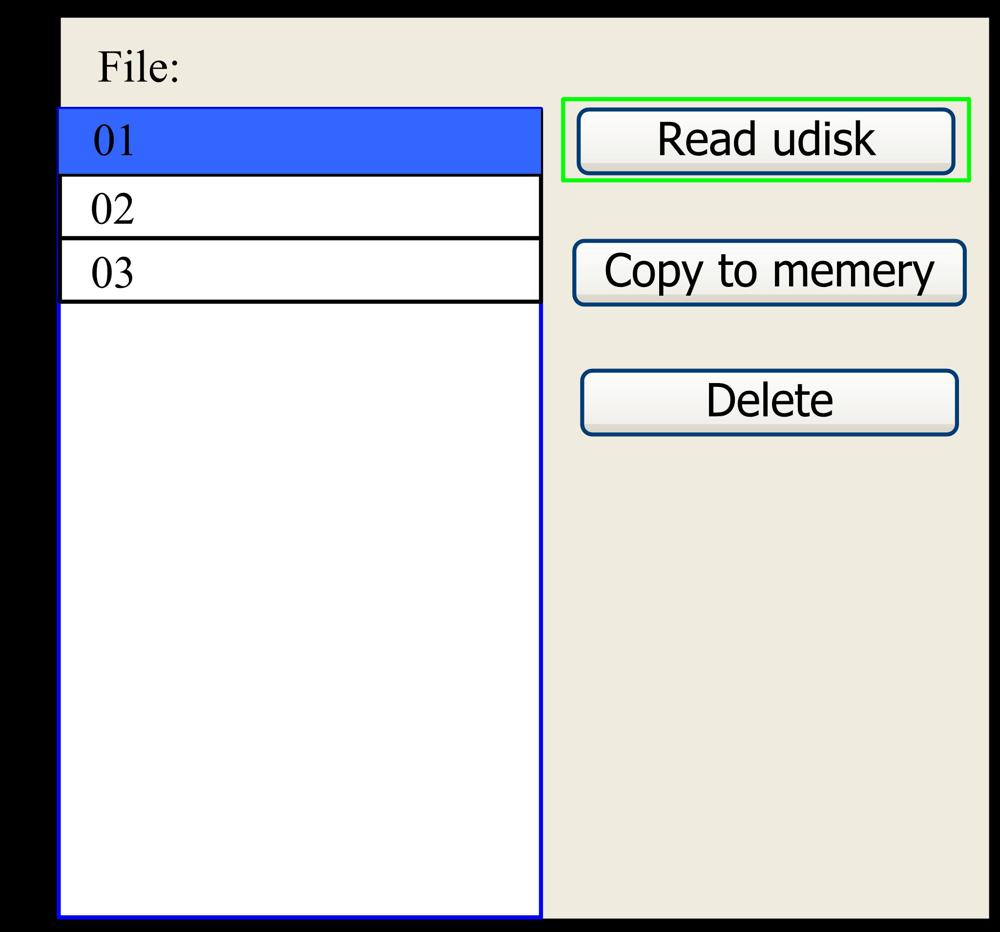

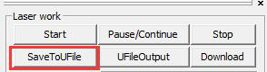

## Page 44

USERS MANUAL
NOVA PLUS SERIES
www.thunderlaser.com
DONGGUAN THUNDER LASER EQUIPMENT CO.,LTD
tech@thunderlaser.com
Room1101, Building 3, No.68, Xingzhou Road, Shatian Town,
Tel:(86) 18103043363
Dongguan City, Guangdong Province, China
44
4.5
Optional Lenses
4.5.1
How to use different Lens
The NOVA PLUS series supports the installation of four types of lenses: 1.5, 2,2.5, and 4 inches. The 2.5-inch
lens is included as standard, while the other three are optional and need to be purchased separately.
Four types of lenses can be used for engraving and cutting, and different lenses can be chosen based on the
actual application.
The 1.5-inch lens is suitable for fine engraving and cutting of thin materials.
The 2-inch lens is suitable for general engraving and cutting.
The 2.5-inch lens is suitable for general engraving and cutting.
The 4-inch lens is suitable for general engraving and cutting materials with a thickness of 10mm and above.
4.5.2
How to replace different lens

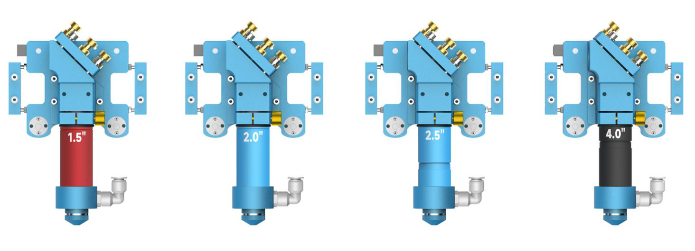

## Page 45

USERS MANUAL
NOVA PLUS SERIES
www.thunderlaser.com
DONGGUAN THUNDER LASER EQUIPMENT CO.,LTD
tech@thunderlaser.com
Room1101, Building 3, No.68, Xingzhou Road, Shatian Town,
Tel:(86) 18103043363
Dongguan City, Guangdong Province, China
45
Please follow these steps:
1. Press the tracheal joint and remove the blue air pipe.
2. Hold the lens tube by hand, loosen the copper screw, and remove the entire lens tube.
3. Remove the blue cone head part.
4. Reinstall the new lens tube in its original position.
(Note: Be sure to reconnect the air pipe, insufficient blowing may damage the lens)
5. When reinstalling, pay attention to the installation position of the black rubber ring.
4.5.3
How to use different nozzle
The NOVA PLUS series is compatible with two nozzles, one is 3mm (standard), and the other is 6mm (optional).
The 6mm nozzle is stored in the toolbox.
A nozzle has a very narrow outlet (approx. 3mm), which provides high air flow to blow directly on the cutting gap.
This nozzle is excellently suited for cutting wood, as this prevents soot formation in the cutting gap.
The other nozzle has a large outlet (approx. 6 mm), which provides the air assist to blow the material more slowly
and not directly on the cutting gap. This nozzle is excellently suited for cutting acrylic, as this prevents white mark
in the cutting edge. Besides, when engraving wood, for example, particles that have been removed and smoke /
gases are gently distributed and extracted in the working area. So you get a clean, almost unaffected by smoke
traces engraving.

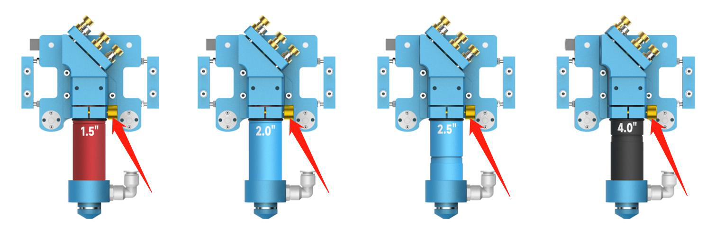

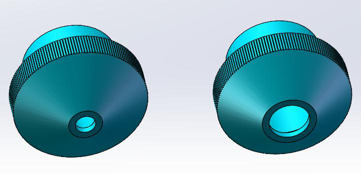

## Page 46

USERS MANUAL
NOVA PLUS SERIES
www.thunderlaser.com
DONGGUAN THUNDER LASER EQUIPMENT CO.,LTD
tech@thunderlaser.com
Room1101, Building 3, No.68, Xingzhou Road, Shatian Town,
Tel:(86) 18103043363
Dongguan City, Guangdong Province, China
46
4.6
How to focus

Manual focus
The laser machine comes equipped with a manual focusing tool that is attached to the cone module. Then raise
the honeycomb table up with LCD panel, and the bottom of the tool touches the material surface, it means
completing the focusing process.

Auto focus
In the NOVA PLUS series, place the material on the honeycomb table, and move the laser head above the
material. Press the auto focus function on the panel: Z/U >> Auto focus >> Enter. The platform will automatically
rise, then lower to the appropriate height after triggering the sensor, indicating that the automatic focus is
complete.

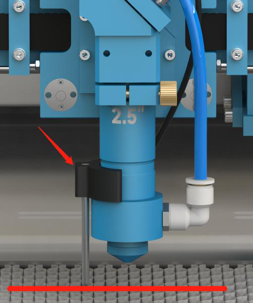

## Page 47

USERS MANUAL
NOVA PLUS SERIES
www.thunderlaser.com
DONGGUAN THUNDER LASER EQUIPMENT CO.,LTD
tech@thunderlaser.com
Room1101, Building 3, No.68, Xingzhou Road, Shatian Town,
Tel:(86) 18103043363
Dongguan City, Guangdong Province, China
47
4.7
How to use the TL-Timer
The TL-Timer is an additional tool for laser machines.
It will control laser machines periphery like air pump, exhaust fan, warning lights, heat alarm detector, electrical
locks and lot of other stuff automatically.
This will increase the ease of use of your laser machine.
About TL-Timer controller interface and buttons description：
1.
OUT1: Control the green light of warning light; When the machine is not at work, the warning light is in green
color;
2.
OUT2: Control the red light of warning light; When the machine is working or getting around alarm message
on LCD panel, the warning light turns red;
3.
OUT3: Control the exhaust fan; Delay shutdown is set to 30 second（Factory default settings, change it if
required）;
4.
OUT4: Control air assist with “Low volume”; Delay shutdown is set to 20 second (Factory default settings,
change it if required) ;
5.
OUT5: Control air assist with “High volume”; Delay shutdown is set to 20 second（Factory default settings,
change it if required）;
6.
OUT6: Control the fire alarm system; When A high temp is detecting on working area, the alarm system will be
active, the warning light alarms and the machine stops working immediately;
7.
OUT7: Control the power for rotary device;
8.
OUT8: Spare interface;

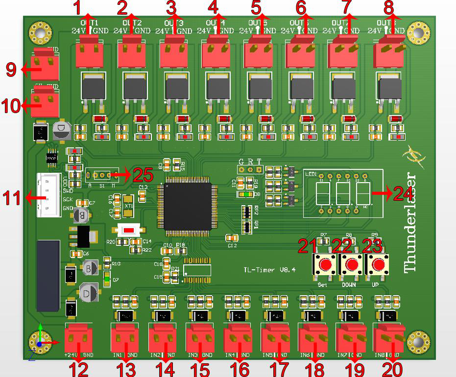

## Page 48

USERS MANUAL
NOVA PLUS SERIES
www.thunderlaser.com
DONGGUAN THUNDER LASER EQUIPMENT CO.,LTD
tech@thunderlaser.com
Room1101, Building 3, No.68, Xingzhou Road, Shatian Town,
Tel:(86) 18103043363
Dongguan City, Guangdong Province, China
48
9.
5V DC Voltage Power Output 1, control the power for red light pointer;
10. 5V DC Voltage Power Output 2, spare interface;
11. Upgrade interface;
12. 24V DC Voltage Power Input;
13. In1: “Working state” interface;
14. In2: Spare interface;
15. In3: Air-assist mode selection;
16. In4: Control air assist with “Low volume”;
17. In5: Control air assist with “High volume”;
18. In6: Temperature detection;
19. In7: Rotary connection state detection;
20. In8: Spare interface;
21. ”Set” button, select each ”OUT” interface and confirm the setting;
22. ”DOWN” button, reduce time of delay shutdown;
23. ”UP” button, increase time of delay shutdown;
24. LED lights display, set the delay time for viewing each interface and enter;
25. Auto and manual mode switch;
The TL-Timer is installed inside the lower right hand door panel, see below.
Operation:
Normal use:
The TL-Timer is selected Auto mode as factory setting.
Under Auto mode, when the laser is not at work, air assist and exhaust fan won’t be on; When the laser is working,
the air assist and exhaust fan starts, after the job finished, the air assist will stop after 20 second, exhaust fan will
stop after 30 second.
Under Manual mode, when the laser is powered on, the air assist and exhaust fan will be on all the time
Each “OUT” interface has a freely adjustable delay time from 0-99 seconds.
Set up delay time:
Generally, there’s only need to set up the delay time for air assist and exhaust fan, so they can be delay to
shutdown according to your need. The default for air assist is 20 second, and for exhaust fan is 30 second.
Click “Set” button to select from OUT1 to OUT8 interface and the LED light display will show you the delay time in
second for each interface. On each interface, click “down” or “up” button you can change the value, then click “Set”
button to confirm and go into the next interface. On the OUT8 interface, click again the “Set” button, the display
will be off and exit the delay time setup.

## Page 49

USERS MANUAL
NOVA PLUS SERIES
www.thunderlaser.com
DONGGUAN THUNDER LASER EQUIPMENT CO.,LTD
tech@thunderlaser.com
Room1101, Building 3, No.68, Xingzhou Road, Shatian Town,
Tel:(86) 18103043363
Dongguan City, Guangdong Province, China
49
4.8 How to use air-assist control
The Air-assist control is an additional tool for laser machines.
Generally, cutting needs the air assist with high air-volume but engraving needs the air assist with low air-volume.
Air-assist control is available in high- and low-volume for engraving and cutting-jobs via software-setting, this will
increase the ease of use of your laser machine.
The air pressure sensor is used to detect the air pressure value, making it easier to adjust the airflow volume
according to actual needs.
1）
How to select the air assist with high volume or low volume?
In RDworks software, high volume or low volume is selected on the “Air-Assist Control” option. We suggest select
“High” for cut mode and select “Low” for scan mode(engraving mode).
You can also set default for “Air-Assist Control” option, so in cut mode, it will select High volume

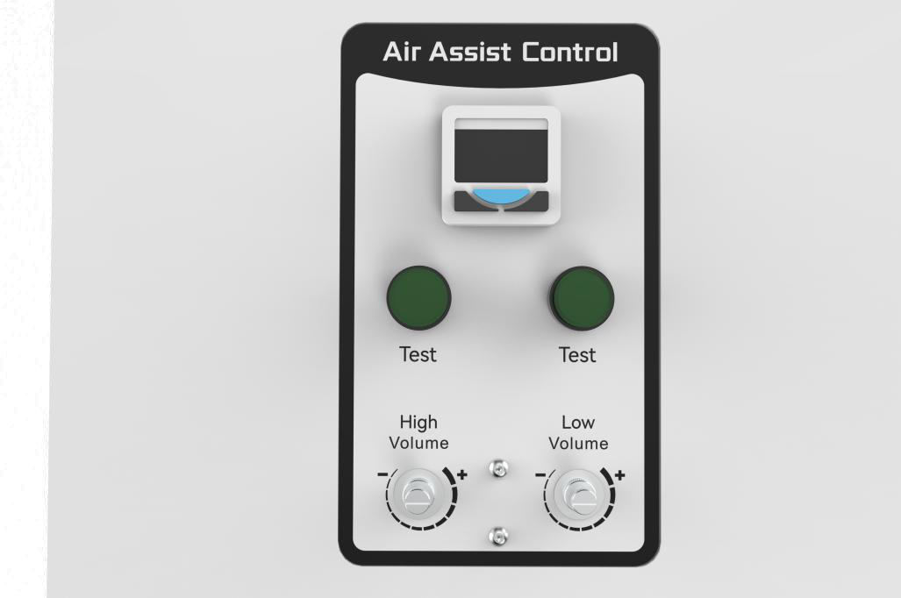

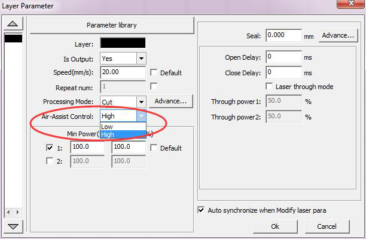

## Page 50

USERS MANUAL
NOVA PLUS SERIES
www.thunderlaser.com
DONGGUAN THUNDER LASER EQUIPMENT CO.,LTD
tech@thunderlaser.com
Room1101, Building 3, No.68, Xingzhou Road, Shatian Town,
Tel:(86) 18103043363
Dongguan City, Guangdong Province, China
50
automatically, and in scan mode (engraving mode), it will select Low volume automatically.
2) How to adjust air volume if require?
For High volume mode,
1.
Make sure machine is not at work and laser switch is off
2.
Click the left green button to start the air-assist with high volume
3.
Check the air volume under the laser head
4.
On left flow control valve, loose the locked nut then rotate the adjusting screw to control the air volume to
mean your requirements.
5.
Fix the locked nut after finished.
And for Low volume mode, you do it the same.
It will be the best if using big air compressor instead of air pump for air-assist.
Also you can refer to the video instruction below：https://youtu.be/GmiphyCBP3w
4.9
How the heat alarm system works
The heat alarm system is an additional tool for laser machines.
Some materials such as acrylic, wood and so on, can easily catch fire, particularly during cutting.
The heat alarm system has a smart board with temperature sensor which will be reacted by an abnormal
temperature (higher than 55°C/131°F) on working table. It will trigger at a certain temperature then signals to
TL-Timer board to stop laser processing and give a warning sound, so operator can active fire control in time to
reduce the potential losses and risks.

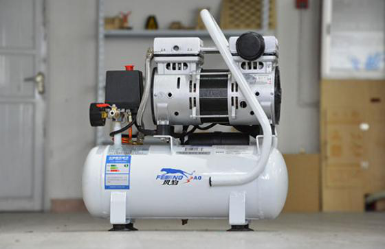

## Page 51

USERS MANUAL
NOVA PLUS SERIES
www.thunderlaser.com
DONGGUAN THUNDER LASER EQUIPMENT CO.,LTD
tech@thunderlaser.com
Room1101, Building 3, No.68, Xingzhou Road, Shatian Town,
Tel:(86) 18103043363
Dongguan City, Guangdong Province, China
51
The warning sound comes from signal lamp (roughly 80dBA within 1m, 75dBA within 5m and 65dBA within 10m,
the sound gets weaker as it travels).
When heat alarm system is activated, the warning sound will beep all the time until user restart the
machine.
Fire Hazard: High potential for fire. NEVER RUN UNATTENDED.

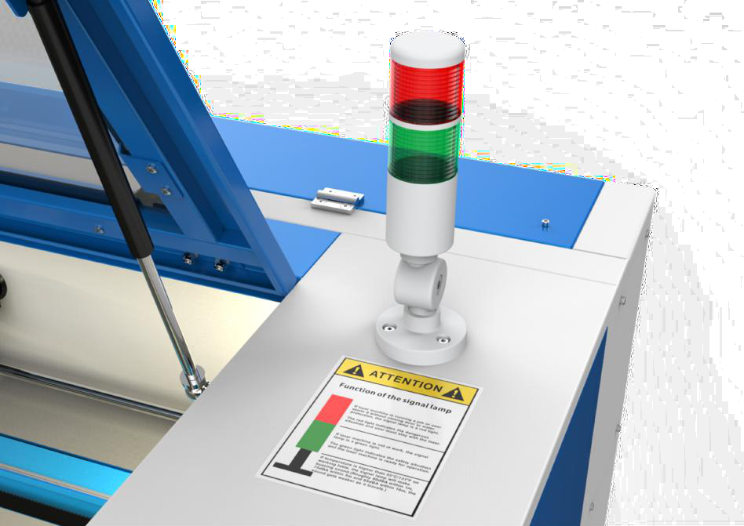

## Page 52

USERS MANUAL
NOVA PLUS SERIES
www.thunderlaser.com
DONGGUAN THUNDER LASER EQUIPMENT CO.,LTD
tech@thunderlaser.com
Room1101, Building 3, No.68, Xingzhou Road, Shatian Town,
Tel:(86) 18103043363
Dongguan City, Guangdong Province, China
52
4.10 The First Time Running the Laser
To be safe, never ever run the laser system unattended.
According to international standard，“O”means close；“I”means open for the rocker switch below
Yours first engraving tests
The following steps describe how to successfully engrave a first pattern. Please follow the individual steps:
1. Switch on you Laser and wait for a beep to note the machine is initialized, and the laser head will do the reset
and find the home from top left corner. DO NOT click “ESC” button to stop the system initialization.
When turn on the power of machine, and note that turn on the Main switch first and then the
Laser switch.
2. After machine finish resetting, adjust the height of working table, place the material usually on the top left
corner of the working table.
1
Move down the working table;
2
Place the material;
3
Move up the working table;
3. With the help of the focus ruler, adjust the focus distance to 6mm between the bottom of laser head and the
material manually by move up and down the working table.
4. Open the software RDworksV8.First to set up the values on the “Scanning(Reverse compensation)” check box.
Open Config(s)>>system setting>>Optimize>>Scanning(Reverse compensation),and there are some default
values on the “Scanning(Reverse compensation)” check box.

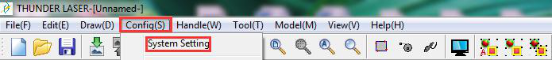

## Page 53

USERS MANUAL
NOVA PLUS SERIES
www.thunderlaser.com
DONGGUAN THUNDER LASER EQUIPMENT CO.,LTD
tech@thunderlaser.com
Room1101, Building 3, No.68, Xingzhou Road, Shatian Town,
Tel:(86) 18103043363
Dongguan City, Guangdong Province, China
53
The particular values are showing with a picture in folder of laser software on the USB flash drive and on the
Anodized aluminum piece that came with your machine.
Save those setting on the “Scanning(Reverse compensation)” check box.
5. Create sample text for engraving directly on RDworks, then set up the parameter and download the file to your
machine.
More details for how to use software please watch the instruction video below.
How to prepare your files for feeding into the laser program to engrave
6. Click “Original” and “Frame” on the display, please make sure that the material is in the right location and there
is enough space for working.
1
Control arrow button to move the laser head;
2
Click “Origin” button to select the start point;

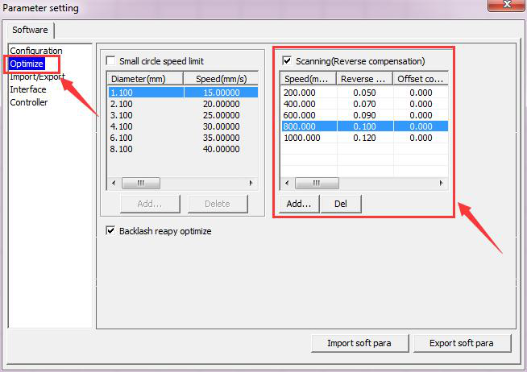

## Page 54

USERS MANUAL
NOVA PLUS SERIES
www.thunderlaser.com
DONGGUAN THUNDER LASER EQUIPMENT CO.,LTD
tech@thunderlaser.com
Room1101, Building 3, No.68, Xingzhou Road, Shatian Town,
Tel:(86) 18103043363
Dongguan City, Guangdong Province, China
54
3
Click “Frame” button to be sure the working area;
4
Click “Start-Pause” to run the program;
7. Finally press the “Start-Pause” button in the display, to start the engraving process.
8. While the laser is engraving, you can generate the next graphic.
9. When the engraving is complete, the laser machine will give out the notification sound and the laser head will
go back to the original point, and the warning light will return to the green light, then you can repeat engraving.
This is software specific, so if you are using LightBurn, you will need to do this in LightBurn. It is
called “Scanning Offset Adjustment.”

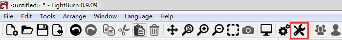

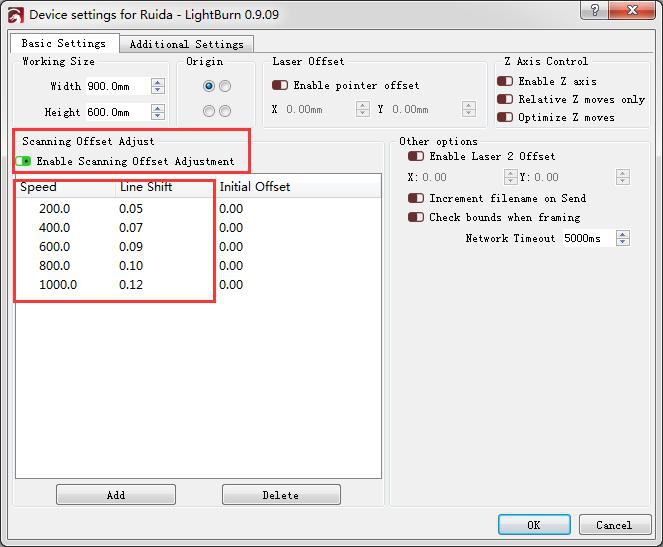

## Page 55

USERS MANUAL
NOVA PLUS SERIES
www.thunderlaser.com
DONGGUAN THUNDER LASER EQUIPMENT CO.,LTD
tech@thunderlaser.com
Room1101, Building 3, No.68, Xingzhou Road, Shatian Town,
Tel:(86) 18103043363
Dongguan City, Guangdong Province, China
55
4.11 Workstation Area Indication

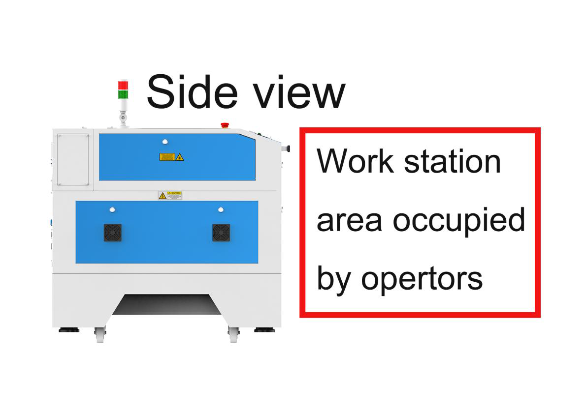

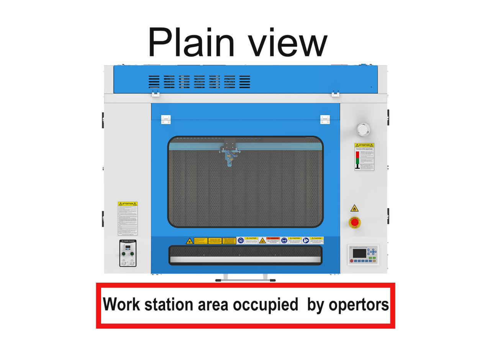

## Page 56

USERS MANUAL
NOVA PLUS SERIES
www.thunderlaser.com
DONGGUAN THUNDER LASER EQUIPMENT CO.,LTD
tech@thunderlaser.com
Room1101, Building 3, No.68, Xingzhou Road, Shatian Town,
Tel:(86) 18103043363
Dongguan City, Guangdong Province, China
56
4.12 How to use the Chuck Rotary axis Attachment
The chuck rotary axis attachment is the optional item.
Specification:
W×D×H
23.62"×5.91"×6.69"/600mm×150mm×170mm
Max working length
11.42"/290mm
Max working diameter
3.94"/100mm
To install and set-up the rotary axis attachment proceed as described as follows:
1.
Move the working table to the lower position then switch off the laser and open the top lid.
2.
Put the rotary axis attachment onto the working table and align the rotary attachment with the x-axis are
parallel, with the jaw chuck closest to where the rotary attachment plugs in.
3.
Connect the rotary axis attachment via the control cable with the connector of the motion system. The
connector is located inside the right front of the laser. Connected it to this interface and fixed, and then you
have finished the device connection. Like below:

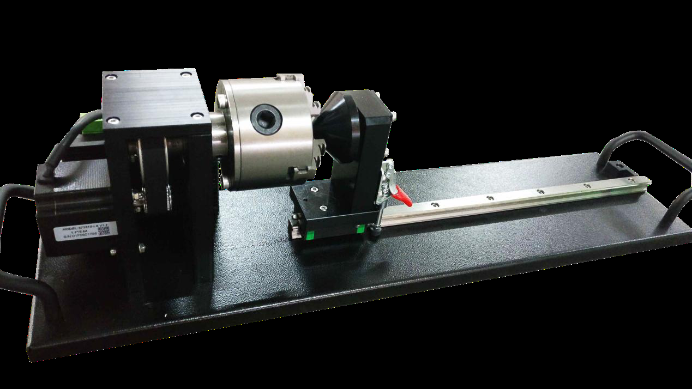

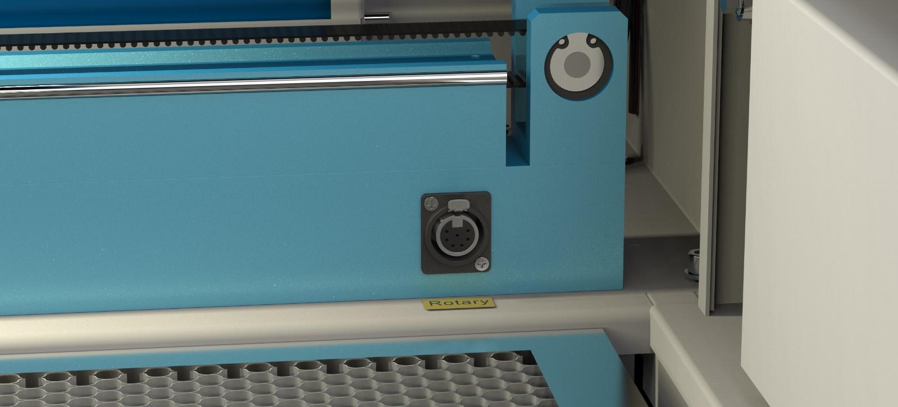

## Page 57

USERS MANUAL
NOVA PLUS SERIES
www.thunderlaser.com
DONGGUAN THUNDER LASER EQUIPMENT CO.,LTD
tech@thunderlaser.com
Room1101, Building 3, No.68, Xingzhou Road, Shatian Town,
Tel:(86) 18103043363
Dongguan City, Guangdong Province, China
57
4.
Before you mount the object into the rotary axis attachment, measure the diameter of the object at the
position to be engraved with a sliding caliper or a similar tool. Write down this value. For example: 80mm.
5.
Adjust and fix the slider to make the work piece fitting into the rotary axis attachment.
6.
Set your focus manually, carefully and safely. It is not recommended to use the auto focus with a rotary axis
attachment for the simple reason that you are not working with a flat object. Set your origin.
7.
Generate a graphic with the help of the graphics software. The graphics size must be adjusted until less than
the dimensions of the work piece.
8.
Select “Output”, and then input the diameter of the object and the circle pulse. How to set up the parameter
for “enable rotate engrave”, please click below link for the instruction.
Rotary axis attachment has a wrong cylindrical engraving/cutting size
9.
Select "Download", click “Origin” and “Frame” on the LCD display, please make sure that the material is in the
right location and enough space for working.
10. Finally press the “Start-Pause” button in the LCD display, to start the engraving or cutting process.
Also you can refer to the video of how the rotary axis works in our website：
Rotary axis attachment has a wrong cylindrical engraving/cutting size

## Page 58

USERS MANUAL
NOVA PLUS SERIES
www.thunderlaser.com
DONGGUAN THUNDER LASER EQUIPMENT CO.,LTD
tech@thunderlaser.com
Room1101, Building 3, No.68, Xingzhou Road, Shatian Town,
Tel:(86) 18103043363
Dongguan City, Guangdong Province, China
58
4.13 For Laser Engraving
The engraving depth can easily be varied through the laser power or the speed. To increase the engraving depth,
reduce the speed or increase the power setting. This way you increase the amount of energy per area unit.
Engraving too deep, however, reduces the quality of the details. With coated materials the required power
depends of the kind and thickness of the coating. With power set too high the individual lines become too thick
and a sharp picture cannot be achieved. The resolution of the graphics should usually be at 500 dpi. The dpi
setting (number of laser dots per inch) depends on the material. The lower this setting is, the lower the resolution
of the engraved picture will be. This, however, reduces flaming and increases the energy of a pulse, which can
improve the overall result (e.g. when engraving some sorts of plastic materials).
1.
Plastics
Plastics for engraving are available in many different colors and thicknesses and with many different coatings and
surfaces. The majority of available plastics can be well engraved and cut with the laser. Plastics with a
micro-porous surface seem to give the best result, because less surface material needs to be removed. As most
plastic materials have a low melting point, a low pip setting should be selected to reduce the danger of melting.
2.
Acrylic
There are two different types of acrylic – cast and extruded. The cast acrylic becomes white or mat after
engraving, the extruded acrylic remains clear. Use extruded acrylic for engravings that are filled with paint and
cast acrylic for normal engravings. Cast acrylic can be best engraved without protection foil. It is better to engrave
the entire surface with a low energy setting.
3.
Engrave the rubber stamp
The various mixtures and densities of rubber plates cause a slightly varying engraving depth. The settings in the
overview table give a good indication. Since engraving a standard rubber material requires a relatively high laser
power, the laser power is principally set to 40% or more high and only the speed is varied. Due to their lower
density, so-called micro porous rubber materials allow a significantly higher engraving speed. Test the rubber first,
to find out the correct speed setting.
The RDWorksV8 software using the engraving function, you can choose “Ramp Effect” or common engraving,
once you choose “Ramp Effect” and you will need to set a minimum power lower than Max Power, generally we
set it to about 15%, and input a value with the Ramp Length what you want, but if you want to make it better, you
may need to test different kinds of power and speed by yourself, then you can get the best result.
Engraving rubber produces a considerable amount of dust and terrible gas. Therefore a well-dimensioned
exhaust system and its regular maintenance are very important.

## Page 59

USERS MANUAL
NOVA PLUS SERIES
www.thunderlaser.com
DONGGUAN THUNDER LASER EQUIPMENT CO.,LTD
tech@thunderlaser.com
Room1101, Building 3, No.68, Xingzhou Road, Shatian Town,
Tel:(86) 18103043363
Dongguan City, Guangdong Province, China
59
Chapter 5. Maintenance
5.1
Cleaning the Laser Machine
Caution – use of controls or adjustments or performance of procedures other than those specified here
in may result in hazardous laser radiation exposure.
Before starting cleaning and maintenance work always switch off the device and unplug the mains
plug.
Always keep the system clean, as flammable parts in the working area or exhaust area rise the fire
hazard.
You should check at least once a day, whether dust has accumulated in the engraving system. In
case of soiling the machine must be cleaned. The cleaning interval strongly depends on the material
that is being processed and the operating time of the device. Please bear in mind that only a clean
machine guarantees optimal performance and reduces the service costs.
General Cleaning Notes:
1.
Make sure, that the device is switched off and unplugged. Open the protective cover.
2.
Move the working table into a position in which it is easiest for you to clean the surface with a window cleaning
agent and paper towels.
3.
Thoroughly remove all loose dirt particles and deposits in the interior of the machine.
4.
Clean the cover of the laser tube.
5.
You can clean the viewing window with a cotton cloth. Do not use paper towels as they could scratch the
acrylic.

## Page 60

USERS MANUAL
NOVA PLUS SERIES
www.thunderlaser.com
DONGGUAN THUNDER LASER EQUIPMENT CO.,LTD
tech@thunderlaser.com
Room1101, Building 3, No.68, Xingzhou Road, Shatian Town,
Tel:(86) 18103043363
Dongguan City, Guangdong Province, China
60
5.2
Cleaning the Optical Parts
The lens has a durable multi-coating and won’t be damaged by correct and careful cleaning. You should inspect
the focus lens and the mirrors and the beam combiner according the maintenance plan. If you discover a veil of
haze or dirt, you must clean them.
It is suggested to clean the mirrors/lens before work every day in order to run the machine at max efficiency.
Please turn off the power of laser machine before cleaning the optical parts.
Lens cleaning fluid and swabs are as follows:
1. Lens cleaning fluid and cotton swabs are in the tool box that came with the machine.
2. The lens must be cleaned carefully with a clean cotton swab to avoid scratching the surface of the
lens.
3. Do not touch the lens with your hands after wiping.
4. Never use a cleaning swab twice.
Follow the instructions below for the cleaning of optical parts:
5.2.1
Cleaning the Focus Lens
1.
Move the working table to a distance approx. 10 cm under the lens holder.
2.
Move the working head into the center of the working surface.
3.
Now you can unscrew the lens holder.
4.
Remove the nozzle from the lens holder by carefully turning the lens holder.
5.
Remove the coarse dust as good as possible by blowing air onto the lens surface.
6.
Check the surface and if necessary clean the lens with the lens cleaning liquid and swabs.

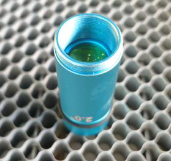

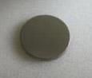

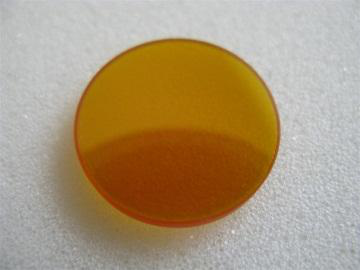

## Page 61

USERS MANUAL
NOVA PLUS SERIES
www.thunderlaser.com
DONGGUAN THUNDER LASER EQUIPMENT CO.,LTD
tech@thunderlaser.com
Room1101, Building 3, No.68, Xingzhou Road, Shatian Town,
Tel:(86) 18103043363
Dongguan City, Guangdong Province, China
61
7.
Put some lens cleaning liquid on one side of the lens. Leave the liquid to take effect for approximately one
minute and then gently wipe it away with cleaning swabs soaked with lens cleaning liquid.
8.
Finally, dry this side of the lens with dry cleaning swabs and repeat the cleaning process on the other side of
the lens. Never use a cleaning swabs twice. Dust accumulated in the cleaning swabs could scratch the lens
surface.
9.
Examine the lens. If it is still soiled, repeat the cleaning process until the lens is clean.
10. Carefully insert the lens holder and fix it.
How to take out the focus lens, please just as following the picture indicated:
1. Remove the laser head
2. Divide the laser head
3. Clean concave side of lens with swabs
4. Clean convex side of lens with swabs
How to take out the lens, and please just as following the picture:

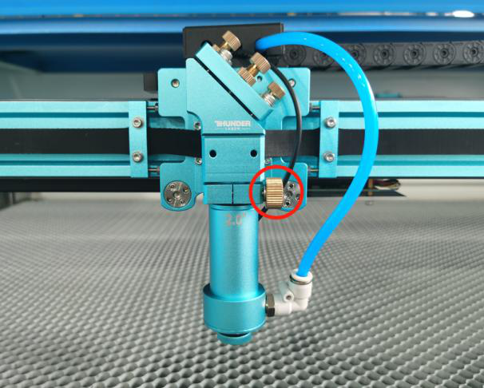

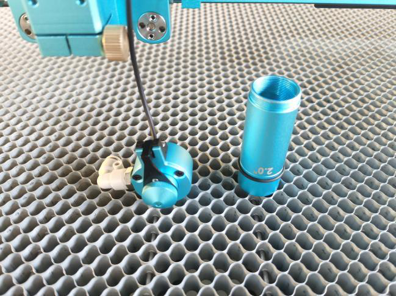

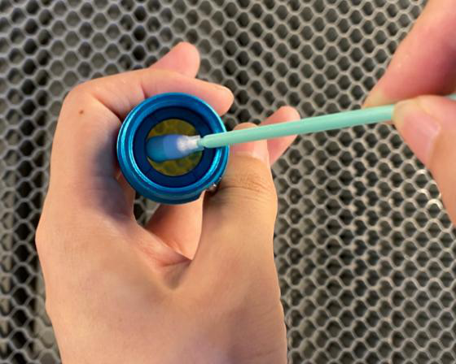

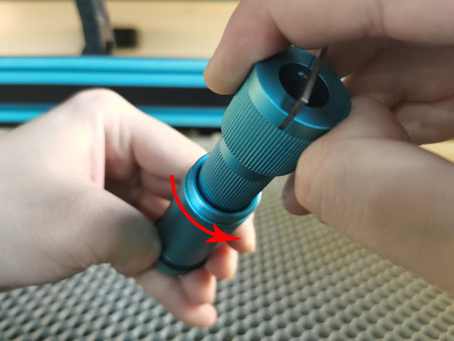

## Page 62

USERS MANUAL
NOVA PLUS SERIES
www.thunderlaser.com
DONGGUAN THUNDER LASER EQUIPMENT CO.,LTD
tech@thunderlaser.com
Room1101, Building 3, No.68, Xingzhou Road, Shatian Town,
Tel:(86) 18103043363
Dongguan City, Guangdong Province, China
62
Note: please refer to the figure below for the installation direction of the focusing lens.
5.2.2
Cleaning the Mirrors
There are three mirrors in the operating area of the laser, which may have to be cleaned if they are soiled. To
clean the reflector, follow the instructions below.
1.
Remove the coarse dust as good as possible by blowing air onto the mirror surface.
2.
Check the surface and if necessary clean the mirror with the lens cleaning liquid and swabs.
3.
Put some lens cleaning liquid on one side of the mirror. Leave the liquid to take effect for approximately one
minute and then gently wipe it away with cleaning swabs soaked with lens cleaning liquid.
4.
Finally, dry this side of the mirror with dry cleaning swabs and repeat the cleaning process on the other side
of the mirror. Never use a cleaning swabs twice. Dust accumulated in the cleaning swabs could scratch the
mirror surface.
5.
Examine the mirror. If it is still soiled, repeat the cleaning process until the lens is clean.
The Mirror#1
The 1st mirror is installed in the rear box of the laser tube, open it then view the right side.

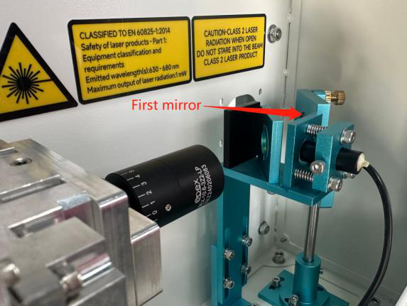

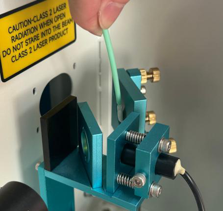

## Page 63

USERS MANUAL
NOVA PLUS SERIES
www.thunderlaser.com
DONGGUAN THUNDER LASER EQUIPMENT CO.,LTD
tech@thunderlaser.com
Room1101, Building 3, No.68, Xingzhou Road, Shatian Town,
Tel:(86) 18103043363
Dongguan City, Guangdong Province, China
63
The Mirror#2
The 2nd mirror is installed on the left side of X rail.
The Mirror#3
The 3rd mirror is installed on the top of the laser head.
How to take out the mirror#1 #2 and#3, and please just as following the picture indicated:
1. The mirror#1

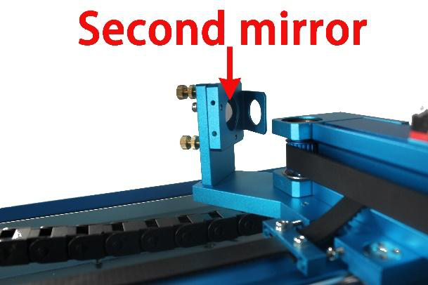

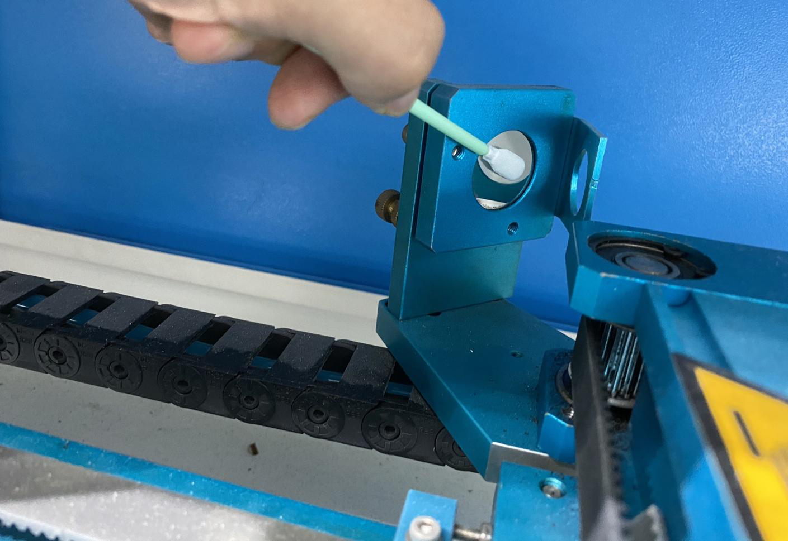

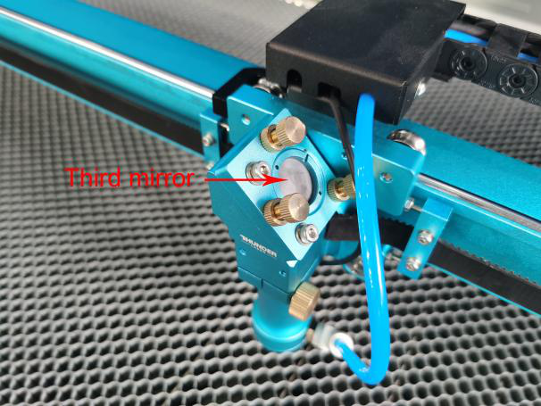

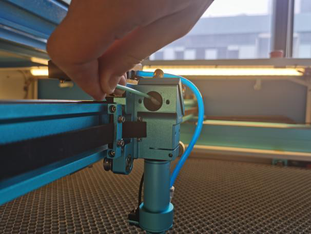

## Page 64

USERS MANUAL
NOVA PLUS SERIES
www.thunderlaser.com
DONGGUAN THUNDER LASER EQUIPMENT CO.,LTD
tech@thunderlaser.com
Room1101, Building 3, No.68, Xingzhou Road, Shatian Town,
Tel:(86) 18103043363
Dongguan City, Guangdong Province, China
64
2. The mirror#2
3. The mirror#3
5.2.3
Cleaning Laser Combiner
1.
The laser combiner is installed on the left side of the first mirror.
2.
Remove the coarse dust as good as possible by blowing air onto the lens surface.
3.
Check the surface and if necessary clean the laser combiner with the lens cleaning liquid and swabs.
4.
Put some lens cleaning liquid on one side of the swab. Leave the liquid to take effect for approximately one
minute and then gently wipe it away with cleaning swabs soaked with lens cleaning liquid.
5.
Finally, dry this side of the laser combiner with dry cleaning swabs and repeat the cleaning process on the
other side of the lens. Never use a cleaning swab twice. Dust accumulated in the cleaning swabs could
scratch the lens surface.
6.
Examine the laser combiner. If it is still soiled, repeat the cleaning process until the lens is clean.

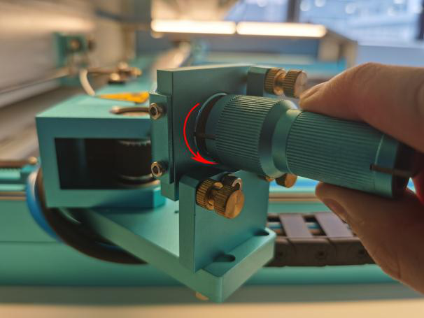

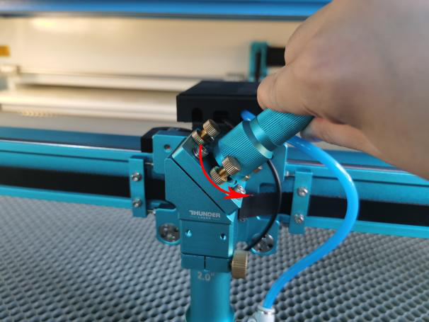

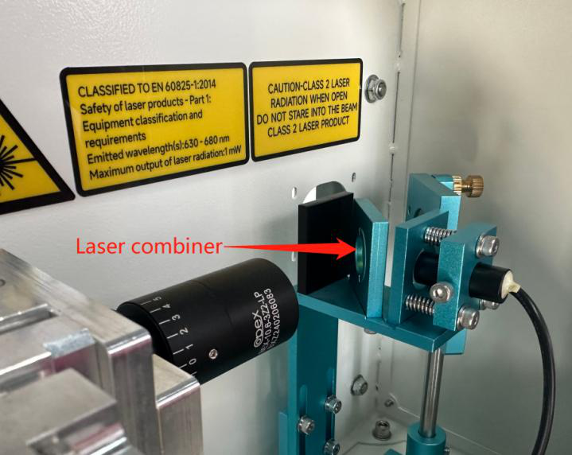

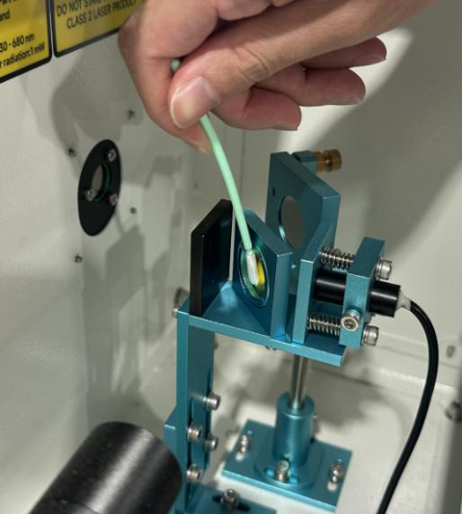

## Page 65

USERS MANUAL
NOVA PLUS SERIES
www.thunderlaser.com
DONGGUAN THUNDER LASER EQUIPMENT CO.,LTD
tech@thunderlaser.com
Room1101, Building 3, No.68, Xingzhou Road, Shatian Town,
Tel:(86) 18103043363
Dongguan City, Guangdong Province, China
65
5.3
Cleaning the cooling system
For the RF tube, providing a good heat dissipation environment for it determines the stability of its beam
output, so it is necessary to regularly clean the dust on the cooling fan of the RF tube and the machine.
It is suggested to use an air blow gun to blow the dust away, as shown in the pictures:
1. Remove the black fan cover and sponge, and use the air blow gun to blow away the dust from the sponge
and mesh.
2. Open the tube cover and use the air blow gun to blow away the dust on the fan inside.
3.Remove the screws which fixed the cooling fan, take out the fan, and use an air blow gun or a pump to blow
the dust away.

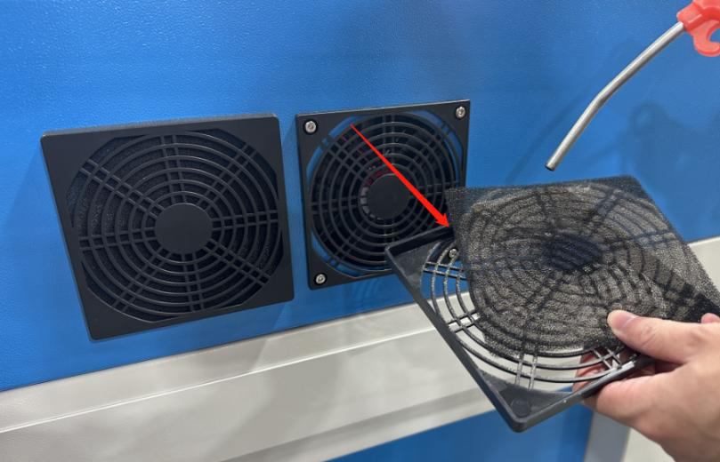

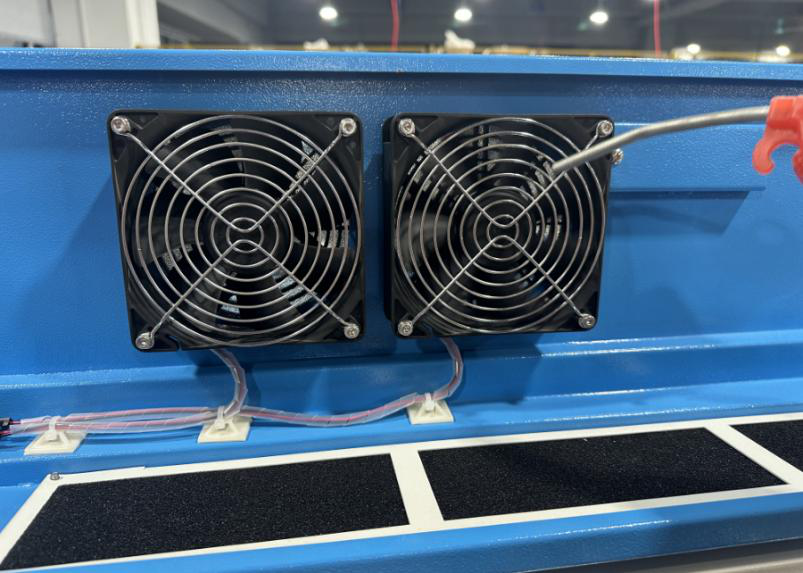

## Page 66

USERS MANUAL
NOVA PLUS SERIES
www.thunderlaser.com
DONGGUAN THUNDER LASER EQUIPMENT CO.,LTD
tech@thunderlaser.com
Room1101, Building 3, No.68, Xingzhou Road, Shatian Town,
Tel:(86) 18103043363
Dongguan City, Guangdong Province, China
66
4. Use an air blow gun to blow away the dust on the RF tube, then you can use a rag to wipe the dust around
the RF tube.
5. After cleaning the dust, reinstall the fan on the RF tube and the cleaning is finished.

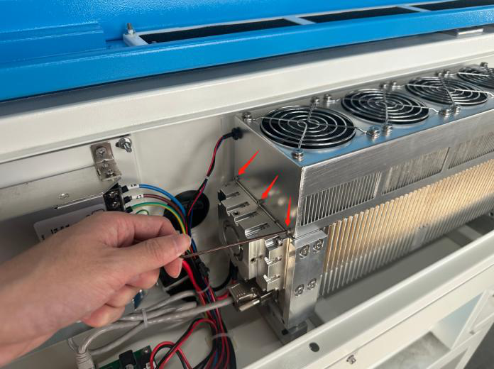

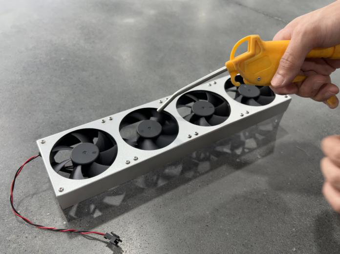

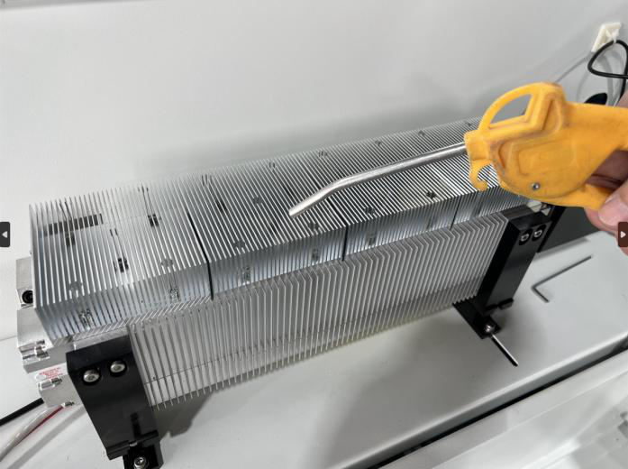

## Page 67

USERS MANUAL
NOVA PLUS SERIES
www.thunderlaser.com
DONGGUAN THUNDER LASER EQUIPMENT CO.,LTD
tech@thunderlaser.com
Room1101, Building 3, No.68, Xingzhou Road, Shatian Town,
Tel:(86) 18103043363
Dongguan City, Guangdong Province, China
67
5.4
Maintain the X/Y/Z Rails
It is suggested to clean the dust on the X/Y rail with alcohol at least every two weeks.
It is suggested to add lubricant oil (or Rust Preventative Grease) to the rails/screws at least every two weeks.

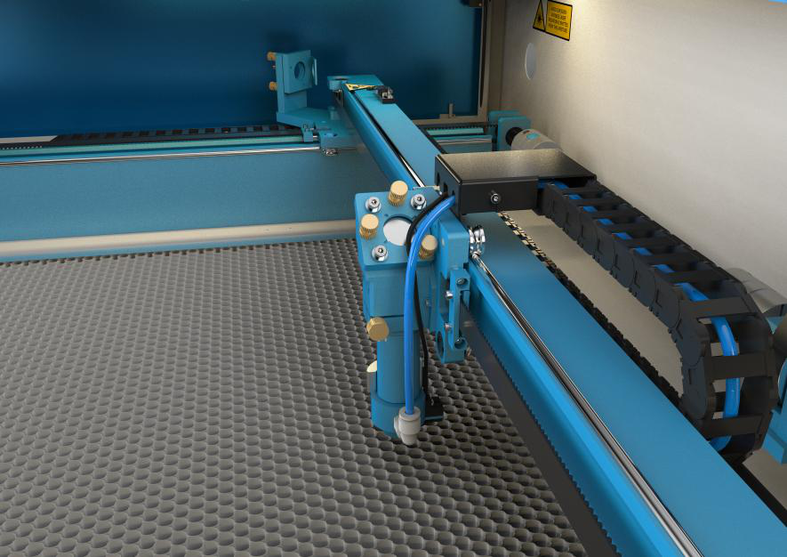

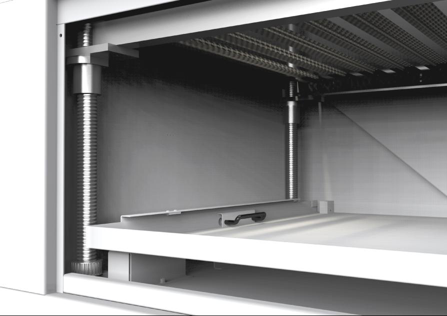

## Page 68

USERS MANUAL
NOVA PLUS SERIES
www.thunderlaser.com
DONGGUAN THUNDER LASER EQUIPMENT CO.,LTD
tech@thunderlaser.com
Room1101, Building 3, No.68, Xingzhou Road, Shatian Town,
Tel:(86) 18103043363
Dongguan City, Guangdong Province, China
68
5.5
Check the Beam Path
After being used for a long time, the beam path might be deflective. This will reduce the efficient of the laser
beam or even cause no laser beam. At this moment, you will need to re-adjust the beam path again.
If you need to know that about adjust the laser beam path of the video on YouTube released by our company
and please link to the URL:
How to adjust the laser beam path
5.6
Maintenance Plan
1. DAILY CHECK LIST
①Check Mirrors and lens for condensation and make sure it is clean after work.
②Check exhaust grille to ensure there is no blockage for exhaust fan.
③Check air filter on compressor.
④Ensure cooling fans on sides are free from debris.
⑤The air blower must be checking and cleaning if required.
2. WEEKLY CHECK LIST
①Clean the exhaust fan to ensure there is no blockage.
②Clean debris from under laser bed.
③Clean X & Y & Z axis rails and lubricate as required.
④Clean Acrylic/Tempered glass covers in lid.
⑤The beam combiner must be checking every weekly, and cleaning if required.
THE END

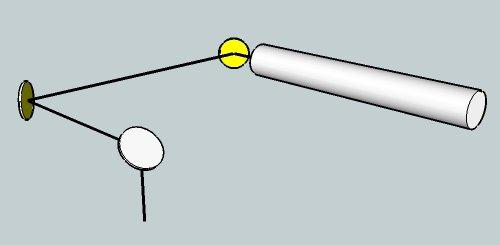
